# Phase 1 — Learning Knowledge Base

> Module content is appended here as you request each module.
> Syllabus/overview: [docs/2026-07-tutorial.md](../docs/2026-07-tutorial.md)
> Structure: modules = `##`, sections & your follow-up questions = `###`.

## Module 0 — Setup & the mental model

### Concepts

#### 1. Where everything sits — the AI landscape

People use "AI" loosely. These terms are actually nested circles, each one a subset of the previous:

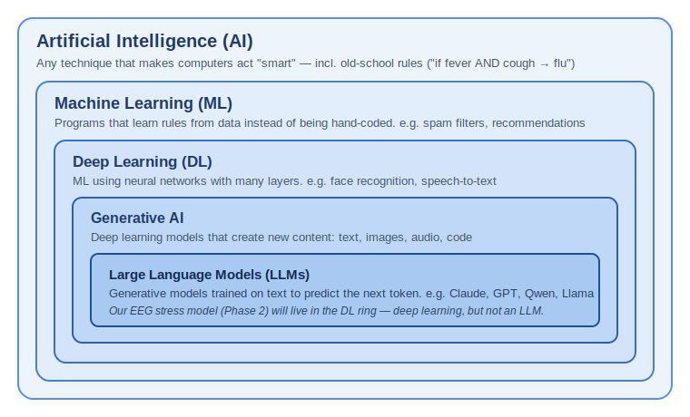

- **Artificial Intelligence (AI)** — the umbrella. Any technique that makes a computer behave "smart", including 1980s-style hand-written rules.
- **Machine Learning (ML)** — the subset where the computer *learns the rules from data* instead of a programmer writing them. This is the big mental shift, and the next diagram makes it concrete.
- **Deep Learning (DL)** — ML done with *neural networks* stacked many layers deep. Dominant since ~2012 because it scales beautifully with data and compute.
- **Generative AI** — deep learning models that *create* content (text, images, audio) rather than just classify it.
- **LLMs (Large Language Models)** — generative models for text: Claude, GPT, Qwen, Llama.

> **Why you care:** our Phase 2 stress model will be *deep learning but not an LLM* — it reads EEG signals, not text. Everything you learn about LLMs (training loop, evaluation, serving) transfers; only the data type and architecture change.

#### 2. The mental shift: software 1.0 vs software 2.0

As a software engineer, this is the fastest way to "get" ML:

| | Traditional software ("1.0") | Machine learning ("2.0") |
|---|---|---|
| You write | The **rules** (code) | Nothing — you provide **examples** (data) |
| The computer produces | Output, by executing your rules | The **rules themselves** (learned weights) |
| Example | `if temp > 38: fever = True` | Show 10,000 labeled patient records → model figures out the pattern |
| Analogy | You write the function | You write the *tests*, and training synthesizes a function that passes them |

ML exists for problems where nobody can write the rules by hand. Nobody can write `if pixel[3][7] > 130 and …` to recognize a cat — but a model can learn it from a million cat photos. Same for "what does stress look like in an EEG signal".

#### 3. What exactly is a "model"?

A model is just **two things in a file**:

1. **Architecture** — the wiring diagram. A fixed structure of simple math operations (mostly matrix multiplications) arranged in layers. Think of it as the *class definition*.
2. **Weights (= parameters)** — millions or billions of numbers that fill that wiring. They start random and get adjusted during training. Think of them as the *state* that makes the class actually useful.

So when you download "Qwen3-8B", you're downloading a known architecture (a transformer) plus **8 billion learned numbers**. "Running a model" = pushing your input through the wiring, multiplying it against those numbers, and reading the result. No magic, no database of answers — just math.

**A neural network**, at ground level: layers of "neurons", where each neuron computes `output = activation(w1·x1 + w2·x2 + … + b)` — a weighted sum of its inputs passed through a simple non-linear function. One neuron is trivial. Millions of them, layered, can approximate almost any function — including "photo → cat?" and "EEG window → stress score".

#### 4. Training vs inference — the two lives of a model

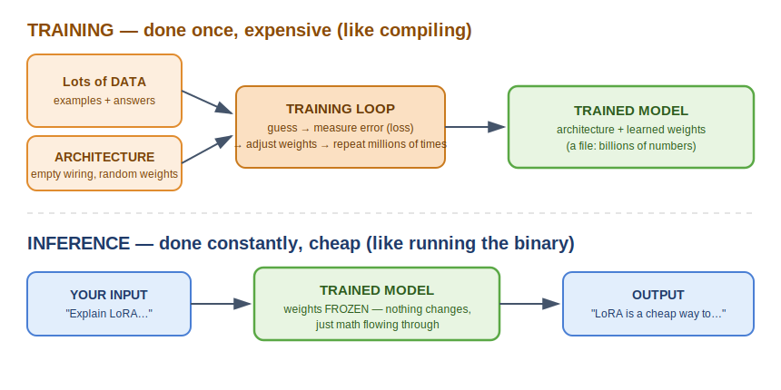

- **Training** (done once, expensive): show the model examples, measure how wrong its guesses are (the **loss**), nudge every weight a tiny bit in the direction that reduces the error (**backpropagation** + an **optimizer**), repeat millions of times. Weights slowly become "knowledge".
- **Inference** (done constantly, cheap): weights are **frozen**. Input goes in, math happens, answer comes out. When you chat with a local model, it is *not* learning — it's pure inference.

Software analogy: training is *compiling* (slow, resource-hungry, done rarely); inference is *running the binary* (fast, done all the time). And **fine-tuning** — which we'll do in Module 4 — is taking someone else's trained model and training it *a little more* on your own data. That's how we sidestep the millions-of-dollars problem.

#### 5. The technology stack on your machine

Here's how every tool we'll use fits together, from silicon up:

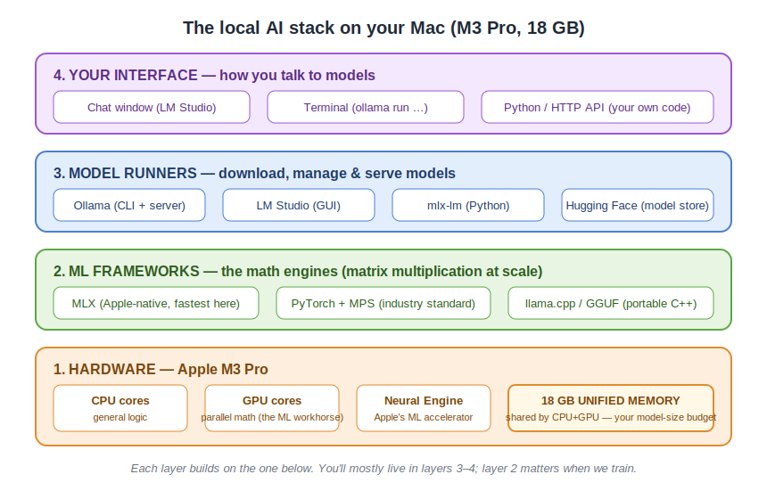

- **Layer 1 — Hardware.** Your M3 Pro's GPU does the heavy math (ML is embarrassingly parallel — perfect for GPUs). The key spec is **18 GB unified memory**: on Apple Silicon, CPU and GPU share one memory pool, so the *whole model must fit in it*. This single number decides which models you can run.
- **Layer 2 — Frameworks.** Libraries that turn "multiply these billion numbers" into fast GPU code. **PyTorch** (industry standard; talks to your GPU via Apple's **MPS** backend) and **MLX** (Apple's own framework, built for unified memory — fastest option on Macs, and what we'll fine-tune with).
- **Layer 3 — Model runners.** Developer-friendly tools sitting on the frameworks: **Ollama** (CLI + local API server), **LM Studio** (GUI), **mlx-lm** (Python library), and **Hugging Face** (the "GitHub of models" — where open models are published).
- **Layer 4 — You.** Chat windows, terminal, or your own Python code calling a local HTTP API.

#### 6. Model sizes, quantization, and your 18 GB budget

- Model size is quoted in **parameters**: "8B" = 8 billion weights.
- Stored naively (16-bit numbers), 8B params ≈ 16 GB — too big. **Quantization** stores each weight in fewer bits (typically 4) with barely any quality loss. Analogy: JPEG compression for weights.
- **Rule of thumb at 4-bit:** memory ≈ params(B) × 0.5–0.6 GB, plus 1–2 GB for working state.

| Model size (4-bit) | Approx. RAM | On your 18 GB Mac |
|---|---|---|
| 3–4B | ~2–3 GB | Effortless, very fast |
| 7–8B | ~4–5 GB | Sweet spot — our default |
| 14B | ~8–9 GB | Comfortable |
| ~30B (MoE) | ~15–17 GB | Practical ceiling; close everything else |
| 70B+ | 35+ GB | Not on this machine |

#### 7. Terminology cheat-sheet

Quick-reference for every term you'll meet in the next modules:

| Term | Plain meaning |
|---|---|
| **Model** | Architecture (wiring) + weights (learned numbers), stored as a file |
| **Parameters / weights** | The learned numbers; model "size" = how many (8B = 8 billion) |
| **Architecture** | The fixed structure numbers flow through (e.g. *transformer*) |
| **Training** | Adjusting weights from examples until predictions get good |
| **Inference** | Using a trained (frozen) model to get answers |
| **Dataset** | The collection of examples used to train/evaluate |
| **Label** | The "correct answer" attached to a training example |
| **Loss** | One number saying how wrong the model currently is (training tries to shrink it) |
| **Backpropagation** | The calculus that tells each weight how to change to reduce loss |
| **Optimizer** | The algorithm (e.g. Adam) that applies those changes |
| **Epoch** | One full pass through the training dataset |
| **Fine-tuning** | Further training of an existing model on your own data |
| **LoRA** | A cheap fine-tuning trick: freeze the model, train tiny add-on "adapter" weights |
| **Token** | The chunk of text (~¾ word) an LLM actually reads/writes |
| **Context window** | How many tokens a model can consider at once |
| **Quantization** | Compressing weights to fewer bits to save memory |
| **GPU / MPS / MLX** | Parallel-math hardware / PyTorch's Apple-GPU backend / Apple's ML framework |
| **Hugging Face** | The main public hub for downloading open models & datasets |
| **Open weights vs closed** | Downloadable models you run yourself (Qwen, Llama) vs API-only (Claude, GPT) |

#### Checkpoint for this section

Before we move to the *Hands-on* section of Module 0, you should be able to answer these in your own words (tell me your answers — I'll correct gently):

1. What are the two things that make up a model?
   - Architecture (The wiring) + Weights (The State)
2. What's the difference between training and inference, in one sentence each?
   - Training is a one time process during which model weights get calculated where as inference is running your custom input against trained model to get output.
3. Why can your 18 GB Mac run a 14B model but not a 70B one?
   - Model + Working state must fit into memory which is possible for 14B model but not for 70B model on 18GB RAM
4. In the software 1.0 vs 2.0 framing — what do *you* provide, and what does the machine produce?
   - In software 1.0 we provide rules and machine provides output whereas in software 2.0 we provide example labelled dataset and model produces rules

**My review of your answers:** All 4 correct. Small refinement on #2 — weights aren't *calculated* in one shot during training; they start random and get *refined* over millions of tiny nudges. Everything else, spot on.

### Follow-up: What is a neural network — how does it look, and how does it relate to code?

A neural network is a **layered pipeline of very simple math**, wired up so that numbers flow left-to-right (input → output). Nothing more. Here's the whole idea in one picture:

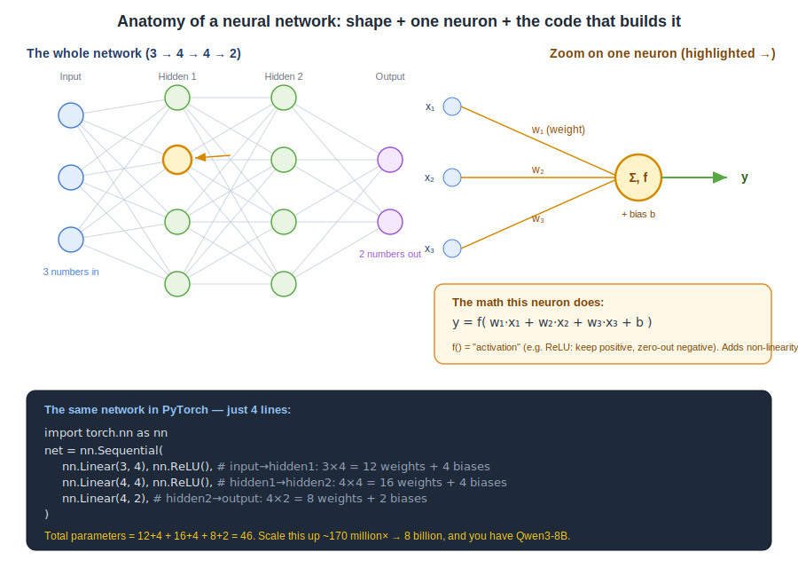

Let's break the diagram apart:

**Left side — the network as a graph.** Circles are **neurons**, lines between them are **connections**. Layers are just columns of neurons: input on the left, hidden layers in the middle, output on the right. Every neuron in one layer is connected to every neuron in the next (this is called a **fully connected** or **dense** layer — the simplest kind).

**Right side — one neuron zoomed in.** This is the entire "intelligence" primitive:

```
y = f( w₁·x₁ + w₂·x₂ + w₃·x₃ + b )
```

Read this like an engineer:

- `x₁, x₂, x₃` — the numbers arriving from the previous layer (or the input).
- `w₁, w₂, w₃` — **weights**. Each connection has one. Weights are *the* learned numbers. High weight = "I care about this input a lot"; near-zero = "I ignore it"; negative = "presence of this input suppresses my output".
- `b` — the **bias**. A per-neuron adjustable offset (like an intercept in `y = mx + c`). It lets the neuron activate even when all inputs are zero.
- `f()` — the **activation function**. A tiny non-linearity applied to the sum, most commonly **ReLU** (`f(x) = max(0, x)` — keep positives, zero-out negatives). Without this, no matter how many layers you stack, the whole network would collapse into one linear equation. Non-linearity is what lets networks learn curves, decision boundaries, meaning.

So one neuron: weighted sum → add bias → squash through a non-linear function → done. Every one of the billions of neurons in Qwen3-8B is doing exactly this.

**Bottom — the same network in code.** In PyTorch, the network above is literally 4 lines:

```python
import torch.nn as nn
net = nn.Sequential(
  nn.Linear(3, 4), nn.ReLU(),   # input→hidden1: 3×4 = 12 weights + 4 biases
  nn.Linear(4, 4), nn.ReLU(),   # hidden1→hidden2: 4×4 = 16 weights + 4 biases
  nn.Linear(4, 2),              # hidden2→output: 4×2 = 8 weights + 2 biases
)
```

Software-engineer translations:

- `nn.Linear(in, out)` — a fully connected layer. **This is just a matrix multiplication** under the hood: `y = xW + b`, where `W` is an `in × out` matrix of weights and `b` is a vector of `out` biases. That's *literally all* it is.
- `nn.Sequential(...)` — pipe the input through these layers in order. Analogous to Unix pipes.
- `nn.ReLU()` — the activation function, applied element-wise.

**Counting parameters.** Each `nn.Linear(a, b)` has `a·b` weights + `b` biases. Add them up:

- Layer 1: 3·4 + 4 = **16**
- Layer 2: 4·4 + 4 = **20**
- Layer 3: 4·2 + 2 = **10**
- **Total: 46 numbers** — the entire "brain" of this net.

Now scale up. An LLM like Qwen3-8B has ~8,000,000,000 numbers. Same primitives, just wider layers, more of them, and specialised structure (transformers, attention). But if you understand these 46 parameters, you understand the 8 billion — only the count changes.

**How does it relate to code?** Think of a trained model as an object with:

- **Structure (methods)** — declared once in code (`nn.Sequential(...)`). Never changes.
- **State (fields)** — the weight and bias tensors. During *training*, an optimizer mutates these fields. During *inference*, they're frozen and just read.

A `.safetensors` or `.gguf` file on disk is literally a serialized snapshot of that state — millions of floats packed into a binary blob, keyed by layer name. Load the file → weights get restored → the object is ready to run.

### Follow-up: Who decides the equation, how many parameters, and how do text/image/video get handled?

Three tightly-linked questions. Answering them together.

#### Who designs the "equation"?

**Humans do — specifically ML researchers.** There is no automatic derivation. The "architecture" *is* the mathematical equation, and choosing it is a design activity, exactly like choosing between a hashmap and a b-tree in traditional software.

A neural network architecture is a specification of:

1. Which **layer types** to use (dense, convolution, attention, ...).
2. How many of each and in what **order**.
3. Each layer's **dimensions** (widths).
4. Which **activation function** between them.
5. How things connect (skip-connections, residuals, etc.).

That specification determines: (a) the exact math the network computes, and (b) the total parameter count.

**You almost never invent an architecture from scratch.** You pick a proven family that matches your data, then tune it. New architectures come out of research papers (transformer = 2017 "Attention Is All You Need"; ResNet = 2015; ViT = 2020) and get adopted when they beat benchmarks. There's even a subfield — *Neural Architecture Search (NAS)* — that tries to automate the search, but hand-designed architectures still dominate.

#### Is there a predefined framework?

**Yes. Two of them, and they're mostly the same idea.**

- **PyTorch** (industry-standard): gives you a catalogue of building blocks in `torch.nn`:

  | Block | What it is | Data it fits |
  |---|---|---|
  | `nn.Linear` | Fully connected / dense layer | Anything (generic) |
  | `nn.Conv1d` | 1D convolution | Time-series (EEG!), audio |
  | `nn.Conv2d` | 2D convolution | Images |
  | `nn.Conv3d` | 3D convolution | Video, volumetric scans |
  | `nn.LSTM` / `nn.GRU` | Recurrent layers | Sequences (older-style) |
  | `nn.TransformerEncoder` | Transformer block | Sequences (modern default) |
  | `nn.BatchNorm` / `nn.LayerNorm` | Normalization | Anything, stabilises training |
  | `nn.Dropout` | Regularisation | Anything, prevents overfitting |

- **MLX** (Apple's framework): near-identical API, tuned for your Mac's unified memory.

You compose these blocks like Lego. That's what "designing an architecture" means in practice — reaching into a well-stocked box, not deriving new math.

#### How many parameters? — chosen, not computed

Parameter count is a **hyperparameter** — you decide it. The knobs you're turning:

- **Layer widths** — a `Linear(1024, 4096)` layer has ~4M params; `Linear(4096, 4096)` has ~16M. Wider = more capacity.
- **Depth** — more layers = more transformations = more params, but harder to train.
- **Vocab & embedding size** (for LLMs) — dominates params in small models.

**How is the sweet spot chosen?** Empirically, guided by "scaling laws" — research has established rough rules for how much data and compute you need to justify a given parameter count. Under-parameterised → the model can't fit the pattern. Over-parameterised → it memorises the training data and fails on new inputs (**overfitting**), or you just waste compute. In practice: pick a proven size (7B, 13B, ...) from the literature, or start small and scale until validation loss stops improving.

#### How do text, image, video, EEG all end up in the same kind of model?

**The trick:** they don't. Every model only ever sees **tensors** (multi-dimensional arrays of floats). Each data type has a standard **encoding step** that converts it into a tensor, and then a matching architecture processes that tensor. The encoding step is *not* magic — it's usually deterministic pre-processing.

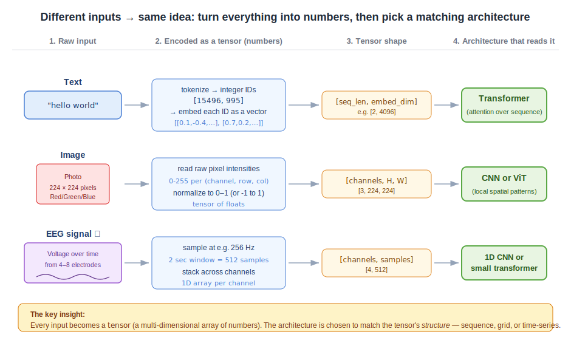

Walking each row:

- **Text.** Not directly usable. First **tokenize** — split into ~word-sized chunks and map each to an integer ID via a fixed vocabulary. Then **embed** — look each ID up in a big table (a learned `vocab_size × embed_dim` matrix, part of the model's weights) to get a vector per token. Result: a `[seq_len, embed_dim]` tensor. Architecture: **transformer** (attention lets each token see every other token — crucial for language).

- **Image.** Already numerical — every pixel is (R, G, B) intensities 0–255. Normalise to floats in 0–1, stack channels. Result: a `[3, H, W]` tensor. Architecture: **CNN** (convolutions scan tiny filters over the image — perfect for local patterns like edges and textures) or **ViT** (Vision Transformer: chop the image into patches, treat each patch as a "token", run a transformer). ViT is winning at scale; CNNs win at small data.

- **Audio.** Just voltage over time from a microphone. Sample at 16–48 kHz → 1D array of amplitudes. Often converted to a **spectrogram** first (a picture of frequencies over time) and then handled like an image. Architecture: 1D CNN, or transformer on spectrogram patches (Whisper).

- **Video.** Just a *sequence of images*. Result: `[frames, 3, H, W]`. Architecture: 3D CNN, or a transformer that attends over both space (within a frame) and time (across frames).

- **EEG (⭐ our Phase 2).** Microvolt voltage readings from 4–8 electrodes, sampled at ~256 Hz. Take a 2-second window per prediction → a `[channels, samples]` tensor, e.g. `[4, 512]`. Architecture: **1D CNN** (small filters slide over time, learning "what a stress pattern looks like across a few hundred milliseconds") or a **small transformer** if we have enough data. The training loop is *identical* to LLM training — data → forward pass → loss → backprop → optimizer step. Only the tensor shape and architecture differ. That's the payoff of everything you're learning in Phase 1.

#### The engineering takeaway

- **Architecture = code.** You write it once (a few dozen lines with PyTorch/MLX building blocks) and it stays fixed.
- **Weights = state.** Millions/billions of numbers, initialised randomly, mutated by the training loop.
- **Encoding = a boundary function.** Turns whatever data you have into a tensor. Each data type has a standard encoder.
- **Choosing an architecture = matching structure to data.** Sequence → transformer. Grid → CNN. Time-series → 1D CNN or small transformer.
- **Choosing parameter count = choosing capacity.** More = more expressive, needs more data and compute. Start with a proven size.

Ready to keep going with **Hands-on** for Module 0 when you are, or ask more.

### Follow-up (simpler): who writes the equations, how does raw data become "workable," and can we walk through an example?

Apologies — the previous answer had too much jargon. Let me restart with a story.

#### 1. The world's tiniest "model": predicting an exam score

Forget AI for a moment. Say you want to guess what a student will score on an exam, based on how many hours they studied. You have data from past students, a piece of paper, and a pencil. That's it.

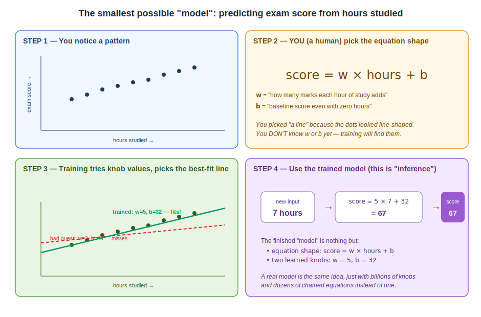

Here's every step:

- **Step 1 — you notice a pattern.** Plot old students on a graph: hours studied on the bottom, scores on the side. The dots roughly form a line going up.
- **Step 2 — YOU pick the shape of the equation.** You look at the line-shaped dots and write down:
  ```
  score = w × hours + b
  ```
  That's your equation shape. Two "knobs" you can tune: `w` and `b`. You picked this because the dots looked line-shaped. If they looked curved, you'd have picked a different shape. **A human made this choice from an observation.** No computer did it.
- **Step 3 — training finds the best knob values.** The computer tries lots of values for `w` and `b`, checks how well each resulting line fits the real dots, and keeps the values that fit best. Say it lands on `w = 5` and `b = 32`.
- **Step 4 — you use it.** Someone says "I studied 7 hours." You compute `5 × 7 + 32 = 67`. Predicted score: 67. That's called **inference**.

That's the whole thing. A "model" is nothing more than:

1. An equation shape (chosen by a human).
2. A few knobs whose values were learned from data.
3. A way to plug in a new input and read out an answer.

Everything else — Qwen3-8B, cat classifiers, EEG stress detectors — is *the same idea, scaled up*. Same recipe, just more inputs, more knobs, and multiple equations chained together.

#### 2. Scaling up (1): more than one input

Real problems rarely have one input. A student's score might depend on hours studied, hours slept, and hours of tuition. So we just add more knobs:

```
score = w₁ × hours_studied + w₂ × hours_slept + w₃ × hours_tuition + b
```

Three inputs → three w-knobs plus one baseline knob = **4 knobs to learn**. Same process. If you have 100 inputs, you get 100 knobs.

#### 3. Scaling up (2): the relationship isn't a straight line

For a real problem like "is this photo a cat?" — a single straight-line equation can't work, no matter how many knobs. The relationship between pixel values and "cat-ness" is wildly complicated.

The trick: **chain many simple equations together, in layers**.

Layer 1 takes the raw input and produces some new numbers. Layer 2 takes those new numbers and produces more new numbers. And so on for 10–50 layers. Between each layer we insert a tiny "bend the number" step (a simple non-linear function), which is what lets the whole chain describe curved, complex realities instead of just straight lines.

That chain-of-equations is what people call a **neural network**. Each layer is still doing the same primitive as our exam-score equation — a weighted sum of its inputs plus a baseline — just applied to many numbers at once, and with its own set of knobs. Stack enough of these, and the chain can learn "cat" from pixel numbers, or "stress" from EEG numbers.

#### 4. Who designs the chain?

**Human researchers do**, by looking at the *shape* of the data and asking: what kind of pattern does it have?

- **Images have spatial patterns** — nearby pixels are related (a cat's ear is next to its head). A researcher (Yann LeCun) designed a layer type that looks at small windows of pixels at a time. It's called a **convolutional layer**. Every image model uses it.
- **Text has sequence patterns** — word 5 depends on words 1–4. Google researchers designed a layer that lets each word "look at" every other word in the sentence — the **attention layer**. It powers every LLM today.
- **EEG has time patterns** — brain voltage 100 milliseconds ago tells us something about now. So EEG models use the same "small window" idea as images, but in one dimension (time) instead of two (space).

Each layer type is one specific mathematical formula that a real person wrote down after noticing a pattern in a real-world data type. There's a menu of maybe a dozen commonly-used layer types. **Designing a model means picking from this menu**, deciding how many of each layer and how wide each one is. You don't invent new layer types — you compose from the menu, the way you compose a program from library functions.

**How many knobs?** That's a design choice too. More layers × wider layers = more knobs = more capacity to learn complex patterns — but also more data and more compute time needed to train. Small models: 1 million knobs. Medium: 100 million. Qwen3-8B: 8 billion. All chosen by hand, guided by "how complex is my problem and how much compute do I have?"

#### 5. How raw data becomes "workable" — the prep step

Models can only do math. So any real-world input — a photo, a sentence, a sound clip, a brain signal — has to become numbers first. Every data type has a standard "prep recipe":

- **Photo:** already made of numbers. Each pixel is 3 numbers: (Red, Green, Blue), each 0–255. Just arrange them in a grid.
- **Sentence:** the model comes with a fixed dictionary that maps every word (or word-piece) to a unique integer, e.g. `"hello" = 15496`. So a sentence becomes a small list of integers. Then each integer looks up a longer list of numbers (learned during training) that captures the word's "meaning."
- **Audio:** a microphone already produces numbers — it just records the sound-wave height 16,000–48,000 times per second. Each recording = a long list of numbers.
- **Video:** a sequence of photos = a big pile of number grids.
- **EEG signal** (our Phase 2 data): the sensor records brain voltage 256 times per second from each electrode. Two seconds from four electrodes = 4 × 512 = **2,048 numbers**.

Each prep recipe is deterministic — someone wrote it down once, everyone reuses it. You rarely design a new recipe.

#### 6. Full walk-through: a cat classifier, end to end

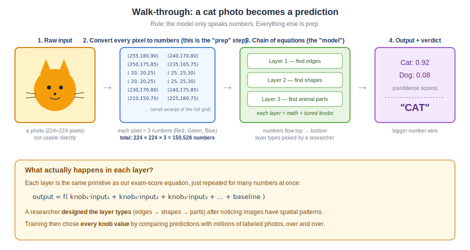

Let me walk you through it:

1. **You start with training data.** ~100,000 photos, each labeled "cat" or "dog." You download this from a public dataset (nobody makes it by hand).
2. **Prep each photo** into a grid of numbers: 224 × 224 × 3 = 150,528 numbers per photo.
3. **A researcher designed the model chain**: say, 20 layers, mostly "look at small windows" (convolutional) layers because photos have spatial patterns. Total knob count: ~10 million.
4. **Training runs, millions of iterations:**
   - Take one photo → 150,528 numbers go in.
   - Numbers flow through the 20 layers, come out as 2 numbers: e.g. `[Cat: 0.42, Dog: 0.58]`.
   - Actual label was "cat" — so the correct answer would be `[1, 0]`. The prediction is wrong.
   - A math routine says: "each of the 10 million knobs is a tiny bit off in this direction — nudge each one." Nudge them all.
   - Grab the next photo. Repeat.
   - After millions of nudges, the 10 million knobs settle into values that make the model reliably output higher "cat" scores for cat photos.
5. **Deploy.** Show the trained model a photo it's never seen. Prep → chain → 2 numbers out → bigger one wins.

Every big model follows this same pattern. Only three things change per problem:

| Piece | Cat classifier | LLM | EEG stress detector (Phase 2) |
|---|---|---|---|
| Data type | Photos | Sentences | Voltage over time |
| Prep recipe | Pixels → number grid | Words → integers → meaning-vectors | Sensor samples → number grid |
| Layer menu | Mostly "spatial window" | Mostly "attention" | Mostly "time window" |
| Output shape | 2 numbers (cat/dog) | Score for each of ~50,000 possible next words | 1 number (stress score) |

**Everything else — the training loop, backpropagation, inference — is identical.** That's why once you understand the cat classifier, you understand the LLM and the EEG detector.

#### 7. Tying it back to your Phase 2 goal

When we build the stress detector later:

- The BCI headset streams voltages → we prep them into 2-second windows of `4 × 512` numbers.
- We design a small model chain: 5–10 "time window" layers ending in one final number (the stress score 0–100).
- We record you doing stressful things (mental arithmetic) vs. relaxed things (deep breathing), label each window with the true stress level, and run the training loop for a few thousand iterations.
- After training, real-time EEG stream → prep → chain → stress score → mapped remedial action.

Same recipe as the cat classifier. Same recipe as an LLM. Just different data and different layer types from the menu.

**That's the whole picture. When you're comfortable with this, we move on.**

---

### Hands-on

**Goal:** end this section with a working Python + PyTorch + MLX environment on your Mac, verified to be talking to the Apple GPU. Everything Module 1 onward will assume this is in place.

**What we install and why (one-line each):**

| Tool | Why we need it |
|---|---|
| **Xcode Command Line Tools** | Compilers + libraries every Mac dev tool depends on |
| **Homebrew** | Mac package manager — how we install everything below |
| **Python 3.12** | The language ML runs in; 3.12 has full PyTorch + MLX support |
| **uv** | A modern Rust-based replacement for `pip` and `venv`, 10–100× faster |
| **git** | Cloning training-code repos in later modules |
| **numpy** | Foundational numerical arrays — every ML library is built on it |
| **torch (PyTorch)** | Industry-standard ML framework — we use it for training in Module 3 |
| **mlx** | Apple's native ML framework — fastest option on Apple Silicon |
| **mlx-lm** | Apple's LLM-specific library on top of MLX — for Modules 1 and 4 |
| **jupyter** *(optional)* | Interactive Python notebooks for exploratory work |

#### Step 1 — Xcode Command Line Tools

Homebrew and Python builds need this. Only install if missing:

```bash
xcode-select -p           # if it prints a path, you already have it
xcode-select --install    # if not, this pops up a GUI installer (~2 GB download)
```

#### Step 2 — Homebrew

```bash
which brew                # if it prints a path, skip the install
/bin/bash -c "$(curl -fsSL https://raw.githubusercontent.com/Homebrew/install/HEAD/install.sh)"
```

After install, Homebrew tells you to add itself to your shell's PATH — copy/paste the exact `eval "$(/opt/homebrew/bin/brew shellenv)"` line it prints into `~/.zprofile` and open a new terminal.

Verify:

```bash
brew --version
```

#### Step 3 — Python 3.12, uv, git

One command installs all three:

```bash
brew install python@3.12 uv git
```

Verify:

```bash
python3.12 --version   # Python 3.12.x
uv --version           # uv 0.x.x
git --version          # git version 2.x.x
```

#### Step 4 — Project virtual environment

A **virtual environment** ("venv") is a folder that holds a private Python + a private set of packages, isolated from the system Python. Standard practice — keeps this project's dependencies from clashing with anything else you have installed.

```bash
cd ~/destress
uv venv .venv --python 3.12
source .venv/bin/activate
```

Once active, your shell prompt shows `(.venv)`. Everything you install now goes into `.venv/`, not your system.

> Every time you open a fresh terminal to work on this project, run `source .venv/bin/activate` from the `~/destress` folder. Deactivate with `deactivate`.

#### Step 5 — Install ML packages

Inside the active venv:

```bash
uv pip install numpy torch mlx mlx-lm jupyter
```

This will pull a few hundred megabytes — PyTorch alone is ~150 MB. Give it a minute.

#### Step 6 — Verify the environment

Run the checker script:

```bash
python learn/00-setup/verify_environment.py
```

Expected — every line prints `[PASS]`:

```
== System ==
[PASS] macOS  (26.5.1)
[PASS] Apple Silicon (arm64)  (arm64)
[PASS] Python 3.10+  (3.12.x)

== Core packages ==
[PASS] numpy  (2.x.x)
[PASS] torch (PyTorch)  (2.x.x)
[PASS] mlx (Apple ML framework)  (0.x.x)

== Apple GPU access ==
[PASS] torch: MPS available
[PASS] torch: MPS built
[PASS] torch: tiny matmul on MPS  (result≈…)
[PASS] mlx: tiny matmul on Apple GPU  (result≈…)
```

If any line shows `[FAIL]`, the message will tell you what to run to fix it.

#### Step 7 — First look at the Apple GPU in action

Two tiny demos. Each takes ~5–10 seconds:

```bash
python learn/00-setup/hello_mps.py    # PyTorch on the Apple GPU
python learn/00-setup/hello_mlx.py    # MLX on the Apple GPU
```

**What `hello_mps.py` does:** multiplies two 2048×2048 matrices ten times each, once on the CPU and once on the GPU. You should see MPS is somewhere between 20× and 100× faster. That "fast" is what "device=mps" means in every piece of code we'll write later.

**What `hello_mlx.py` does:** the same matmul benchmark using MLX. Notice: **there is no `device` argument anywhere in the script**. MLX runs on the Apple GPU by default because CPU and GPU share the same memory pool. That's the ergonomic advantage that makes MLX our default for fine-tuning in Module 4.

#### Troubleshooting

- **`brew: command not found` after install** — you skipped the "add to PATH" step. Run `eval "$(/opt/homebrew/bin/brew shellenv)"` and add that line to `~/.zprofile`.
- **`torch: MPS available` is False** — you're either not on Apple Silicon (check `uname -m` → should say `arm64`), or torch was installed for the wrong architecture. Try `uv pip install --force-reinstall torch`.
- **SSL / certificate errors during `uv pip install`** — usually a corporate proxy. Try `uv pip install --trusted-host pypi.org --trusted-host files.pythonhosted.org <packages>`.
- **Some line shows `[FAIL]` but the message is confusing** — paste the full output back to me and I'll unpack it.

#### Checkpoint — Module 0 complete

- [x] `verify_environment.py` prints all `[PASS]`.
- [x] `hello_mps.py` prints `MPS available: True` and shows the GPU running faster than the CPU.
- [x] `hello_mlx.py` runs and completes without errors.
- [x] You can explain, in your own words, what the venv did, what MPS is, and what a "matmul on the GPU" actually means (multiplying two grids of numbers on the parallel-math chip).
  - venv created a dedicated folder private folder to which python and packages install will reside separate from system. MPS is a type of device which we can specify in our code to nudge script to use gpu instead of cpu. Matrix multiplication is a standard problem in machine learning which allows us to assess operational performance of the system.

When all four are ticked, tell me and we move on to **Module 1 — Run models locally**.

---

## Module 1 — Run models locally

### Concepts

**Goal of this module:** by the end you can chat with a local LLM three ways — a GUI, a terminal command, and Python code — and know when to use each. This section covers the *why* and *what*; the Hands-on section is where we actually run things.

#### 1. Why run models locally at all?

You already use cloud LLMs (Claude, ChatGPT). Why bother running one on your own Mac?

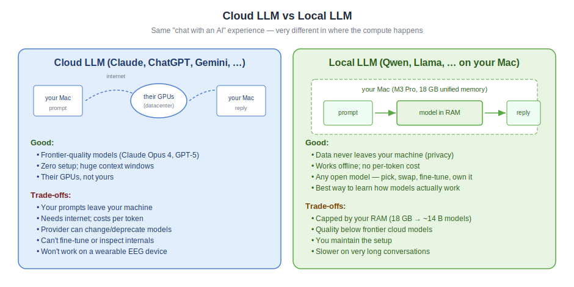

**Four reasons that matter for this project:**

1. **Learning.** You can't inspect Claude's weights or watch it think. A local model is transparent — you *own* the file, you *see* the memory, you *control* the settings. That's how you actually understand what an "LLM" is.
2. **Privacy & offline.** Nothing leaves your machine. Good for personal notes, medical data, or exploring without a bill.
3. **Freedom to fine-tune.** Modules 4–5 will train the model further on your data. That's only possible with weights you can touch — which means local, open-weights models.
4. **Phase 2 demands it.** A wearable EEG stress detector cannot round-trip every prediction to a cloud API — it would be slow, expensive, and privacy-invasive. Whatever we build for Phase 2 *must* run on-device. Doing local now is training-wheels for that.

**Reasonable expectations:** local models on 18 GB won't feel like Claude Opus. They'll feel like a solid junior assistant — good enough for many tasks, and the perfect canvas to learn on.

#### 2. Anatomy of a model download — what's actually in the file(s)

When someone says "download Qwen3-8B," they're pointing you at a *folder* of files on Hugging Face (the public model hub). Every open-weights LLM ships as basically the same set:

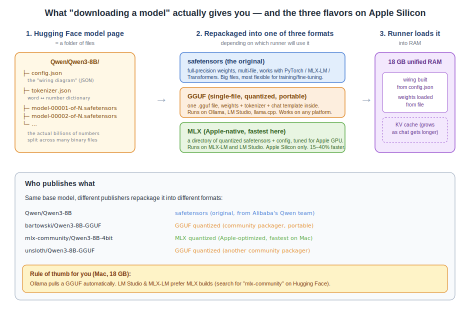

The folder holds:

- **`config.json`** — the *wiring diagram*. Tells the runner "this is a transformer with 32 layers, 4096 hidden dimensions, vocabulary size 152k, …" No weights inside, just structure.
- **`tokenizer.json`** (and friends) — the *word ↔ number dictionary*. When you type "hello", this file says "that's token IDs [15496]". Every family (Qwen, Llama, Gemma) has its own tokenizer.
- **`model-00001-of-N.safetensors`** — the actual **billions of numbers**. Usually split into 4-5 GB chunks because a single 16 GB file is unwieldy.

Total download for an 8B model at 4-bit quantization: roughly 4–5 GB. That's all that "having a model" means physically — a folder on disk.

#### 3. Three file formats you'll see (and which tool eats which)

Same underlying weights, three different packaging conventions:

| Format | What it is | Runners that use it | When to prefer |
|---|---|---|---|
| **safetensors** | The original full-precision (or lightly quantized) weights as they came from the original team. Multi-file. | PyTorch, MLX-LM, Hugging Face Transformers | Fine-tuning; you want originals |
| **GGUF** | A single self-contained file: quantized weights + tokenizer + chat template baked in. Portable across OSes. | Ollama, LM Studio, llama.cpp | Portability, simple install |
| **MLX** | A directory of quantized safetensors + config, laid out for Apple's MLX framework | MLX-LM, LM Studio (MLX runtime) | Fastest inference on Apple Silicon (15–40% quicker than GGUF) |

**Publisher naming convention.** The same model ships from multiple publishers in different formats. All of these are the same "Qwen3-8B" weights, repackaged:

```
Qwen/Qwen3-8B                    ← the original team, safetensors
bartowski/Qwen3-8B-GGUF          ← community packager, GGUF
mlx-community/Qwen3-8B-4bit      ← community packager, MLX format
unsloth/Qwen3-8B-GGUF            ← another community packager
```

`mlx-community` is the go-to publisher for MLX-format models. `bartowski` and `unsloth` are the top GGUF packagers. You rarely download originals directly — you grab a repackaged version that matches your runner.

#### 4. Reading a model's name

Once you know the pattern, model names decode themselves:

```
mlx-community  /  Qwen3        -  8B         -  Instruct                -  4bit
─────┬──────      ──┬──         ──┬──         ────┬────                    ──┬──
publisher         family        size           variant                     quantization
(who packaged)    (Alibaba's    (8 billion    ("Instruct" = fine-tuned    (4 bits per
                  Qwen team,    parameters)   for chat; alternative is     weight instead
                  Qwen3 gen)                  "Base" = raw pretrained)     of default 16)
```

**Ollama uses a shorter form:**

```
ollama run qwen3.5:9b
                ─┬─
              size tag; Ollama picks the sensible quantization for you
```

Under the hood Ollama is still fetching a GGUF from its own registry, but it hides all the packaging detail behind the `family:size` tag.

#### 5. Quantization — the trick that lets 18 GB run 8B and 14B models

**The problem.** A raw 8B model at 16-bit precision = 8B × 2 bytes = **16 GB just for weights**. Add working memory and it doesn't fit.

**The trick.** Store each weight in fewer bits. 4 bits instead of 16 is a **4× reduction** — an 8B model shrinks to ~4 GB.

**Why it still works.** Neural network weights carry information redundantly, and inference is naturally tolerant of small rounding errors — the same reason JPEG can compress a photo 10× without you noticing. Modern quantization schemes are clever about which layers get the harshest compression, so 4-bit models perform roughly on par with their 16-bit originals for chat tasks.

**The bits ladder:**

| Precision | Bits/weight | Size for 8B | Quality | Speed |
|---|---|---|---|---|
| FP32 (float32) | 32 | 32 GB | Reference | Slowest |
| FP16 / BF16 | 16 | 16 GB | Nearly identical to FP32 | Fast |
| Q8 (8-bit int) | 8 | 8 GB | Indistinguishable in chat | Fast |
| **Q4 / 4-bit** | 4 | **4 GB** | 95–98% of original | **Fastest** |
| Q3 / Q2 | 3 / 2 | 3 / 2 GB | Noticeably worse | Very fast |

**Reading GGUF quantization codes.** In GGUF-land you'll see names like `Q4_K_M`. Decoded:

- `Q4` — 4 bits average per weight
- `_K_` — "K-quants" family (a smarter mixed-precision scheme)
- `_M` — medium size within that family (there are `_S` small, `_M` medium, `_L` large)

For your 18 GB Mac, **`Q4_K_M`** (GGUF) or **`4bit`** (MLX) is the default sweet spot for everything up to ~14B. Only step down to Q3 if a model won't fit; only step up to Q8 if you have room to spare and want maximum quality.

#### 6. The three tools we'll actually use

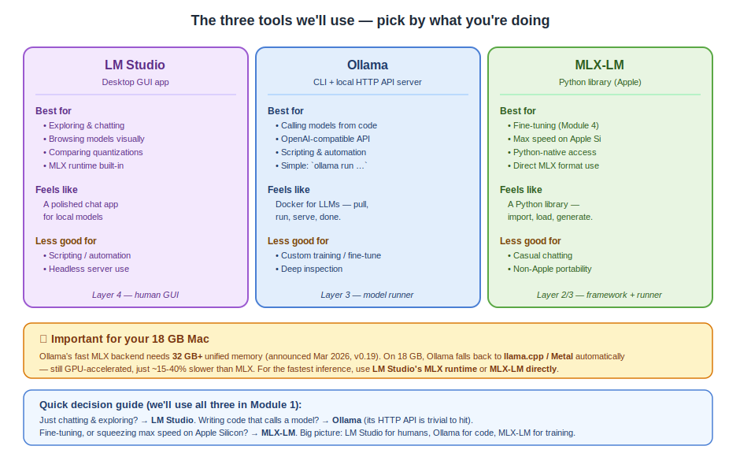

Referencing the layered stack from Module 0 — all three tools live in Layer 3 (model runners), just wearing different clothes:

- **LM Studio** — a polished desktop app. Search Hugging Face inside the app, one-click download, chat. Ships with an MLX runtime that Just Works on Apple Silicon.
- **Ollama** — a background service + `ollama` CLI. `ollama run qwen3.5:9b` gives you a chat prompt in one line. Also exposes a **local HTTP server on `localhost:11434`** with an OpenAI-compatible API — you can point any OpenAI SDK at it.
- **MLX-LM** — a Python library. `from mlx_lm import load, generate`. Direct MLX-format use, and the tool we need in Module 4 for LoRA fine-tuning.

We'll use **all three** in this module's Hands-on to feel the difference.

#### 7. Important gotcha: Ollama's MLX backend and your 18 GB Mac

You may see 2026 articles saying "Ollama now uses MLX and is 2× faster on Apple Silicon." True — but with a footnote that matters to you:

- **Ollama 0.19 (March 2026) shipped an MLX backend** that bypasses llama.cpp and runs inference through Apple's MLX directly.
- **It requires ≥ 32 GB unified memory.** On smaller machines, Ollama silently falls back to its previous **llama.cpp / Metal** path.
- **Your Mac has 18 GB → Ollama will use llama.cpp / Metal.** Still GPU-accelerated, still fast, just ~15–40% slower than an equivalent MLX-native run.

**Practical implication:**

- Use Ollama when you want the ergonomics (`ollama run …`, HTTP API) and don't need the last ounce of speed.
- Use **LM Studio's MLX runtime** or **MLX-LM directly** when you want the fastest inference on your hardware.
- We'll actually see the difference in Hands-on by timing the same model on both paths.

#### 8. Where models live: Hugging Face

Hugging Face (huggingface.co) is the "GitHub of models." It hosts:

- **Model repos** — that folder of files we described in Section 2. Free to download, most have permissive licenses.
- **Model cards** — the README for each repo. Tells you what the model does, how it was trained, which licenses apply, and typical benchmarks.
- **Datasets** — training and evaluation data (we'll use these in later modules).
- **Spaces** — hosted demos (not our concern for now).

**Publishers you'll see a lot:**

- Original teams: `Qwen`, `meta-llama`, `google`, `mistralai`, `deepseek-ai`.
- Community repackagers: `mlx-community`, `bartowski`, `unsloth`, `TheBloke` (historically prolific).

You mostly won't visit huggingface.co directly — Ollama, LM Studio, and MLX-LM all fetch from it under the hood — but it's useful to know that any model *name* is really a Hugging Face URL: `mlx-community/Qwen3-8B-4bit` → `huggingface.co/mlx-community/Qwen3-8B-4bit`.

#### 9. Memory: weights + KV cache = your real budget

Not all of your 18 GB is available for a model. Rough breakdown when a model is loaded and mid-chat:

```
18 GB unified memory
├── macOS + apps        ≈ 3–4 GB (Chrome open? more)
├── model weights       ≈ params × bytes-per-weight  (8B × 0.5 = 4 GB at Q4)
├── working state       ≈ 1 GB (activations while computing)
└── KV cache            grows with your conversation length
```

**What's the KV cache?** Every token the model processes leaves a small footprint in memory so it can be attended to by future tokens. As your chat gets longer, this pile grows. Roughly:

```
KV cache ≈ context_length × 2 × layers × heads × head_dim × bytes-per-value
```

Concrete numbers for Qwen3-8B at Q4:

- Empty chat: ~5 GB total (weights + working).
- 4,000-token conversation: +0.5–1 GB for KV cache.
- 32,000-token conversation: +4–8 GB — you're now competing with the model itself for RAM.

**The takeaway:** long conversations don't just get slow, they get *fatter*. If a chat drags on and your Mac starts thrashing, that's the KV cache filling RAM. Solutions: start a fresh chat, use a smaller context window, or pick a model with a "sliding window" attention design.

#### 10. Picking your first model (July 2026)

Fresh landscape check as of this month:

**Top picks for an 18 GB Mac chat use case:**

| Model | Size @ Q4 | Why |
|---|---|---|
| **Qwen 3.5 9B** ⭐ | ~5–6 GB | Current sweet spot: beats models 3× its size on reasoning; `/think` mode for chain-of-thought; Apache-2.0 license |
| **Gemma 4 (E4B / 12B)** | ~3 / 7 GB | Google's family, strong general chat; Gemma 4 12B fits comfortably with headroom |
| **Llama 3.3 8B** | ~4 GB | Meta's; solid, well-documented; a bit older feel but rock-solid |
| **Qwen3 14B** | ~8 GB | Step up in capability, still comfortable on 18 GB |
| **Qwen3-30B-A3B** (MoE) | ~15 GB | Ceiling of what fits; close other apps to run it |

**Rule of thumb we'll use throughout:** start with **Qwen 3.5 9B at Q4** (or the MLX-community 4-bit build). It's the current safest default across chat, coding, and reasoning. Swap later if you need something specific.

#### Checkpoint for this section

Before we do Hands-on, you should be able to answer:

1. Name three concrete reasons to run models locally instead of calling an API.
   - Privacy is guranteed as data does not leave the laptop
   - Training : Model weights can be changed easily and effect can be easily verified locally.
   - Open Weights : Model weights can be viewed / explored to understand how model works.
2. What's the difference between GGUF and MLX formats, and which runner uses which?
3. In `mlx-community/Qwen3-8B-4bit`, what does each of the five parts mean?
   - Publisher : mlx-community
   - Model Name / Series : Qwen3
   - Parameters : 8 Billion
   - Model Type : Instruction (Chat based)
   - Quantization : 4 bit
4. What's quantization solving? Why does Q4 still work well?
   - Quantization helps efficiently store model weight in 4 bits instead of 16 bits. Reducing number of bits approximates but have very little loss in terms of inference hence it still works well.
5. Why won't Ollama's MLX backend be used on your Mac?
   - Ollama's MLX backend requires 32GB hence it won't be used on my Mac with 18GB RAM and it will fallback to Ollama + Metal
6. What does the KV cache do, and why does it grow?
   - KV Cache stores tokens encountered in cache for faster lookups in future so as chat progresses no of tokens increases and so do the KV cache/
7. Which model would you start with, and why?
   - I will start with Google Gemma 4 12B as it will easily fit into my 18GB RAM.

**My review of your answers:**

- **Q1 — solid.** Privacy, inspectability, fine-tuning-ability — all valid. Add one more if you want: *Phase 2 requires on-device inference* (a wearable can't round-trip to a cloud API).
- **Q2 — you left this blank, so filling it in for you:** **GGUF** is a *single self-contained file* (weights + tokenizer + chat template baked in) used by **Ollama** and **llama.cpp** — portable across OSes. **MLX** is a *directory* (quantized safetensors + config) used by **MLX-LM** and **LM Studio's MLX runtime** — Apple Silicon only, ~15–40% faster on your Mac.
- **Q3 — perfect.**
- **Q4 — correct.** Small nuance on *why* it works: neural nets are naturally redundant (many weights encode similar patterns from slightly different angles), so rounding a few doesn't destroy the model's behavior.
- **Q5 — perfect.**
- **Q6 — close, but a subtle correction.** The KV cache does *not* store the raw tokens themselves. It stores the **key and value vectors** each transformer layer computed *for* each past token. When a new token arrives, the model performs a fresh attention pass over those cached vectors instead of re-running earlier tokens through the network. That's why it grows linearly with conversation length — one set of K/V vectors per past token, per layer.
- **Q7 — Gemma 4 12B is a legitimate pick** and fits comfortably on 18 GB (~7 GB at Q4). My primary recommendation was **Qwen 3.5 9B** because current July-2026 benchmarks put it slightly ahead on reasoning, and its smaller footprint leaves more room for KV cache in long conversations. But both are strong choices — you can try them side-by-side in Hands-on.

All accepted. Moving on.

### Hands-on

**Goal:** chat with a local LLM three ways — GUI, terminal, Python — and *feel* the speed difference between Ollama's fallback path and MLX-LM native on your 18 GB Mac.

**Preconditions**

- Module 0 environment complete (`verify_environment.py` all `[PASS]`).
- venv active (`cd ~/destress && source .venv/bin/activate`).
- ~10 GB free disk (models cache locally).

**One extra Python package to install:**

```bash
uv pip install openai
```

We need the `openai` client library to hit Ollama's OpenAI-compatible HTTP API — Ollama speaks the same protocol Anthropic's competitor invented, so the exact same code works against a local model or a paid API.

#### Path 1 — LM Studio (GUI)

**Install.** Download from [lmstudio.ai](https://lmstudio.ai) → drag to `/Applications` → open.

**Download a model.**

1. In LM Studio, click the magnifying-glass icon (Discover / Search) in the left sidebar.
2. Search for `Qwen3-8B` or `Gemma 4 12B`. In the results, filter by **MLX** format (LM Studio labels these). Pick a **4-bit** build — should be ~5 GB.
3. Click Download. Wait for it to finish.

**Chat.**

1. Switch to the Chat tab (speech-bubble icon).
2. At the top, click the model dropdown → choose the model you just downloaded.
3. Type a message. First response takes a few seconds (the model loads); subsequent messages stream instantly.

**What to notice:**

- Open Activity Monitor (`Cmd+Space`, "Activity Monitor") → Memory tab. Watch the *LM Studio* process. Its "Memory" number jumps by ~5 GB when the model loads — that's the weights sitting in unified RAM.
- LM Studio shows a live "tokens/sec" counter under each response. On Qwen3-8B (MLX 4-bit) on your M3 Pro you should see roughly **30–60 tok/s**.
- Try a long question, then a short one. The `time to first token` (TTFT) is dominated by prompt length; generation speed is fairly constant.

#### Path 2 — Ollama (CLI)

**Install.**

```bash
brew install ollama
```

**Start the service** (it also starts automatically on boot after install):

```bash
ollama serve   # leave this running; open a new terminal for the next commands
```

**Pull a model** — Ollama fetches a GGUF-quantized build from its registry:

```bash
ollama pull qwen3:8b
```

**Chat in the terminal:**

```bash
ollama run qwen3:8b
```

You'll see a `>>>` prompt. Type a message, hit Enter, watch the reply stream. Type `/bye` to exit.

**Introspect what's running:**

```bash
ollama ps           # what's loaded in RAM right now, memory footprint, time-to-unload
ollama list         # everything you've pulled (they live in ~/.ollama/models)
ollama show qwen3:8b   # architecture, parameter count, quantization, context length
```

**What to notice:**

- After `ollama run`, `ollama ps` shows the model resident and how much RAM it's using.
- Ollama auto-unloads after 5 minutes of inactivity (configurable) — that's why the *first* prompt in a fresh session takes a couple seconds.

#### Path 3 — Ollama from Python (HTTP API)

This is the real payoff of Path 2: Ollama runs a **local HTTP server on port 11434** the whole time it's running. Any code speaking the OpenAI API can call it. This is how you'd embed a local LLM in an application.

Run the ready-made script:

```bash
python learn/01-run-local/chat_ollama.py
```

Open [chat_ollama.py](../learn/01-run-local/chat_ollama.py) to see what it does — a streaming chat call, only ~20 lines. Notice `base_url="http://localhost:11434/v1"` and `api_key="ollama"`. Change `MODEL` at the top to try a different model.

**Try changing the prompt.** Edit the `messages=` list in the script. Add a system prompt. See how the model responds differently.

#### Path 4 — MLX-LM directly (max speed on your Mac)

Ollama on your 18 GB machine uses its llama.cpp/Metal fallback (from the Concepts warning). To use MLX natively — the fastest option on Apple Silicon — we call MLX-LM directly from Python.

Run the ready-made script:

```bash
python learn/01-run-local/chat_mlx.py
```

**First run downloads ~5 GB** from Hugging Face into `~/.cache/huggingface/`; subsequent runs load instantly from disk. The script uses `mlx-community/Qwen3-8B-4bit` — an MLX-format 4-bit build.

**MLX-LM also has a CLI**, no Python needed:

```bash
mlx_lm.generate --model mlx-community/Qwen3-8B-4bit \
    --prompt "Explain LoRA in 2 sentences." \
    --max-tokens 200
```

Prints the response plus prompt-processing and generation speeds at the end.

#### Bonus — speed comparison

The big claim in Concepts was: on your 18 GB Mac, MLX-LM is ~15–40% faster than Ollama for the same model. Let's actually measure that:

```bash
python learn/01-run-local/speed_compare.py
```

The script sends the same 200-word explainer prompt through both Ollama's HTTP API and MLX-LM natively, times each, and prints tokens/second. First run will be slower for MLX (downloading + loading); the second run is the honest number.

**Expected result on your M3 Pro:**

| Runtime | Rough tok/s |
|---|---|
| Ollama (llama.cpp + Metal) | 35–55 tok/s |
| MLX-LM (Apple native) | 45–75 tok/s |

Actual numbers vary by prompt length, model, and current system load — but MLX should win.

#### Troubleshooting

- **`ollama: command not found`** — reopen your terminal after `brew install ollama` (PATH refresh needed).
- **`connection refused` from the Python script** — Ollama's server isn't running. Run `ollama serve` in another terminal, or start the app from `/Applications`.
- **First MLX-LM run stalls at "Loading..."** — it's downloading the model (~5 GB). Watch the terminal or `ls -lh ~/.cache/huggingface/hub/` to confirm progress.
- **"model not found" from `ollama pull qwen3:8b`** — the exact tag varies as Ollama's registry updates. Browse [ollama.com/library](https://ollama.com/library) for the current tag, or try `ollama pull qwen3` (default variant).
- **"repository not found" from MLX-LM** — the `mlx-community/…` name may have shifted. Browse [huggingface.co/mlx-community](https://huggingface.co/mlx-community) for the current 4-bit build of your preferred model, and update `MODEL` at the top of the script.
- **Chat is very slow, Mac gets hot** — check `ollama ps` for a *different* model still loaded. `ollama stop <name>` frees it.

#### Checkpoint — Module 1 complete

- [x] I chatted with a model in LM Studio (GUI).
- [x] I chatted with a model via `ollama run` (CLI).
- [x] `chat_ollama.py` streams a response into my terminal.
- [x] `chat_mlx.py` streams a response into my terminal.
- [x] `speed_compare.py` runs both and I can *see* the MLX advantage on my hardware.
- [x] I can explain the difference between the three tools and know which I'd reach for in different situations.

When all six are ticked, we move on to **Module 2 — How models work inside** (tokens, embeddings, attention, actual peek under the hood).

### Follow-up: "401 Unauthorized / Repository Not Found" from `chat_mlx.py`

You hit this on first run:

```
huggingface_hub.errors.RepositoryNotFoundError: 401 Client Error.
Repository Not Found for url: https://huggingface.co/api/models/mlx-community/Qwen3-8B-Instruct-4bit/…
```

**What actually happened.** My original guess at the model name — `mlx-community/Qwen3-8B-Instruct-4bit` — didn't exist on Hugging Face. The actual repo published by mlx-community is `mlx-community/Qwen3-8B-4bit` (no `-Instruct` suffix in the name; it *is* still the instruction-tuned chat variant, they just don't advertise it in the name).

**Why the error says "401 Unauthorized" instead of "404 Not Found"** — a legitimate confusion. Hugging Face deliberately returns 401 for both "repo doesn't exist" *and* "repo exists but is private/gated." This is a security decision: it hides whether a private repo exists at all from unauthenticated users. So a 401 when you *aren't* trying to access anything private almost always means "this name doesn't exist."

**How to find the right name yourself next time.** Two ways:

1. **Browse the org listing** on Hugging Face — [huggingface.co/mlx-community](https://huggingface.co/mlx-community) lists everything they've published. Filter or search for "Qwen3-8B".
2. **Search the site** — [huggingface.co/models?search=mlx-community/Qwen3-8B](https://huggingface.co/models?search=mlx-community/Qwen3-8B) shows all variants at once.

Community publishers name inconsistently. Some examples I saw for Qwen3-8B alone:

- `mlx-community/Qwen3-8B-4bit` ← what we want (~4.6 GB on disk, Apache-2.0)
- `mlx-community/Qwen3-8B-4bit-AWQ` — AWQ quantization variant
- `lmstudio-community/Qwen3-8B-MLX-4bit` — LM Studio's own packaging
- `mlx-community/Qwen3-VL-8B-Instruct-4bit` — vision-language variant (not what we want)

**Fixed.** I updated both `chat_mlx.py` and `speed_compare.py` to `mlx-community/Qwen3-8B-4bit`. Rerun:

```bash
python learn/01-run-local/chat_mlx.py
```

Now the download will start (watch the terminal for progress; ~4.6 GB into `~/.cache/huggingface/hub/`).

### Follow-up: Why does each tool re-download the same model? Is there a shared cache?

Short answer: **no universal shared cache exists today** — and it is genuinely wasteful. Downloading Qwen3-8B through LM Studio, Ollama, and MLX-LM really does mean ~15 GB of near-duplicate data on disk.

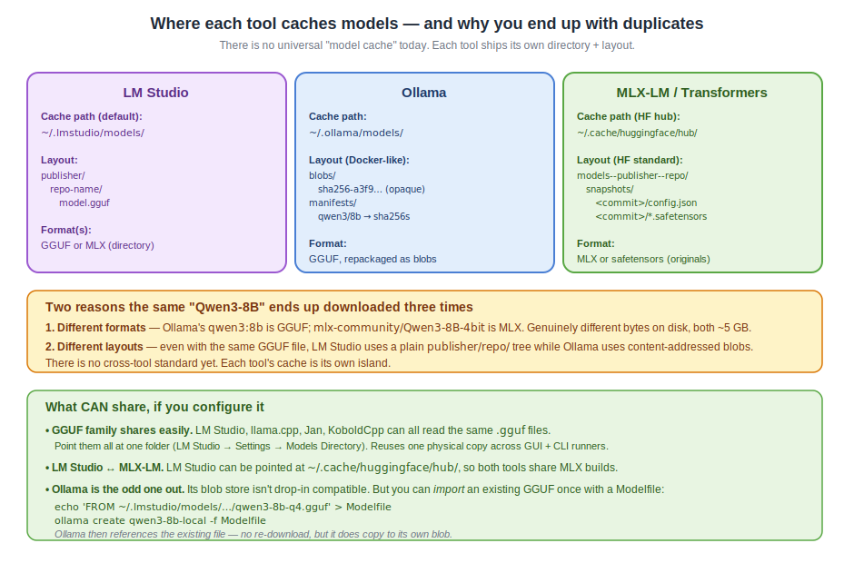

**Two reasons they can't dedupe:**

1. **Different file formats.** Ollama's `qwen3:8b` is a *GGUF* file. `mlx-community/Qwen3-8B-4bit` is *MLX* format (a folder of safetensors + config). Same underlying model, quantized and packed by different toolchains, produces genuinely different bytes on disk. Even a hypothetically shared cache couldn't dedupe these.
2. **Different cache layouts.** Even for pure GGUFs, LM Studio uses a plain `publisher/repo/` folder tree while Ollama uses a Docker-style content-addressed blob store with opaque `sha256-…` filenames plus JSON manifests. They can't see into each other's directories.

**Where each tool caches on your Mac:**

| Tool | Cache directory | On-disk layout |
|---|---|---|
| LM Studio | `~/.lmstudio/models/` | `publisher/repo/model.gguf` — human-readable |
| Ollama | `~/.ollama/models/` | `blobs/sha256-…` + `manifests/…` — content-addressed |
| MLX-LM / Transformers | `~/.cache/huggingface/hub/` | HF standard: `models--publisher--repo/snapshots/…` |

**What you *can* share, if you configure it:**

- **GGUF is the most inter-compatible.** LM Studio, llama.cpp, Jan, KoboldCpp all read the same `.gguf` files. Point them at one folder → one physical copy, many tools.
- **LM Studio ↔ MLX-LM** — LM Studio's *Settings → Models Directory* can be pointed at `~/.cache/huggingface/hub/`, so MLX builds you fetch via Python are visible in the LM Studio UI.
- **Ollama is the odd one out**, but you can *import* an existing GGUF once without a re-download:
  ```bash
  echo 'FROM ~/.lmstudio/models/…/qwen3-8b-q4_k_m.gguf' > Modelfile
  ollama create qwen3-8b-local -f Modelfile
  ```
  Note: Ollama still copies the file into its own blob store, so you save the *download* but not the *disk*.

**Practical rule going forward.** Don't keep all three tools active. Pick one primary path per use:

- **Python-heavy work** → MLX-LM as your default (fastest on your 18 GB Mac, single cache under `~/.cache/huggingface/hub/`). Keep Ollama installed only when you need its HTTP API.
- **Chat-app usage** → LM Studio (its MLX runtime is competitive with MLX-LM). Skip Ollama entirely unless you need the API.

For the rest of this course we'll lean on **MLX-LM + Ollama**. LM Studio was Module 1's "get chatting fast" demo and can be uninstalled later if disk is tight.

### Follow-up: Base vs Instruct variants — what's the actual difference?

A pretrained model comes in two flavors. Same weights family, different final training.

**Base** = the raw model straight off large-scale pretraining. It has read enormous amounts of text and its one skill is *predict the next token*. It has no notion of "conversation" — every prompt is just more text to continue.

**Instruct** (also called *IT*, *Chat*, *SFT*) = a Base model that was *further trained* on curated `instruction → response` pairs, plus formatted with a chat template (special tokens marking who said what). Now the model knows: when it sees a user turn, it should emit an assistant response.

**Concrete example — same prompt, different outputs:**

| Prompt: "What is the capital of France?" |
|---|
| **Base (Qwen3-8B-Base)** — "What is the capital of Germany? What is the capital of Spain? What is the capital of Italy? These are common geography questions that…" *(it's autocompleting a list of questions, not answering yours)* |
| **Instruct (Qwen3-8B)** — "The capital of France is Paris." *(follows your instruction; answers)* |

**Why Base models exist even though Instruct is what most people want:**

- **Fine-tuning starting point.** In Module 4 we take a Base model and further train it on our data. Starting from Base is cleaner because Instruct training might conflict with the behavior we're teaching.
- **Text completion tasks.** IDE autocomplete, structured text generation, code models embedded in build tools.
- **Research.** Comparing raw model capabilities without instruction-tuning artifacts.

**Naming conventions you'll see:**

- `Qwen3-8B` (no suffix) — modern Qwen convention: default IS instruction-tuned; base is separately called `Qwen3-8B-Base`.
- `google/gemma-3-8b-it` (Instruction-Tuned) vs `google/gemma-3-8b-pt` (Pretrained / base).
- `Llama-3-8B` (base) vs `Llama-3-8B-Instruct` (chat). Meta's convention.
- `-Chat`, `-DPO`, `-RLHF` — all variants of "further tuned for dialogue," each with a different method. From your point of view they're all "instruct-style."

**Which do you want?** For everything in this course except Module 4's fine-tuning experiments, **use Instruct**. For Ollama and LM Studio you almost always are, because default tags (like `qwen3:8b`) pull the Instruct variant automatically.

### Follow-up: Model-name abbreviations glossary (exhaustive)

Community publishers name inconsistently. Once you know the abbreviation vocabulary, any name decodes at a glance.

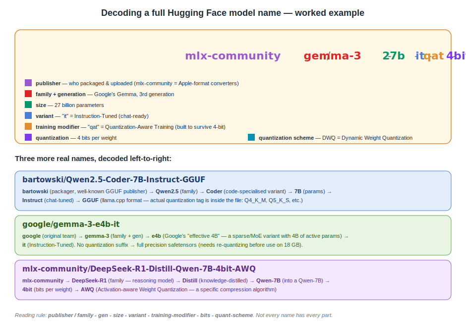

**The general reading pattern:**

```
publisher / family - generation - size - variant - training-modifier - bits - quant-scheme
```

Not every name has every part. Publishers pick and choose.

**Variant / capability suffixes**

| Suffix | Meaning |
|---|---|
| `Base`, `-pt` | Raw pretrained — text-continuation only |
| `Instruct`, `-it`, `-IT`, `-Chat`, `-SFT` | Instruction / chat-tuned |
| `-DPO`, `-RLHF` | Further tuned by Direct Preference Optimization / Reinforcement Learning from Human Feedback |
| `Coder`, `-Code` | Specialized for programming |
| `Math` | Specialized for math reasoning |
| `Reasoning`, `Thinking`, `R1`, `-o1` | Chain-of-thought reasoning model |
| `Distill`, `Distilled` | Small model trained to imitate a large one |
| `VL`, `Vision` | Multimodal — accepts images |
| `Omni` | Multimodal — text/image/audio |
| `Audio` | Speech-in, speech-out |
| `Nemo` | NVIDIA-tuned or NVIDIA-flavored variant |

**Size and architecture indicators**

| Token | Meaning |
|---|---|
| `1.5B`, `7B`, `13B`, `27B`, `70B` | Total parameters (billions) |
| `A3B`, `A0.5B` | Active parameters in a Mixture-of-Experts model (e.g. `30B-A3B` = 30B total, 3B active per token) |
| `MoE` | Mixture-of-Experts architecture |
| `E4B`, `E2B` | Google's "effective 4B / 2B" — sparse variants with those active params |
| `128K`, `1M` | Context window size (tokens) |

**Quantization — precision**

| Token | Meaning |
|---|---|
| `FP32`, `FP16`, `BF16` | Full or half-precision floating point (no compression) |
| `Q8`, `8bit`, `INT8` | 8-bit — indistinguishable quality from FP16 in chat |
| `Q4`, `4bit` | 4-bit — sweet spot; ~4× smaller, ~95-98% quality |
| `Q5_K_M`, `Q4_K_S`, `Q3_K_L` | GGUF K-quant family: `Q<bits>_K_<Small/Medium/Large>` |
| `IQ4_XS`, `IQ2_XXS` | Importance-quantized — smarter compression at low bit-rates |
| `NF4` | 4-bit NormalFloat (from the QLoRA paper) |
| `Q2`, `Q3` | 2-bit / 3-bit — noticeably degraded; last-resort fit |

**Quantization — algorithm/scheme**

| Token | Meaning |
|---|---|
| `AWQ` | Activation-aware Weight Quantization — protects the most-active weights from harsh compression |
| `GPTQ` | GPT-style Quantization — older post-training method |
| `EXL2` | ExLlama v2 format — flexible per-layer bit widths |
| `DWQ` | Dynamic Weight Quantization — MLX-family scheme |
| `QAT` | Quantization-Aware Training — the *model was trained knowing it would be quantized* → survives 4-bit better |
| `PTQ` | Post-Training Quantization (contrast to QAT) |

**File formats**

| Token | Meaning |
|---|---|
| `GGUF` | llama.cpp's portable single-file format (Ollama, LM Studio) |
| `GGML` | Old predecessor to GGUF — avoid |
| `MLX` | Apple-Silicon-native format |
| `safetensors` | Hugging Face standard weight file (no chat template baked in) |

**Fine-tuning artifacts**

| Token | Meaning |
|---|---|
| `LoRA` | Low-Rank Adaptation — a tiny fine-tuning add-on |
| `QLoRA` | LoRA on top of a quantized base model |
| `adapter` | LoRA weights only (needs base model to run) |
| `merged`, `fused` | LoRA merged back into base weights → standalone model |

**Common publishers you'll see**

| Publisher | What they ship |
|---|---|
| `Qwen`, `meta-llama`, `google`, `mistralai`, `deepseek-ai`, `microsoft` | Original teams — usually safetensors, sometimes official GGUF/MLX |
| `mlx-community` | Community MLX-format conversions |
| `bartowski` | Prolific GGUF quantizer; builds within hours of a new model's release |
| `unsloth` | GGUFs + fine-tuning toolkit |
| `lmstudio-community` | LM Studio's curated builds |
| `TheBloke` | Historically the most prolific GGUF packager; less active in 2025-2026 |

**Worked example — decode this yourself:**

```
mlx-community/gemma-3-27b-it-qat-4bit-DWQ
```

Left to right:

- `mlx-community` — publisher (community MLX-format converters)
- `gemma-3` — family and generation (Google's Gemma, 3rd generation)
- `27b` — 27 billion parameters *(too big for your 18 GB Mac at 4-bit; ~14 GB — leaves almost no room for context)*
- `it` — Instruction Tuned (chat-ready)
- `qat` — Quantization-Aware Training (built to survive 4-bit gracefully)
- `4bit` — 4 bits per weight
- `DWQ` — Dynamic Weight Quantization (an MLX-specific compression scheme)

**Reading rule:** work left to right, ignore parts you don't recognize (you can always look them up), and trust that the *middle* usually tells you what the model *is* (family + size + variant) while the *tail* tells you how it was *packaged* (bits + scheme + format).

---

## Module 2 — How models work inside

### Concepts

**Goal of this module:** open the black box. By the end of this section you'll be able to draw, from memory, what happens between the moment you press Enter and the moment the first word of the reply appears. No new tools, no new commands — just understanding.

Everything in the last two modules told you *what* a model is and *how to run one*. Now we look at *how it thinks*.

#### 1. The full pipeline — the map before the deep-dive

Every LLM does the same six-stage dance, once per output token:

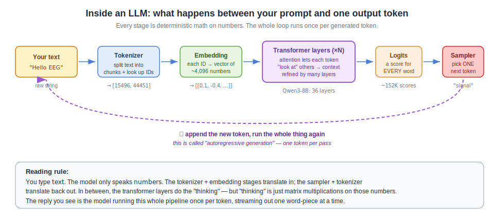

Read left to right:

1. **Your text** goes in as a raw string.
2. **Tokenizer** splits it into chunks the model knows about, and looks up an integer ID for each chunk.
3. **Embedding** turns each integer ID into a long list of numbers (a vector) that captures the token's "meaning."
4. **Transformer layers** — 30–80 stacked layers — refine those vectors so that each one carries context from the surrounding words.
5. **Logits** — the final layer emits a raw score for *every word in the vocabulary* (Qwen3-8B has ~152,000).
6. **Sampler** picks one word from that distribution. That's the next output token.

Then the loop back: the picked token gets appended to the input, and the whole thing runs again to produce the *next* token. And again. And again. Until the model emits a stop token or hits a length limit.

That's why generation is one word at a time — each word is a full trip through the whole 8-billion-parameter network.

Let's unpack each stage.

#### 2. Stage 1 — Tokenization: text → integer IDs

Models don't see words. They see **integers**. Before any math happens, we translate.

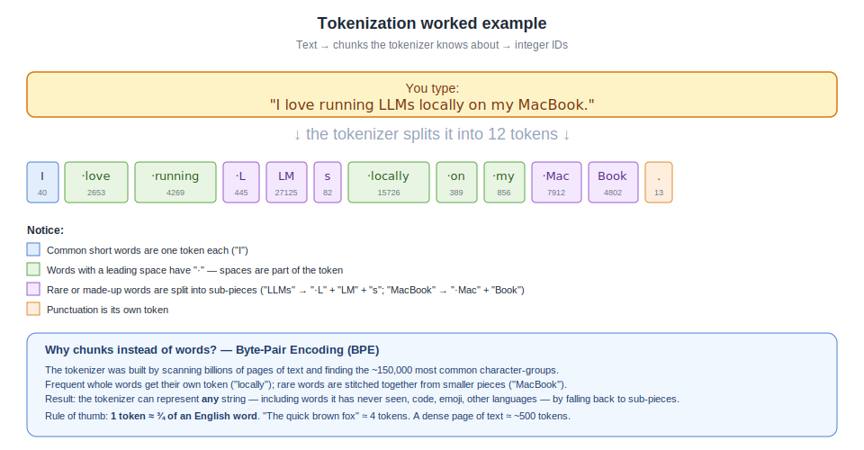

**Why chunks, not words?** Because human language has ~600,000+ English words, plus code, other languages, emoji, misspellings, and made-up words like "MacBook." A word-based vocabulary would be huge *and* still miss things. Instead, the tokenizer is trained by a technique called **Byte-Pair Encoding (BPE)**:

1. Start with every raw byte as its own token (256 tokens).
2. Scan a massive text corpus, find the most common adjacent pair, merge it into a new token.
3. Repeat ~150,000 times.

Result: common words end up as single tokens ("locally"), rare words become 2-3 sub-tokens ("MacBook" → "·Mac" + "Book"), and *anything* can be encoded — including things the tokenizer has never seen, by falling back to sub-pieces.

**Rules of thumb you'll use daily:**

- **1 token ≈ ¾ of an English word.** A dense page of text ≈ ~500 tokens.
- **Leading spaces are part of the token.** "cat" and " cat" are different token IDs. That's why you see the "·" in the diagram.
- **Every model family has its own tokenizer.** Qwen and Llama break "MacBook" differently. Their vocabularies are incompatible — you can't mix and match.
- **Context window is measured in tokens, not words.** A 32K context window ≈ 24,000 English words ≈ 50 pages.
- **Token count = cost + latency.** Even for a free local model, more tokens = slower generation and more KV-cache memory.

Chinese, Japanese, code, and math tend to be *more* token-heavy per character than English — a Chinese page might be ~1,500 tokens where an English page is ~500. Something to remember when you use a small model in a non-English language.

#### 3. Stage 2 — Embeddings: integer IDs → meaning-vectors

An integer ID like `15726` for "·locally" doesn't tell the model anything by itself. So the very first thing the model does after tokenizing is **look up a vector for each ID** in a big table.

**The embedding table** is one of the model's own learned components — a matrix of size `vocab_size × embed_dim`. For Qwen3-8B that's roughly `152,000 × 4,096` = 623 million numbers, all learned during training. Row 15726 of that table is the "meaning" of `·locally`.

**What does "meaning" look like?** Just a list of 4,096 numbers. There's no human-interpretable label like "location:0.9, formality:0.4" — the model organizes the space however training happened to shape it. But something structural emerges:

- **Similar tokens end up near each other.** The vector for `·dog` sits close to `·cat` and `·puppy`, and far from `·quantum`.
- **Directions carry meaning.** In a famous early example (Word2Vec, 2013), the vector arithmetic `king − man + woman ≈ queen` actually works — because the direction "male → female" is encoded consistently across gendered word pairs.
- **Analogies are directions.** "Paris is to France as Tokyo is to ___" becomes a nearest-neighbor lookup in the embedding space.

This is where the model's compressed knowledge of language geometry lives. Everything downstream operates on these vectors, not on the original words.

**Where the embedding table sits in a model file:** it's a huge chunk of the parameters. For small models (1–3B params), the embedding + output layers can be *half* the total parameters. That's why small vocabularies matter for small models.

#### 4. Stage 3 — Transformer layers & attention: the actual "thinking"

If embeddings gave us *isolated meaning* per token, transformer layers add *context*. Every layer looks at all the tokens together and refines each one's vector based on the others.

The single most important operation inside a transformer layer is **attention**.

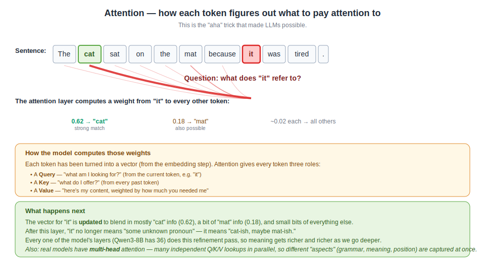

Consider the sentence:

> "The cat sat on the mat because it was tired."

The word "it" is ambiguous — could refer to "cat" or "mat." Humans figure this out from context. So does the model, through attention.

**How attention works (mechanically):**

For each token, the model computes three vectors:

- **Query** — "what am I looking for?" (produced from the current token's vector)
- **Key** — "what do I offer?" (produced from every past token's vector)
- **Value** — "here's the actual content I contribute"

The model dot-products the Query against every Key. Big overlap → high attention weight. In our example, "it"-as-a-Query overlaps strongly with "cat"-as-a-Key (both refer to animate subjects), so the weight from "it" → "cat" ends up around 0.62. The weight to "mat" is smaller (~0.18) because "it" refers to an animate thing more often than an inanimate one. Everything else gets tiny weights.

The Values, weighted by those attention weights, are summed up and added to the "it" vector. After this one attention pass, the vector for "it" has literally absorbed most of "cat" and a bit of "mat." Its meaning is no longer "some pronoun" — it's "a cat-ish thing."

**Then stack the layers.** Qwen3-8B has **36 transformer layers**. Each layer does its own attention pass, plus a small feed-forward network (the neural-net primitive from Module 0 — weighted sums and activations). Every pass refines meaning further:

- Layer 1–5 mostly resolve syntax ("which noun does this verb belong to?").
- Middle layers weave in semantic context ("this is about a cat, being tired, in a domestic setting").
- Later layers do task-relevant reasoning ("the user is asking a factual question, my next word should be an assertion").

Nobody hand-coded these interpretations — they emerged during training. But researchers can inspect attention weights and often see human-recognizable patterns.

**Multi-head attention** — real models don't run *one* attention pass per layer, they run many (say, 32) in parallel, each with its own Q/K/V transformation. Different "heads" pick up different aspects — one might focus on grammar, another on long-range coreference, another on formatting. Their outputs are concatenated and mixed.

**Result of Stage 3:** you started with a list of standalone token vectors. You now have a list of *context-rich* vectors where each one has been updated by every other. The whole sentence's meaning is distributed across them.

#### 5. Stage 4 — Logits and sampling: how the model actually picks a word

At the very end of the transformer stack, we take the last token's vector (the one representing the *end* of the input so far) and do one more matrix multiplication against a **big output matrix**. The result: one raw score per word in the vocabulary. These raw scores are called **logits**.

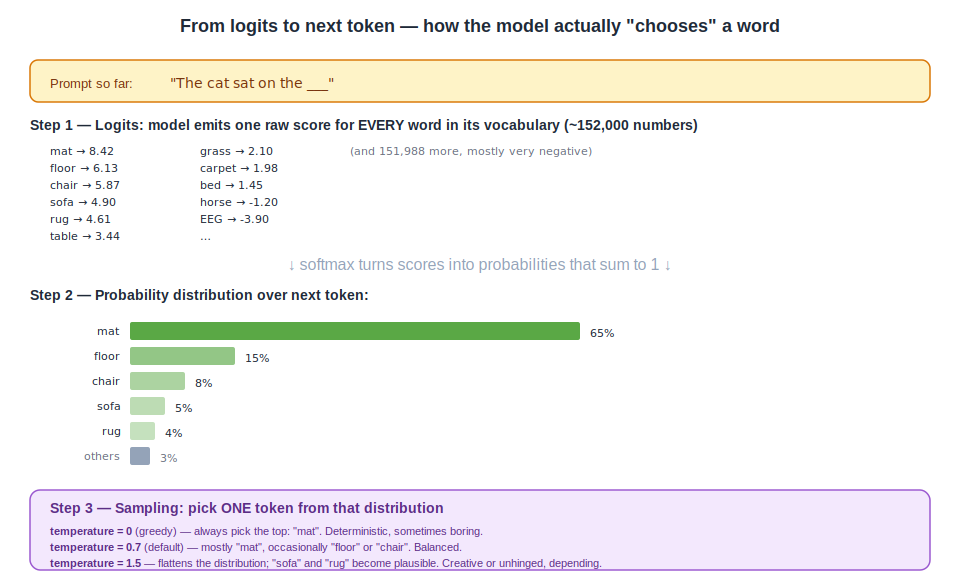

Raw logits are unbounded numbers — some very positive, most very negative. They're not directly meaningful. So we apply a function called **softmax** which:

- Exponentiates each logit (so bigger numbers get exponentially bigger weight).
- Normalizes so all values sum to 1.

Now we have a **probability distribution** over the entire vocabulary. In the diagram: "mat" has 65% probability, "floor" 15%, "chair" 8%, and the remaining 12% is spread across 151,995 other tokens.

**Then we sample.** The model doesn't just pick the top-scoring token by default — that's called **greedy decoding** (temperature = 0). It's fast and deterministic but often stilted and repetitive. Instead, most tools sample randomly from the distribution, biased toward higher-probability tokens.

**Sampling knobs you'll actually turn:**

| Knob | Effect |
|---|---|
| **temperature** | Divides the logits before softmax. `temp=0` → deterministic (greedy). `temp=1` → distribution as-is. `temp>1` → flatter, more creative/random. Typical chat: `0.5–0.8`. |
| **top-k** | Only consider the top `k` most likely tokens. `top_k=50` throws away everything else. Prevents very-low-probability weirdness. |
| **top-p** (nucleus) | Consider only enough tokens to cover `p` of the probability mass. `top_p=0.9` keeps whatever candidates it takes to reach 90% cumulative probability. Adaptive — sometimes 3 tokens, sometimes 20. |
| **repetition penalty** | Down-weights tokens that appeared recently. Stops the model from getting stuck in loops. |

Chat interfaces typically use `temperature=0.7` + `top_p=0.9` + a small repetition penalty. For code generation, `temperature=0.2` (more deterministic). For creative writing, `temperature=1.0` and higher.

**The sampled token is the next output.** It gets appended to the input string, and we go around the loop again to generate the token *after* that.

#### 6. The autoregressive loop — one token at a time

"Autoregressive" is jargon for "the model's own output becomes its next input." Every generated token is fed back into stage 1 (the tokenizer sees it as part of the growing sequence), and the whole 6-stage pipeline runs again to produce the token *after* that.

Consequences worth internalizing:

- **A 300-word answer requires ~400 forward passes** through the whole 8-billion-parameter network. That's why generation is slow — you can't parallelize this. Token N depends on token N-1.
- **Speed is measured in "tokens per second"**, not "words per second," precisely because tokens are the unit of generation.
- **The model has no plan.** It doesn't decide "I'll write a 3-paragraph answer" and then fill it in. It just picks the next token, over and over, until it happens to emit a stop token. Its coherence over hundreds of tokens is entirely a consequence of high-quality training.

This also explains **streaming**: your chat UI shows tokens as they're generated because *that's when they exist*. There's no completed answer sitting in memory waiting to be displayed.

#### 7. The KV cache, now that we understand attention

Back in Module 1 we said the **KV cache** grows with conversation length and eats memory. Now we can explain exactly *why*.

Recall Stage 3: for each token, every layer computes a Query, Key, and Value vector. The Query is the token asking "what should I attend to?"; the Keys and Values are what past tokens *offer* in response.

Here's the key observation: **the Keys and Values for past tokens don't change** when a new token arrives. They're a function of the tokens themselves, not of the token we're currently generating.

So we cache them.

For every token in your prompt and every token generated so far, we store its Key vector and Value vector — for every layer, for every attention head. When we generate token N+1, we don't re-run tokens 1..N through the model; we just look up their cached K/V vectors and do a fresh attention pass from the new token's Query against them.

**Size math** (roughly, for Qwen3-8B):

- 36 layers × 8 KV heads × 128 head-dim = 36,864 numbers of K + same of V per token.
- At half-precision (2 bytes each) that's ~150 KB per token.
- A 4,000-token conversation caches ~600 MB. A 32,000-token conversation caches ~5 GB.

That's the KV cache in your 18 GB budget. It's the reason long conversations get fatter and slower. The alternative — no cache — would mean re-running the entire network on every past token, every step. That would be intolerably slow.

You now have the full picture: **text → tokens → embeddings → transformer (attention + feedforward) → logits → sampled token → append → repeat**. Nothing hidden. Everything else you'll see (LoRA, RAG, longer context, tool use) sits on top of this exact pipeline.

#### Checkpoint for this section

Answer in your own words:

1. What's a "token" and why don't models just use whole words?
2. What are embeddings, and what does it mean that "similar meanings are nearby"?
3. In one sentence, what does an attention layer do?
4. What are Query, Key, and Value — and which one changes when a new token arrives?
5. Why does temperature = 0 make the model repetitive and boring?
6. Why does generation happen one token at a time, and what's the practical consequence?
7. Now that you know what attention needs, explain in your own words why the KV cache grows linearly with conversation length.

Answer these and we do Hands-on (where you'll poke at a real tokenizer, sample with different temperatures, and watch a real model generate one token at a time).

### Follow-up: "8B parameters" vs "4,096 embedding dim" — what's the difference?

Legit confusion. Two numbers, both large, both keep showing up — but they measure *different things*.

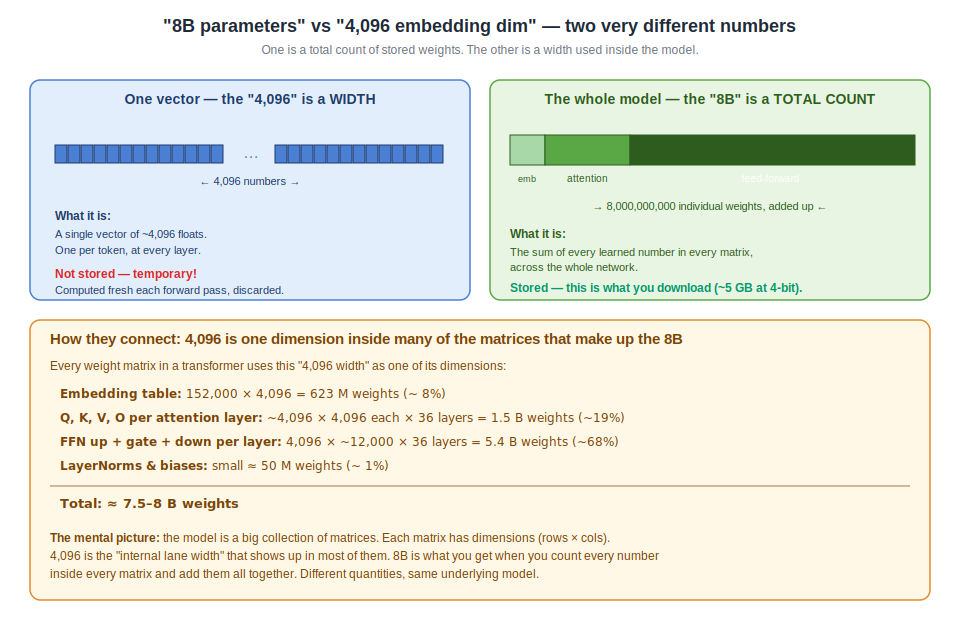

**Short version:**

- **8 B = a total count.** Sum every single number stored in every weight matrix across the whole model. That's the size of the file you download.
- **4,096 = a width.** How wide *one* vector is when it flows through the model. It's a dimension used inside many matrices, not a separate stored thing.

**Analogy.** A house has "1,000 bricks total" and "each brick is 20 cm long." Both true, both numbers, different quantities. The bricks make up the house; a brick's length is one of its dimensions.

**Where the two connect.** The 4,096 width shows up as a dimension in most of the matrices that make up the 8B total. Roughly for Qwen3-8B:

| Component | Shape | Count | % of 8B |
|---|---|---|---|
| Embedding table | 152,000 × **4,096** | 623 M | ~8% |
| Q, K, V, O per attention layer × 36 | ~**4,096** × **4,096** each | 1.5 B | ~19% |
| FFN up + gate + down per layer × 36 | **4,096** × ~12,000 | 5.4 B | ~68% |
| LayerNorms & biases | small | ~50 M | ~1% |
| **Total** | | **~8 B** | 100% |

Every one of those matrices has 4,096 as one of its dimensions. The 8B is what you get by counting every number *inside* every matrix and summing.

**What's stored vs what's temporary.**

- **Stored (permanent):** every weight in every matrix. This is the 8B. Loaded from disk into RAM when the model starts.
- **Temporary (per pass):** every intermediate vector — the token embeddings, the attention outputs, the layer outputs. Each is 4,096 wide. They're computed each forward pass and thrown away when the pass finishes.

So when you see "Qwen3-8B has embed_dim = 4,096" — that's saying "the model's internal lane is 4,096 numbers wide, and that width recurs throughout its 8 billion weights." Two numbers, one model.

### Follow-up: Simpler explanation of Stage 3 — what a transformer layer actually does

Let me redo this with an analogy instead of Q/K/V jargon-first.

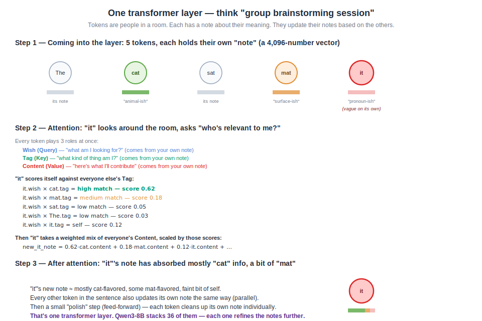

**Set the scene.** After the embedding step, every token in your prompt has been turned into a **note** (a 4,096-number vector) that describes what that token means *in isolation*. "cat" has a note that says "animal-ish, four-legged, mammal." "it" has a very vague note — because "it" *is* vague until you know what it refers to.

We now want to enrich each note using the *rest of the sentence*. That's what one transformer layer does. Think of it as a **group brainstorming session** in three steps:

**Step 1 — Everyone plays three roles.**

Each token generates three little vectors *from its own note*:

- A **Wish** (in the papers: *Query*) — "what am I looking for?"
- A **Tag** (*Key*) — "what kind of thing am I?"
- A **Contribution** (*Value*) — "here's the content I'll offer to whoever wants it"

For "it", the Wish might be something like "I'm a pronoun looking for a subject." For "cat", the Tag might be "I'm an animal, singular, third-person." For "mat", the Tag might be "I'm an inanimate object."

**Step 2 — Everyone scores everyone else.**

The model dot-products **your Wish** against **each other token's Tag**. Big overlap → high score. In our example:

```
it.wish × cat.tag   →  0.62   (strong match: pronoun looking for a subject → cat qualifies)
it.wish × mat.tag   →  0.18   (weaker match: pronoun could sort of refer to mat)
it.wish × sat.tag   →  0.05   (low: sat is a verb, doesn't fit)
it.wish × The.tag   →  0.03
it.wish × it.tag    →  0.12   (some self-attention)
```

Those numbers are what "attention weights" means. They're computed automatically by matrix math — nobody hand-labels "cat is an animal" anywhere.

**Step 3 — Everyone updates their note.**

Now "it" takes a **weighted mix of everyone's Contribution**, scaled by those attention scores:

```
new_it_note  =  0.62·cat.contribution + 0.18·mat.contribution + 0.12·it.contribution + …
```

After this pass, "it"'s note is no longer "some vague pronoun." It's mostly-cat-flavored with a bit of mat-flavored. The model has *resolved the pronoun*, silently, purely through math.

**Everyone else updates their note the same way**, in parallel. "cat" might get a bit of "sat" info woven in ("this cat is *sitting*"). "sat" might get a bit of "cat" info ("the sitter is a cat"). Every token influences every other.

**Step 4 — A short polish (feed-forward network).**

After the group step, each token individually runs its updated note through a small neural network (that primitive from Module 0 — weighted sums + activation). This is the *feed-forward* half of the layer. It's like each person taking a moment to clean up and consolidate the notes they just wrote.

That's **one full transformer layer** — attention (talk to everyone) + feed-forward (individual polish).

**Then stack it 36 times.**

Qwen3-8B repeats this whole process 36 times. Each layer takes the previous layer's notes as input, does its own brainstorming + polish, produces refined notes.

- Layers 1–5: mostly resolve **syntax** — "which word goes with which."
- Middle layers: build **semantic meaning** — "this is about a cat sitting on a mat, in a domestic context."
- Later layers: do **task-relevant reasoning** — "the user is asking me a question; my next word should start an answer."

Nobody hand-programmed those layer specialties. They emerged during training on billions of pages of text.

**What comes out at the end.** After 36 layers, you have 36-times-refined notes for every token. The model looks at the note for the *last* token in the input (the one that represents "here's where I need to keep going") and uses it to compute the logits — one score per possible next word. That's Stage 4.

**One more note: multi-head attention.** Real models don't run *one* attention pass per layer, they run many (Qwen3-8B: ~32 "heads") in parallel, each with its own Wish/Tag/Contribution transformation. Different heads pick up different things — one might focus on grammar, another on long-range coreference, another on formatting. Their outputs are concatenated and mixed. Think of it as 32 simultaneous brainstorming groups, each with a different focus, contributing to the same final note.

That's the whole thing. Nothing else in Stage 3 is deeper — it's just this pattern, applied a lot.

### Follow-up: Who decides how long the token vector will be, and how?

**Short answer:** the humans who design the model — usually the ML research team at the company shipping it (Alibaba for Qwen, Meta for Llama, Google for Gemma). It's a design choice, exactly like a software engineer picking the size of a struct or the width of a database column.

**What "how long" means here.** When we say "each token becomes a vector of 4,096 numbers," that number 4,096 is called the **embedding dimension** or **hidden size** — think of it as *"how wide the model's internal information lane is."* Wider lane = more room to carry meaning per token. Narrower lane = less room.

**How they decide — the trade-off, in plain terms:**

| Wider lane (e.g. 8,192) | Narrower lane (e.g. 768) |
|---|---|
| More capacity — can hold more nuance per token | Less capacity — has to compress meaning |
| More stored weights → bigger, slower, more RAM | Smaller, faster, fits on smaller hardware |
| Needs more training data to fill that capacity | Cheap to train, but hits a quality ceiling sooner |

There's also one *hard rule*: the width must divide evenly by the number of attention heads (each head takes an equal slice of the width). Beyond that, everything is empirical — the team runs experiments at small scale, measures quality vs cost, and picks a number that looks best. The community has converged on a handful of common values.

**Real values across well-known models:**

| Model | Total params | Embedding dim (width) | Layers (depth) |
|---|---|---|---|
| GPT-2 small (2019) | 124 M | 768 | 12 |
| GPT-2 XL | 1.5 B | 1,600 | 48 |
| Llama 3 8B | 8 B | **4,096** | 32 |
| **Qwen3-8B** ← ours | **8 B** | **4,096** | **36** |
| Qwen3-14B | 14 B | 5,120 | 40 |
| Llama 3 70B | 70 B | 8,192 | 80 |
| GPT-4 (rumored) | ~1.7 T | ~18,000 | ~120 |

**Rule of thumb they use:** as total parameters grow ~10×, embedding dim grows ~2×, and depth (layer count) grows ~2×. So the model gets *both* wider *and* deeper — not just one. This relationship is called a **scaling law**, and it comes from research papers that measured many model sizes and fit a curve.

**Concrete example for Qwen3-8B.** The team likely started with "we want a model in the 7–8B range for laptops." From published scaling-law charts, that size class points at *width ≈ 4,096 and depth ≈ 36* as the roughly-optimal shape. Then they train, evaluate, and adjust if quality lags.

You didn't have to pick anything. The number 4,096 arrived as a decision from Alibaba, informed by trade-off math + prior research + experiments.

### Follow-up: How does the model create Query, Key, and Value from an embedding?

**Short answer:** by multiplying the token's embedding by three matrices — one for Query, one for Key, one for Value. Those three matrices are among the 8 billion weights the model learned during training.

Let me show you with tiny concrete numbers.

**Setup.** Pretend the embedding dim is just 4 (instead of 4,096) so we can see every number. After Stage 2, the token "it" has an embedding:

```
it.embedding = [ 1.2,  -0.5,   0.8,   0.3 ]
```

The model has learned **three separate 4×4 matrices** (Qwen3-8B calls these `q_proj`, `k_proj`, `v_proj`). One of them, say `W_Q`, might look like:

```
W_Q =
  [  0.4,  -0.1,   0.7,   0.2 ]     ← row for output slot 1
  [ -0.3,   0.5,   0.1,  -0.4 ]     ← row for output slot 2
  [  0.6,   0.2,  -0.5,   0.8 ]     ← row for output slot 3
  [  0.1,  -0.2,   0.3,   0.5 ]     ← row for output slot 4
```

(That word **matrix** just means "a grid of numbers." Four rows, four columns → 16 numbers total. This particular matrix is part of the model's stored weights.)

**Compute the Query vector** by "multiplying" the embedding by this matrix. For each row of the matrix, take the dot product with the embedding (multiply matching positions, sum them up):

```
Q[1] = 1.2·(0.4) + (-0.5)·(-0.1) +  0.8·(0.7) + 0.3·(0.2)  =  1.15
Q[2] = 1.2·(-0.3) + (-0.5)·(0.5) +  0.8·(0.1) + 0.3·(-0.4) = -0.65
Q[3] = 1.2·(0.6) + (-0.5)·(0.2) +  0.8·(-0.5)+ 0.3·(0.8)   =  0.46
Q[4] = 1.2·(0.1) + (-0.5)·(-0.2)+  0.8·(0.3) + 0.3·(0.5)   =  0.61

it.Q = [ 1.15, -0.65,  0.46,  0.61 ]   ← the "wish" of the token "it"
```

Do the same with `W_K` → `it.K` (its "tag"). Do the same with `W_V` → `it.V` (its "content"). Three new 4-number vectors, all derived from the same starting embedding by three different learned matrices.

**Two important observations:**

1. **The matrices `W_Q`, `W_K`, `W_V` do not depend on the token.** They're fixed weights. Every token — "it", "cat", "hello", any of the 152,000 vocabulary tokens — gets multiplied by the *same three matrices* to produce its own Q, K, V.
2. **The values inside those matrices were learned during training.** They started as random noise. During pretraining on billions of pages of text, the training process nudged those 16 numbers (per matrix) over and over until the resulting Q/K/V vectors produced useful attention patterns. Nobody typed those numbers by hand.

**In real Qwen3-8B**, the embedding dim is 4,096, so `W_Q`, `W_K`, `W_V` are each ~4,096 × 4,096 matrices (~16.8 million numbers each). And each of the 36 layers has its *own* set of `W_Q`, `W_K`, `W_V`. That's where a huge chunk of the 8 billion weights live.

**Who decides the shape of these matrices?** The model designer — same person who picked the embedding dim. They pick a width (4,096) and how many attention heads (32); the matrix shapes follow.

**Who decides the numbers inside?** Training does. Purely emergent from data.

### Follow-up: Who decides how many layers, and what each layer does?

This has two parts, and the answers are very different.

**Part A — How many layers? (Design choice, humans pick.)**

The model team decides layer count, exactly like they decide embedding dim. Same trade-off:

- More layers → more refinement passes → the model can build up richer, more abstract patterns → higher quality output.
- But more layers → more weights, more compute, harder to train (a problem called "vanishing gradients" — small correction signals can fade to zero after passing through too many layers).

Modern research established rough "scaling laws" — published curves that say *"for X total parameters and Y training compute, roughly N layers give the best quality."* Teams start from those curves, then experiment near the recommended point.

**Real values (same table as before):**

| Model | Total params | Layers | Rough sense |
|---|---|---|---|
| GPT-2 small | 124 M | 12 | Toy scale |
| Llama 3 8B | 8 B | 32 | Standard 8B recipe |
| **Qwen3-8B** | **8 B** | **36** | Slightly deeper than Llama 3 8B |
| Llama 3 70B | 70 B | 80 | Big model, deep stack |
| GPT-4 (rumored) | ~1.7 T | ~120 | Frontier |

Notice: doubling params roughly doubles layers *and* widens the model. Both dimensions grow together.

**Part B — What does each layer do? (Nobody decides. It emerges.)**

This is the more surprising answer, and it's important: **no human programs the role of each layer.** Every layer starts with random-weight `W_Q`, `W_K`, `W_V`, and random-weight feed-forward matrices. Training on billions of pages nudges those weights over and over. What each layer *ends up specializing in* is a byproduct of that training pressure — nobody typed "layer 5 handles pronouns" anywhere.

Researchers can **inspect** trained models afterward and observe patterns (this field is called *mechanistic interpretability*). What they see, broadly:

- **Early layers (1–5)** tend to specialize in low-level structure — which words go together, part-of-speech, local grammar.
- **Middle layers (10–25)** tend to build semantic meaning — "this is about a cat, in a domestic setting, being tired."
- **Later layers (25–36)** tend to focus on task-relevant output — "the user is asking a question; my next word should start an answer."

These patterns are **emergent**, meaning they weren't designed, they surface naturally because that's the most efficient way to compute the correct next token. They're also **only rough** — real trained models are messier than this clean story suggests, and there's a lot of overlap.

**Is there a predefined process?** Yes and no:

- **For layer count**: yes — scaling-law papers give a rough recipe, and teams tune from there.
- **For layer roles**: no. There's no template you fill in. The team just decides "36 identical transformer layers" and lets training do the specialization.
- **Some architecture choices influence *where* specialization lands** — e.g., putting extra "residual streams" between layers, or using specific normalization schemes — but the *content* of what each layer learns is always emergent from data.

**Analogy that might help.** Think of building a factory with 36 identical work stations. You (the designer) decide there will be 36 stations and each has the same tools. Then you flood the factory with training examples for weeks. Over time, workers naturally start dividing labor — Station 1 handles first inspection, Station 30 handles final packaging — not because you assigned roles, but because the workflow settles into what's most efficient. Same idea with transformer layers.

That's the whole picture. **Layer count is a picked number; layer content is what training happens to grow.**

### Follow-up: What the model processes vs. what you see on screen

You're right to push back — I confused two different things. Let me separate them cleanly.

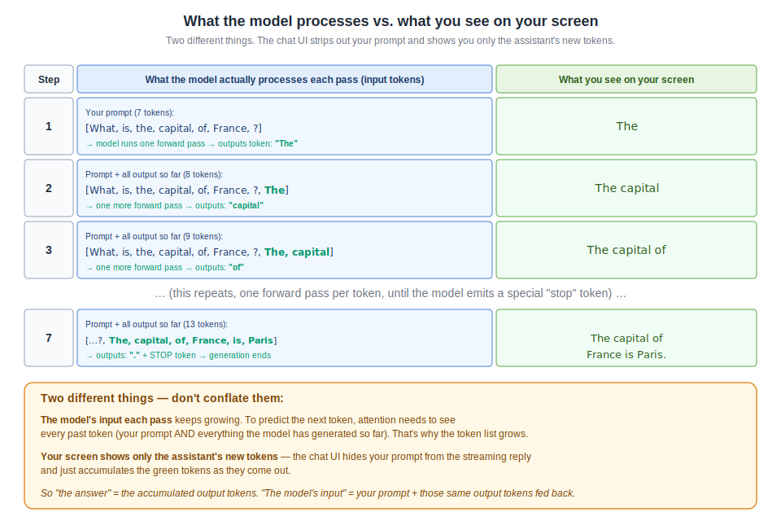

**"The answer" is only the new tokens** the model generated — that's what streams to your screen and what your chat app collects into the assistant's message. Just the green tokens in the diagram.

**But the model's input list keeps growing.** Here's why: to predict the next token, the attention machinery from Stage 3 needs to see *every past token in the conversation* — your prompt AND every token the model has already generated. It cannot just look at the last output token in isolation, because language depends on wider context. ("The capital of France is ___" needs *all* those earlier words to figure out that "Paris" is a good next word.)

So on every generation step, the model is fed **your original prompt + everything it has generated so far** as one growing list. That list is called the **context** at that moment.

**Two things going on, side by side:**

| What | Grows how? | Who sees it? |
|---|---|---|
| Model's input list ("context") | Grows by 1 token per step | Only the model, internally |
| The answer on your screen | Grows by 1 token per step | You (the user) |

The chat app is doing this bookkeeping silently. When you send "What is the capital of France?", the app hands the model that prompt. The model produces "The". The app displays "The" AND remembers it, then feeds the model `[your prompt + "The"]` for the next step. Model produces "capital". App displays "The capital" AND stores it, then feeds `[your prompt + "The", "capital"]` next time. And so on.

**When the conversation continues** (you send a second message), the app packages the full growing conversation — your prompt 1, model reply 1, your prompt 2 — as one giant input, and the model generates reply 2 the same one-token-at-a-time way, appending each new token back into its own input as it goes. That's why the KV cache from Module 2 grows *linearly* with conversation length: every token in the entire chat history has to stay "in front of" the model for every future generation step.

**One tightening on my earlier phrasing:** the model doesn't literally "run all 8 billion parameters from scratch for every new token." Thanks to the KV cache, most of the work for past tokens is already saved — only the freshly-added token has to go through the whole computation from scratch. But every one of the 8 billion weights *is* touched by the computation for that new token (all the matrices are used). The 8B are the fixed instructions; the cache is the memoized past.

### Follow-up: What is a "forward pass"?

Software analogy first: **a forward pass is exactly like calling a function.** You feed input in one end, computation runs, an output comes out the other end. No back-and-forth. Data flows one direction only — *forward* — from input to output. Hence the name.

**More precisely for an LLM:** a forward pass is one complete trip through the whole network:

```
input tokens
   → embedding layer            (look up meaning-vectors)
   → transformer layer 1        (attention + feed-forward)
   → transformer layer 2
   → …
   → transformer layer 36
   → final projection to logits (one score per vocab word)
   → sampler                    (pick one token)
   → output: ONE new token
```

Every stage runs, all the model's matrices get multiplied against, and out comes exactly **one** output token. That's one forward pass.

**Why the name matters.** There's also a "backward pass," but it only happens during *training* — after the model produces an output, a backward pass runs through the network in *reverse* to calculate how each weight should change to make the output more correct. Inference (what you're doing when you chat with the model) is **forward only**. Training is **forward + backward**. We'll do a real backward pass live in Module 3.

**Why forward passes are the fundamental unit for LLMs:**

1. **One forward pass ⇒ one new token.** No way around it. To generate a 200-word reply (≈ 265 tokens), the model runs ≈ 265 forward passes.
2. **Speed is measured as forward-passes-per-second.** That's what the "tokens/sec" number in Ollama, LM Studio, MLX-LM (and our `speed_compare.py`) is measuring. 50 tok/s = 50 forward passes per second.
3. **Every forward pass touches every one of the ~8 billion weights** (all the matrices are used in the computation). That's why bigger models are slower — more numbers to multiply in each pass.
4. **You cannot parallelize *within* a reply.** Token 42 depends on token 41, which depends on token 40, and so on. The forward passes must run in sequence. This is the ceiling on generation speed and why more layers / more parameters directly hurt tokens-per-second.

**Who decides how a forward pass is structured?** The model architect — same person who picked the layer count and embedding dim. The forward pass is just "run through the network as designed, in order, one time." Nobody redesigns it per token; it's the same fixed pipeline every pass.

**Concrete numbers for your setup:**

- Qwen3-8B on your Mac at ~40 tok/s = 40 forward passes per second = each forward pass takes ~25 ms.
- Each forward pass performs on the order of ~16 billion arithmetic operations (2 × 8B weights, each multiplied and added once).
- 40 tok/s × 16 billion = ~640 billion operations per second flowing through your Apple GPU. That's why the MPS/MLX GPU path matters so much.

**Putting it together with the previous follow-up:** at each step of generation, the app packages the growing context, hands it to the model, the model runs **one forward pass** through all its 8 billion weights, out pops one new token, the app displays it, appends it to the context, and repeats. Loop until the model emits a stop token. That is the entirety of "how an LLM answers you."

### Hands-on

**Goal:** poke each stage of the pipeline you learned in Concepts. Four short scripts, roughly 15 minutes total, each one hands-on with a single concept.

**Preconditions**

- Module 1 Hands-on complete (`mlx-community/Qwen3-8B-4bit` already downloaded from the earlier run).
- venv active (`cd ~/destress && source .venv/bin/activate`).

**One extra package to install** — the standard Hugging Face library, useful for the tokenizer exercise:

```bash
uv pip install transformers
```

#### Step 1 — Poke a real tokenizer

Run:

```bash
python learn/02-model-internals/tokenizer_playground.py
```

**What it does.** Loads the same tokenizer our Qwen3-8B chat model uses, then feeds it a bunch of test strings — English sentences, code, emoji, Hindi, Japanese — and prints the token IDs and pieces for each.

**What to notice** (each of these is a concept from the [Tokenization section](#2-stage-1--tokenization-text--integer-ids) made concrete):

- Common English words = 1 token. Rarer words split into 2–3 pieces.
- `"cat"` and `" cat"` (leading space) are **different token IDs**. Spaces are part of the token.
- Emoji and non-Latin scripts often take *many* tokens per character. That's why a Hindi page uses ~2–3× more context than an English page of the same word count.
- Total vocabulary is ~152,000 tokens — printed at the top so you can see it.

Look at the "·" characters in the output — that's how the script visualizes leading spaces which are otherwise invisible in a terminal.

#### Step 2 — Watch generation happen one token at a time

Run:

```bash
python learn/02-model-internals/token_by_token.py
```

**What it does.** Instead of streaming the whole response, this script uses MLX-LM's `stream_generate` and prints one line per generated token, showing the token ID, the text piece, and how long that step took in milliseconds.

**What to notice.**

- The output arrives **one row per forward pass**. Each row = one full trip through all 36 layers = one new token. That's literally the autoregressive loop from Module 2.
- Step 1 usually takes much longer than the rest (typically 500–1500 ms vs. 20–40 ms per token). That first step includes **prompt processing** — the model has to compute K/V vectors for every prompt token before it can start generating. From step 2 onward, thanks to the KV cache, only the *new* token needs to be processed each pass.
- The steady-state pace (roughly 25–40 ms per token on your M3 Pro at Q4) is exactly what "tokens per second" measures.

We used `temp=0.0` (greedy) so the output is reproducible — you should see the same tokens every time you run it.

#### Step 3 — Feel the temperature knob

Run:

```bash
python learn/02-model-internals/temperature_playground.py
```

**What it does.** Runs the same short prompt ("Describe the color blue in one sentence") three times each at three temperatures: `0.0`, `0.7`, and `1.5`.

**What to notice.**

- `temperature = 0.0` — **all three runs are identical**. Greedy sampling picks the highest-probability token every time; no randomness at all.
- `temperature = 0.7` — three different but sensible sentences. This is the typical default chat temperature — enough variation to avoid feeling robotic, but the model still picks reasonable words.
- `temperature = 1.5` — the distribution gets flattened, low-probability words become plausible, and outputs get more creative — sometimes wonderfully, sometimes into word salad. This is the same behavior the [logits & sampling section](#5-stage-4--logits-and-sampling-how-the-model-actually-picks-a-word) described in math form, now visible in output.

#### Step 4 — Peek at raw logits (advanced but very revealing)

Run:

```bash
python learn/02-model-internals/peek_logits.py
```

**What it does.** For each of a handful of prompts, runs *one* forward pass, grabs the raw scores (logits) at the last position, converts them to probabilities via softmax, and prints the **top 10 candidate next tokens with their probabilities** — plus a mini bar chart.

**What to notice.**

- **Constrained prompts** like `"The capital of France is"` produce a *very sharp* distribution — the top token (usually `·Paris`) has 80–95% probability and everything else is negligible. The model is confident.
- **Open-ended prompts** like `"Once upon a time,"` produce a *flat* distribution — the top token might only be 5–15%, and the top 10 all look plausible ("there", "in", "a", "the", …).
- `"2 + 2 ="` should produce `·4` with overwhelming probability — because that's exactly what most training text says.
- This is **the raw material the sampler picks from.** Temperature reshapes this distribution before sampling; top-p/top-k truncate the tail. But this — the softmaxed distribution — is what stage 5 actually produces on every forward pass, for every token generated.

#### Troubleshooting

- **`ModuleNotFoundError: No module named 'transformers'`** — you forgot the install. Run `uv pip install transformers`.
- **`peek_logits.py` errors on `model(input_ids)`** — mlx-lm's low-level API sometimes drifts between versions. Update mlx-lm (`uv pip install -U mlx-lm`) and retry.
- **`token_by_token.py` output looks empty** — the first `stream_generate` chunk may include tokens that decode to just whitespace or partial UTF-8 characters. Keep watching; content follows.

#### Checkpoint — Module 2 complete

- [x] Tokenizer output makes sense: I can point at which words became one token vs. multiple, and why leading spaces matter.
- [x] `token_by_token.py` visibly shows one-token-at-a-time generation, and I can explain why step 1 is slower than the rest (prompt processing + KV cache warm-up).
- [x] I can predict, from a prompt, whether the top-token probability will be *sharp* (like factual questions) or *flat* (like open creative prompts) — and I've verified that with `peek_logits.py`.
- [x] I can explain, in my own words, what `temperature = 0.0` vs `1.5` actually does to the sampling distribution.

When all four are checked, we move on to **Module 3 — Train a tiny model from scratch** — where the training loop from Module 0 becomes real code (backpropagation, the backward pass, watching loss drop) and we build a mini-GPT ourselves.

### Follow-up: What `peek_logits.py` is actually doing, step by step

Fair — that script packed a lot of new ideas into 20 lines. Let me walk through it slowly, no jargon.

**First, forget the code. What does the script *do*?**

Given a prompt like `"The capital of France is"`, it runs *one forward pass* through the model, catches the raw scores the model produces for every possible next word (all 152,000 of them), converts those into probabilities, and prints the top 10 candidates with their probabilities.

The output looks like:

```
Prompt:  "The capital of France is"
Top 10 candidate next tokens (out of 152,000):
             ·Paris   92.3%   ██████████████████████████████████████████████
              ·Lyon    1.8%   █
              ·Rome    0.9%
                 ·a    0.6%
              ·well    0.4%
                 …
```

That's it. Everything else is machinery to make that happen.

**A picture of the entire flow:**

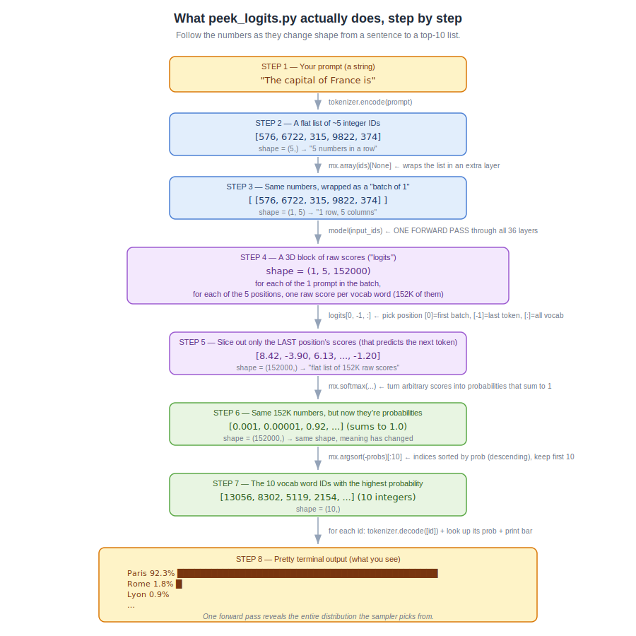

Now let me define the four new ideas the code uses, then read it top to bottom.

#### The four new ideas

**Idea 1 — "Shape" of a list of numbers.**

A plain list of 5 numbers has shape `(5,)` — five numbers in a row. A table with 2 rows and 5 columns has shape `(2, 5)`. A block of numbers with 2 sheets of 2×5 tables has shape `(2, 2, 5)`. The word "shape" just means "how many numbers along each dimension." (In ML lingo these are also called *tensors*, but "shape" is enough for now.)

**Idea 2 — "Batch dimension."**

Models are built to process *many* prompts at once for efficiency — this is called a **batch**. Even when you only have one prompt, the code wraps it in a "batch of size 1" so the same code path works whether you send 1 prompt or 100. Concretely: `[576, 6722, 315, 9822, 374]` (shape `(5,)`) becomes `[[576, 6722, 315, 9822, 374]]` (shape `(1, 5)` — 1 batch item, 5 tokens). The `[None]` in `mx.array(ids)[None]` is the trick that adds this outer wrapping.

**Idea 3 — "Softmax."**

The model's forward pass produces one raw score per vocab word. These scores are arbitrary numbers — some big positive, some negative, some tiny. Not directly meaningful. `softmax` is a small math function that:

1. Exponentiates each score (so bigger scores get exponentially bigger weight, negatives get near-zero).
2. Normalizes them so they sum to 1.

After softmax, you have a **probability distribution** — 152,000 numbers between 0 and 1 that add up to 1.0. Now they mean something: "probability this is the next token."

**Idea 4 — "Argsort" (with a negation trick).**

`sort(list)` gives you the values in order. `argsort(list)` gives you the *indices* in the order they'd appear if sorted. MLX sorts in *ascending* order by default (smallest first). We want the *largest* probabilities first, so we sort `-probs` (negate everything) ascending — which is the same as sorting `probs` descending. Then `[:10]` keeps the first 10 indices.

#### Now read the code

Here's the core function again, with an explanation to the right of each line:

```python
def top_next_tokens(model, tokenizer, prompt, k=10):
    ids = tokenizer.encode(prompt)
    # ids is a plain Python list of integers, e.g. [576, 6722, 315, 9822, 374].
    # Same tokenization step we saw in Module 2 Concepts. Shape: (5,).

    input_ids = mx.array(ids)[None]
    # Two things happen here:
    #  1. mx.array(ids) turns the Python list into an MLX array (so the GPU can process it).
    #  2. [None] adds a "batch of 1" wrapper. Shape becomes (1, 5).
    #     Same numbers, just one extra layer of brackets.

    logits = model(input_ids)
    # THE FORWARD PASS. This is the one line where all the model's 8B weights are used.
    # Output shape: (1, 5, 152000).
    #   - 1  = batch dimension (we sent 1 prompt).
    #   - 5  = the 5 input tokens.
    #   - 152000 = one raw score for every word in the vocabulary,
    #              at each of the 5 positions.
    # "Logits" is just the name for these raw scores.

    last_logits = logits[0, -1, :]
    # Slice: pick out only the LAST position's scores.
    #   - 0  = the first (and only) item in the batch.
    #   - -1 = the last position in the sequence — that's the one predicting
    #          what comes after the prompt.
    #   - :  = all 152000 vocab scores at that position.
    # Result shape: (152000,) — a flat list of 152K raw scores.

    probs = mx.softmax(last_logits, axis=-1)
    # Turn arbitrary scores into probabilities that sum to 1.
    # Same shape (152000,), but the numbers now mean "P(next token = this vocab word)".

    top_indices = mx.argsort(-probs)[:k]
    # Sort indices by probability, largest first, take top 10.
    # Result shape: (10,) — just 10 vocab word IDs.

    mx.eval(probs, top_indices)
    # MLX is lazy — it defers actual computation until you force it.
    # eval() says "please actually compute those two arrays now."
    # Without this, the next lines would silently do the computation multiple times.

    idx_list = top_indices.tolist()
    # Convert the MLX array back to a plain Python list [12345, 67891, ...]
    # so we can loop over it.

    for idx in idx_list:
        prob = float(probs[idx])
        # Look up the probability for this vocab word ID.

        piece = tokenizer.decode([idx])
        # Convert the vocab word ID back to its text piece, e.g. 13056 → "·Paris".

        vis = piece.replace(" ", "·").replace("\n", "\\n")
        # Make invisible characters visible in the terminal.

        bar = "█" * int(prob * 50)
        # Build a simple bar chart. A 100% probability = 50 blocks; 10% = 5 blocks; etc.

        print(f"  {vis:>18s}  {prob * 100:5.1f}%  {bar}")
        # Print one row per candidate.
```

**Mapping back to what you already know from Module 2 Concepts:**

- The tokenizer step is [Stage 1](#2-stage-1--tokenization-text--integer-ids).
- `model(input_ids)` is the full [pipeline stages 2 + 3](#3-stage-2--embeddings-integer-ids--meaning-vectors) — embeddings + all 36 transformer layers — collapsed into one function call.
- The raw scores this returns are the [logits from Stage 4](#5-stage-4--logits-and-sampling-how-the-model-actually-picks-a-word).
- Softmax + top-10 is what you're doing *instead of* Stage 5's sampler. The sampler would randomly pick one token from this distribution; this script just prints the distribution so you can see what the sampler was going to pick from.

**Why the script is useful.** In the normal flow (Ollama, `chat_mlx.py`, LM Studio), the sampler picks one token and you never see the other 151,999 candidates. This script cracks open that moment and shows you the raw distribution — you get to see how *confident* the model was about its answer.

Try running it again after this and reading the code alongside the output. It should click.

---

## Module 3 — Train a tiny model from scratch

### Concepts

**Goal of this module:** watch a model actually *learn*. So far every model we've touched came pre-trained — its weights were already tuned by someone else. In this module we start from *random* weights and shape them ourselves. The moment you see loss drop from 400 → 40 → 4 on your own screen, "training" stops being a magic word.

This Concepts section covers the *what* and *why*. Hands-on builds three models yourself, from tiny to real.

#### 1. Setting up the mystery — how did training find `w = 5, b = 32`?

Cast your mind back to Module 0's tiniest model:

```
score = w × hours + b
```

We said: given a bunch of (hours, actual-score) examples, "training" figured out that `w = 5` and `b = 32` fit the data best. But we glossed over *how*. That's the whole subject of this module.

**The setup you always start from.** You have three things:

1. **A model with knobs** — e.g. `score = w × hours + b`, where `w` and `b` are the knobs. Initially set to random values, say `w = 0.1, b = 0`. The model's prediction is useless right now.
2. **Training data** — pairs of `(input, correct output)`. E.g. `(hours=2, score=42)`, `(hours=5, score=60)`, `(hours=7, score=68)`, ...
3. **A rule for measuring "how wrong"** — you'll see this below. It's called a *loss function*.

Training's job: **turn the random knobs into good knobs, using nothing but those training examples.**

Nobody hand-tunes the knobs. The whole point of ML is that we *derive* them from data by running a loop. That loop is called the **training loop**, and it is the single most important idea in the whole field.

#### 2. The training loop — the heartbeat of ML

Every trained model, from our exam-score line to Qwen3-8B to the future EEG stress detector, was produced by many repetitions of this same 4-step cycle:

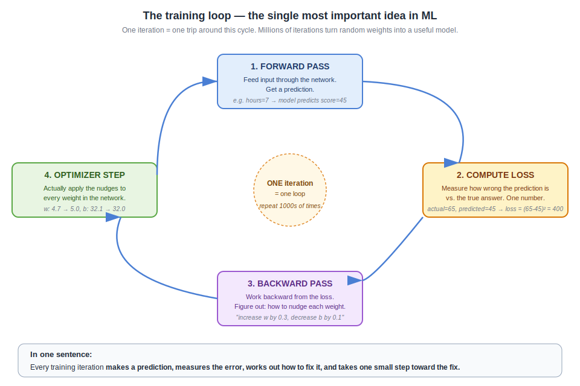

One trip around the cycle is called **one iteration** (or "one step"). A useful model needs thousands to millions of iterations.

- **Step 1 — Forward pass:** feed an input through the network's current knobs, get a prediction. (Same forward pass we already met in Module 2 — but on random knobs, the prediction will be terrible.)
- **Step 2 — Compute loss:** compare the prediction to the true answer. Get one number that says "how wrong." Bigger number = more wrong.
- **Step 3 — Backward pass:** work backward from that loss to figure out, for *each* knob in the model, "should this knob go up or down, and by how much, to reduce the loss?"
- **Step 4 — Optimizer step:** actually apply those nudges to the knobs. Now every knob is slightly better than a moment ago.

Repeat. The loss keeps dropping. Random knobs slowly become useful ones.

Let's unpack steps 2, 3, 4 — they're where the actual "who decides what" happens.

#### 3. Loss — what "wrong" looks like as one number

"How wrong is this prediction?" needs to be a *single number* so the training loop has something to reduce. That number is called the **loss**.

**Concrete example (exam scores).** Say your model currently predicts `w=2, b=25`, so for hours=7 it outputs `2×7 + 25 = 39`. The actual score in the training data was 68. The prediction is 29 off.

A common way to convert that gap into one number is **squared error**:

```
loss = (actual - predicted)²  =  (68 - 39)²  =  841
```

Do this for every training example, average the results — that's the loss for the whole training set at the current knob values.

Why squared? Two reasons: it makes the number always positive (an under-prediction and over-prediction of the same size hurt equally), and big errors get punished disproportionately (an error of 20 costs 400; an error of 40 costs 1600 — 4× worse, not 2×). That pressure pushes the model to fix the worst mistakes first.

**Different tasks use different loss functions.** All of them collapse "how wrong" into one number, but the formula differs:

| Task | Loss function used | Intuition |
|---|---|---|
| Predicting a number (regression) | Mean Squared Error (MSE) | Squared distance from truth |
| Predicting a category (classification) | Cross-entropy | How badly the model spread probability across the wrong classes |
| Predicting the next token (LLMs like Qwen3) | Cross-entropy on the next-token distribution | Same as classification — every next-token pick is a classification over 152,000 vocab words |

**Who decides which loss function?** The person setting up the training. It's picked based on what the model is meant to do — predicting a number → MSE; predicting a category or a token → cross-entropy. There's a short menu, and choosing is a design decision, not something the model figures out.

**What does the loss number mean in absolute terms?** Nothing on its own. `loss = 400` is only meaningful compared to earlier or later loss values in the same run. What matters is: **is it going down?**

#### 4. Backpropagation — figuring out how each knob contributed to the error

Now we have one loss number. But the model might have 8 billion knobs. How do we know which ones to move, and in which direction, and by how much?

That's the job of **backpropagation** (or "backprop" for short). It's the calculus algorithm that computes, for every single knob in the model, one number: *"if I nudge this knob up by a tiny amount, does the loss go up or down, and by how much?"* That answer is called the **gradient** for that knob.

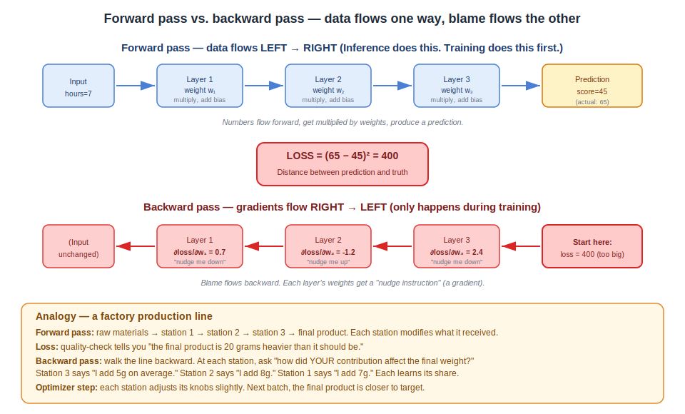

**A software engineer's analogy.** Think of the network as a production line. Data flows left-to-right through layers, each layer's knobs modifying it. At the end, quality control says "final output is off by 20 grams." Backprop walks the line *backward*, and at each station asks: *"how much did YOUR contribution contribute to that 20g error?"* Every station learns its share of the blame — its gradient.

Concretely, at the end of a backward pass, every knob has a gradient number attached to it:

- Positive gradient = "nudging me up would *increase* the loss → I should go down"
- Negative gradient = "nudging me up would *decrease* the loss → I should go up"
- Magnitude = "how much I contribute to the error"

**Chain rule intuition (no math).** Layer N's contribution to the final error depends on: (a) what layer N does with its input, and (b) what layers N+1, N+2, ... do with layer N's output. So we can only figure out layer N's gradient *after* we already figured out the layers downstream. That's why we go backward — the last layer first, then second-to-last, and so on. This chained blame-assignment is the "chain rule" in calculus.

**Who wrote backprop?** Rediscovered/popularized by Rumelhart, Hinton, and Williams in 1986. Been unchanged since then. Every ML framework — PyTorch, MLX, JAX — implements it as an *automatic* feature: you just describe the forward pass, and the framework figures out the backward pass for you (this is called **autograd** — "automatic gradients"). You never write derivatives by hand.

**Why the "backward pass" needs the "forward pass" first.** Backprop needs to know the *intermediate* values produced by the forward pass to compute gradients. So training is always: forward pass (save all intermediate values) → compute loss → backward pass (use the saved values) → optimizer step. That's the loop.

#### 5. Optimizer — actually applying the nudge

Backprop tells you the direction and rough magnitude to move every knob. The **optimizer** is the algorithm that actually does the moving.

**Simplest optimizer: Stochastic Gradient Descent (SGD).**

```
new_weight = old_weight  -  learning_rate  ×  gradient
```

That's it. Move each knob a tiny amount in the direction that reduces loss. The `learning_rate` is a small multiplier — usually somewhere in `0.0001` to `0.1` — that controls **how big the step is.**

**Why not just take a huge step?** If `learning_rate` is too big, you'll overshoot the minimum, bounce around, and never settle. If it's too small, training takes forever. Getting it right is a balancing act.

**Who decides the learning rate?** A human — the person setting up training. It's called a **hyperparameter** (as opposed to a *parameter*, which is a weight the model learns). Hyperparameters are picked empirically: try a few values, watch which one lets loss drop fastest, keep that one. There are published "recipes" for common architectures (e.g. "for a transformer of this size, start with `3e-4`") which the community reuses.

**Better optimizers.** The real world uses smarter variants of SGD (Stochastic Gradient Descent):

| Optimizer | What it adds beyond SGD |
|---|---|
| SGD with momentum | Remembers the previous step's direction — like a ball rolling; helps traverse flat spots faster |
| Adam | Keeps a per-knob "sensitivity" and adjusts step size per-knob. Currently the default for training LLMs. |
| AdamW | Same as Adam plus a "weight-decay" trick that improves generalization |

For the exam-score model, SGD is fine. For a transformer, we use Adam or AdamW. **You don't need to know the math** — you just call `torch.optim.AdamW(...)` in code and it works.

#### 6. Batch, iteration, epoch — the vocabulary of "how much data at a time"

Three related terms you'll hit constantly. All three describe how training data is fed to the loop:

- **Batch** — a small group of training examples processed in one forward+backward pass. Typical: 8, 16, 32, 64 examples per batch. Reason it exists: doing one example at a time is slow (bad use of GPU parallelism); doing all of them at once is impossible (won't fit in memory).
- **Iteration** (or "step") — one trip around the training loop, on one batch. Forward → loss → backward → optimizer update.
- **Epoch** — one complete pass over the *entire* training set. If your dataset has 60,000 examples and your batch size is 32, one epoch = 60,000 / 32 ≈ 1,875 iterations.

Concrete numbers for training a small image classifier (Module 3 Hands-on):

```
Dataset:        60,000 images
Batch size:     64        ← human choice, memory-constrained
Iterations/epoch:  60,000 / 64  =  938
Epochs:         5         ← human choice, watch validation loss
Total iterations:  938 × 5  =  4,690
```

**Who decides batch size and epoch count?** Humans, empirically. Batch size is picked by "the biggest that fits in your memory without slowing training down" (typically 32–256 for small models). Epoch count is decided by watching the validation loss curve — which brings us to overfitting.

#### 7. Overfitting — memorising instead of learning

Here's the trap. If you train long enough, the model doesn't just learn the *patterns* — it starts to memorize the *specific examples*, quirks and all. Its training loss looks great, but it can't handle any input it hasn't seen. This is called **overfitting**.

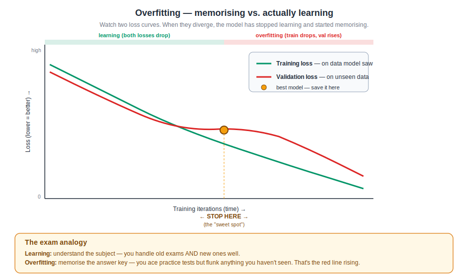

**How we catch it.** We split the training data into two piles before training starts:

- **Training set** — the examples the model actually trains on (updates weights from).
- **Validation set** — held-back examples the model *never* trains on. Only used to measure quality.

After each iteration (or every N iterations), we compute the loss on both sets:

- **Training loss** should keep going down (the model is getting better at what it saw).
- **Validation loss** goes down at first (learning), then starts going up (memorising instead of generalizing).

The point where validation loss stops improving is the **sweet spot** — the model has learned as much as it usefully can. Train longer than that, and quality on new data actually degrades.

**In practice.** You save a checkpoint of the model's weights every so often, and when training ends you pick the checkpoint with the best validation loss. This is called **early stopping**. It's the reason validation loss is the number practitioners obsess over, not training loss.

**Who decides how to split train vs validation?** The person setting up training. Typical: 80/20 or 90/10 split. For Phase 2's EEG data, we'll set aside recordings from a session we didn't use for training as the validation set.

#### 8. What we'll actually build in Hands-on

Three escalating projects, each unlocks the next:

1. **Micrograd** — a ~150-line autograd engine written from scratch. You'll watch gradients flow through a tiny computation graph and see backpropagation work with your own eyes. This is the "aha" moment — no framework magic, just numbers.
2. **A tiny classifier on MPS** — train a small neural network on MNIST (60,000 handwritten digits, the "hello world" of ML) using PyTorch on your Mac's GPU. Watch loss drop live. This is where the whole pipeline (data → forward → loss → backward → optimizer) becomes concrete code you run.
3. **nanoGPT** — clone Andrej Karpathy's `nanoGPT` and train a real transformer, character-by-character, on Shakespeare's works. In under 10 minutes you'll have a model that generates (bad but real) Shakespeare-flavored text. This is a real transformer — just small — and it uses every idea we've covered so far.

By the end you'll have watched loss numbers go down on your screen for three different models, and you'll have earned the right to say you've trained an LLM from scratch.

#### Checkpoint for this section

Answer these in your own words:

1. What are the four steps of the training loop, in order?
   - Forward pass, loss calculation, back propagation, Optimizer
2. What is "loss" — as a single number, not as a formula?
   - Loss represents how much output deviates from original answer
3. What does backpropagation compute for each knob in the model?
   - Backpropagation calculates direction and magnitude in which each knob in model needs to be optimised so that loss reduces.
4. What role does the "learning rate" play? What breaks if it's too big / too small?
   - Learning rate helps control magnitude of knob adjustments, too small learning rate - it takes forever to train, too large learning rate - it keeps oscillating as it wrongfully modifies knobs by huge amount.
5. Difference between batch, iteration, epoch — concrete example, please.
   - Batching helps optimize GPU usage by sending multiple input data simultaneously as per defined batch size.
   - Iteration is a single pass through all the model layer having billions of parameters
   - Epoch is nothing but no of iterations of batches it will take to pass training data through all layers.
6. What is overfitting? How would you detect it while training?
   - Overfitting is training model so much that instead of generalizing model starts memoizing and doesn't work well with unseen data . As soon as validation data loss stop decreasing and start increasing we say model has stopped learning and started memoizing.
7. Who decides the learning rate? Who decides the batch size? Who decides when to stop training?
   - ML Researcher training the model decides learning rate based on published research. ML Researcher also decides batch size to optimize GPU usage so that dataset can fit into memory. ML Researcher also decides when to stop training the moment validation data start to show increase in loss instead of decrease in loss.

Tell me your answers — I'll correct gently — then we move to Hands-on.

### Hands-on

**Goal:** three escalating training runs, all on your Mac, in ~45 minutes total. Backprop with your own eyes → a real classifier from scratch → a real transformer from scratch.

**Preconditions**

- Module 0 environment complete; `verify_environment.py` all PASS.
- venv active (`cd ~/destress && source .venv/bin/activate`).
- One extra package for the MNIST download step:

```bash
uv pip install torchvision
```

#### Project 1 — Micrograd: watch backpropagation with your own eyes

**What it is.** A ~100-line scalar autograd engine (the "backward pass" from Concepts, done from scratch with no framework). You get to see gradients flow.

**Run:**

```bash
python learn/03-train/micrograd_demo.py
```

**Expected output** (something like):

```
Forward pass produced output o = 0.7071

Gradients (∂o/∂value = 'how much o changes per unit change in this value'):

  x1.data =  +2.000    grad = -1.5000  ↓ nudge UP lowers o
  x2.data =  +0.000    grad = +0.5000  ↑ nudge UP raises o
  w1.data =  -3.000    grad = +1.0000  ↑ nudge UP raises o
  w2.data =  +1.000    grad = +0.0000  · no effect
  b.data  =  +6.881    grad = +0.5000  ↑ nudge UP raises o
```

**What to notice.**

- One call to `o.backward()` populated `.grad` on every input.
- `x2.grad = 0` because `x2` itself is `0` — it had no influence on the output. Backprop correctly assigns zero blame.
- Signs tell you direction: positive grad = "moving this up would raise the output"; negative = "moving this up would lower it."

**Then read the code.** Open [micrograd_demo.py](../learn/03-train/micrograd_demo.py) and skim the `Value` class. Each math operation defines its own `_backward()` function that says how to route gradient to its inputs. `backward()` at the bottom just walks the graph in reverse and calls each of those. That's the entire "autograd" concept — everything in PyTorch and MLX is a scaled-up version of this pattern.

#### Project 2 — Train an MNIST classifier on the Apple GPU

**What it is.** A real neural network training on the "hello world" of ML datasets — 60,000 handwritten digit images. The task: classify each image as 0-9.

**Run:**

```bash
python learn/03-train/mnist_train.py
```

**Expected output:**

```
Device: mps
Loading MNIST (first run downloads ~10 MB to /Users/…/.cache/destress-mnist)…
Training examples: 60,000
Test examples:     10,000

Model parameters: 109,386
Batch size: 64,  Epochs: 5,  Learning rate: 0.001

epoch  train loss   val acc  time (s)
------------------------------------------
    1      0.3143    94.86%      18.4
    2      0.1275    96.71%      16.7
    3      0.0879    97.32%      16.9
    4      0.0644    97.51%      17.1
    5      0.0489    97.68%      17.2

Checkpoint saved to …/mnist_ckpt.pt
```

**What to notice.**

- **Train loss drops each epoch** — the training loop is doing its job.
- **Validation accuracy climbs to ~97-98%** — the model is generalizing to unseen digits.
- **~1-2 minutes total** on your M3 Pro. That's a real neural net trained live on your laptop.
- The **4-step training loop** you learned in Concepts is right in the code — five lines inside the inner loop, unchanged from what Module 3 described:
  ```python
  logits = model(x)                    # 1. forward
  loss = F.cross_entropy(logits, y)    # 2. compute loss
  optimizer.zero_grad()
  loss.backward()                      # 3. backward (autograd)
  optimizer.step()                     # 4. optimizer step
  ```

**Then classify some digits:**

```bash
python learn/03-train/mnist_infer.py
```

Prints the model's guess for the first 10 test-set digits with confidence. Should get 9-10 right.

#### Project 3 — nanoGPT: train a real transformer on Shakespeare

**What it is.** Andrej Karpathy's `nanoGPT` — the canonical minimalist GPT training codebase. In ~10-15 minutes on your Mac, you'll train a real transformer that generates Shakespeare-flavored text. Same architecture as Qwen3, just tiny.

**Step 1 — Clone the repo** (outside `~/destress`):

```bash
cd ~
git clone https://github.com/karpathy/nanoGPT
cd nanoGPT
```

**Step 2 — Prepare the Shakespeare dataset.** This downloads Shakespeare's works and encodes them character-by-character (~1 MB, ~30 seconds):

```bash
python data/shakespeare_char/prepare.py
```

**Step 3 — Train.** Uses your Mac's GPU via MPS. The `--compile=False` flag is required because PyTorch's compile step doesn't fully support MPS yet:

```bash
python train.py config/train_shakespeare_char.py --device=mps --compile=False
```

This runs 5000 training iterations. You'll see loss lines every 10 iterations. Expected timeline on M3 Pro:

- Start: `train loss 4.28` (essentially random)
- 500 iters: `train loss 2.5` (gibberish)
- 2000 iters: `train loss 1.8` (real words appearing)
- 5000 iters: `train loss ~1.4` (Shakespeare-flavored)
- Total time: ~10-15 minutes

If it feels too slow, add `--max_iters=2000` to cut it short.

**Step 4 — Generate text:**

```bash
python sample.py --out_dir=out-shakespeare-char --device=mps
```

**Expected output** (something like):

```
CORIOLANUS:
And with a good heart to see thee stand,
To be the sword of the world's fall,
And be the son of a woman of the world.

MENENIUS:
A most sweet mother, and to hear the words…
```

**What to notice.**

- The model didn't know English when it started — it learned character-by-character from Shakespeare's text alone.
- Character names appear correctly capitalized and colon-terminated (like the source).
- Line breaks look like verse. Words are mostly real. Grammar is often plausible.
- Meaning is nonsense — the model doesn't know facts, only patterns.
- This is exactly the same architecture as Qwen3-8B. It has ~10 million parameters instead of 8 billion. Everything else — attention, forward pass, autoregressive generation, cross-entropy loss, the training loop — is identical.

You just trained a transformer from scratch on your laptop. That's a real achievement.

#### Troubleshooting

- **`ImportError: No module named 'torchvision'`** → `uv pip install torchvision`
- **MNIST training crawls at 3-4 minutes/epoch** → MPS isn't being used; `mnist_train.py` prints "Device: cpu" at the top. Rerun Module 0's `verify_environment.py`.
- **`AttributeError: module 'torch' has no attribute 'compile'` from nanoGPT** → make sure you passed `--compile=False`.
- **`RuntimeError: MPS backend out of memory` during nanoGPT** → reduce `--batch_size=32` (halved from default 64) on the train.py command.
- **`data/shakespeare_char/prepare.py` fails** → check your internet; it needs to download ~1 MB of Shakespeare text.
- **`ModuleNotFoundError: No module named 'tiktoken'` when running `sample.py`** → nanoGPT's `sample.py` imports `tiktoken` at the top even though our character-level model doesn't need it. Fix with: `uv pip install tiktoken`.

#### Checkpoint — Module 3 complete

- [ ] `micrograd_demo.py` runs and I can trace *why* each gradient came out the value it did.
- [ ] `mnist_train.py` shows validation accuracy climbing to ~97-98%.
- [ ] `mnist_infer.py` prints 9-10 correct classifications out of 10.
- [ ] nanoGPT loss dropped from ~4 to ~1.5 during training.
- [ ] `sample.py` output contains character names, line breaks, and real English words that look Shakespeare-flavored (even if nonsensical).
- [ ] I can explain, from memory, the four steps of the training loop and point at each one in `mnist_train.py`.

When all six are ticked, you've officially trained a real transformer from scratch. Say the word to move on to **Module 4 — Fine-tune a real model on your own data** (LoRA + MLX-LM, taking a pretrained Qwen3-8B and teaching it your custom style in ~30 minutes).

### Follow-up: Fix for `sample.py` — `ModuleNotFoundError: No module named 'tiktoken'`

nanoGPT's `sample.py` imports `tiktoken` at the top of the file, even though the character-level Shakespeare model we trained doesn't actually use it. Install it:

```bash
uv pip install tiktoken
```

Then re-run:

```bash
python sample.py --out_dir=out-shakespeare-char --device=mps
```

I've also added this to the Troubleshooting section above so it's easy to find later.

### Follow-up: Why did we squash `n` through `tanh()` — why not use `n` directly?

Excellent question — this is one of the most important tricks in neural networks and I should have flagged it explicitly.

**The short answer.** If you stack many layers that only do "multiply and add" (a *linear* operation), the whole stack collapses into a single linear equation. No matter how many layers, no matter how many weights — it's just one straight line. So you can't learn anything more complex than a line. That's useless for real problems.

**Squashing** the output of each layer through a curved function like `tanh` breaks that trap. Now the layers can build on each other and the network can learn curves, bends, and complex patterns.

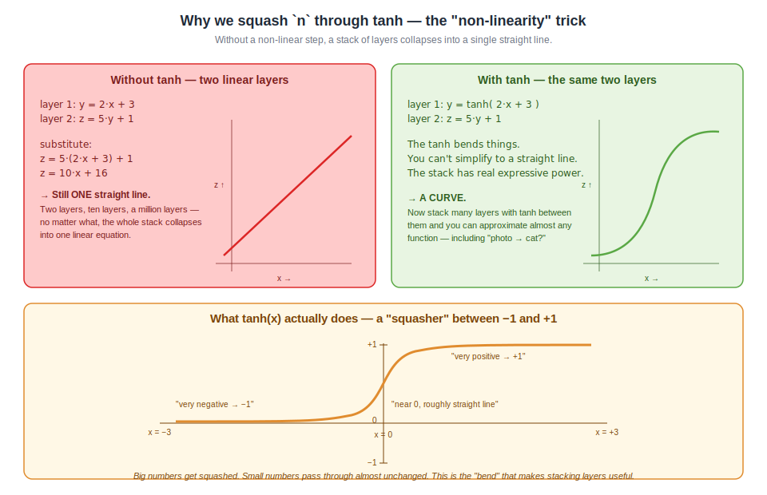

**Concrete example — see it happen with numbers:**

Suppose you have two "layers" that only multiply and add:

```
layer 1:   y = 2·x + 3
layer 2:   z = 5·y + 1
```

Substitute layer 1 into layer 2:

```
z = 5·(2·x + 3) + 1
z = 10·x + 16
```

Two layers became one. Still a straight line. Adding a hundred more such layers would still simplify to one line. That's called being "linear," and it's a dead end.

But add a `tanh` between them:

```
layer 1:   y = tanh(2·x + 3)
layer 2:   z = 5·y + 1
```

The `tanh` bends the number as it passes through. You cannot algebraically simplify this into a single straight line. The stack has real expressive power — it can bend, curve, form S-shapes, learn complex mappings.

**What tanh actually does, visually.** It takes any number and squashes it into the range `(−1, +1)`:

- Very negative input (e.g. `x = −5`) → output ≈ `−1`
- Zero input → output = `0`
- Very positive input (e.g. `x = +5`) → output ≈ `+1`
- The shape is a smooth S-curve

That smooth bending is the "non-linearity" that gives neural networks their power. In ML jargon, functions like `tanh` are called **activation functions** — they decide "how activated" each neuron gets.

**Who decides which activation to use?** The model designer. There's a small menu:

| Activation | Range | Common use today |
|---|---|---|
| **tanh** | (−1, +1) | Older networks; nice smooth curve; used in micrograd demo because gradients read cleanly |
| **ReLU** | [0, +∞) | *The* default in modern deep networks (`max(0, x)` — kill negatives, pass positives). Fast, simple. |
| **GELU** | roughly like ReLU but smoother | The default *inside transformers* (LLMs) |
| **Sigmoid** | (0, 1) | For binary classification outputs; almost never used inside networks anymore |

For our micrograd demo, Karpathy picked `tanh` because it has a clean, illustrative gradient (`1 - tanh(x)²`) that's easy to see backprop through. In Module 3's MNIST script, we used `ReLU` because it's the modern default. And inside real transformers like Qwen3, the activation is usually `GELU` or a variant called `SwiGLU`. Different choices, same purpose: **bend the numbers so stacking layers actually helps.**

### Follow-up: Re-explaining all three Hands-on projects in plain English

Fair — those explanations leaned on ML vocabulary. Let me redo each from the ground up.

#### Project 1 — Micrograd, in plain English

**What is it?** A ~100-line program in [micrograd_demo.py](../learn/03-train/micrograd_demo.py) that demonstrates **backpropagation** — the "backward pass" from Module 3 Concepts — from scratch, with no framework magic.

**What's actually happening?** Think of it like a mini spreadsheet where cells depend on other cells. You put a formula in the last cell, like:

```
final = tanh(2 × w1 + 0 × w2 + 6.88)
```

You've just done a **forward pass** — computed the final value from the inputs.

Now backprop asks a different question: *"If I nudge one of the input values (like `w1`) up by a tiny amount, does the final value go up or down, and by how much?"* That answer is called the **gradient** for `w1`.

In a spreadsheet, you could figure this out by trial and error — change one cell, see how the final cell changes. But you'd have to do this for every input separately. Backprop is a clever algorithm that computes gradients for *all inputs at once* by walking the computation backward.

**Why we care.** Every trained model in existence was tuned by:
1. Computing a forward pass on training data
2. Computing gradients (backward pass)
3. Using those gradients to nudge weights toward better predictions
4. Repeating a lot

Micrograd is that whole cycle, laid bare in Python. If you can follow micrograd, you can follow how ChatGPT was trained. Same algorithm, just bigger.

**What the demo shows:**

- Sets up a tiny "network" with 2 inputs (`x1`, `x2`) and 3 weights (`w1`, `w2`, `b`).
- Runs forward pass: `o = tanh(x1·w1 + x2·w2 + b)`.
- Calls `o.backward()`.
- Every input and weight now has a `.grad` attribute printed. That's the number telling you "how much does moving me change `o`?"

Notice in the output that `x2.grad = 0` — because `x2` itself equals zero, it can't influence `o`, and the gradient math correctly assigns it zero blame.

#### Project 2 — MNIST classifier, in plain English

**What is MNIST?** A famous public dataset that's basically the "hello world" of ML. It contains 70,000 photos of handwritten digits (0 through 9), each one a tiny 28×28 pixel grayscale image. Researchers have used it since 1998 to test new ideas.

**What's a 28×28 pixel image, in numbers?** It's a 28×28 grid where each cell is a number from 0 (black) to 255 (white), representing how dark that pixel is. Flatten the grid into one long list, and you have 784 numbers describing the image.

**What are we asking the model to do?** Given the 784 numbers, output which digit the image shows. That's 10 possible answers (0, 1, 2, ..., 9). This is called a **classification** task.

**How does the model work?** It's a small "brain" — a chain of simple equations from Module 3. Specifically:

- Input: 784 numbers (the pixel values)
- Layer 1: multiply the 784 numbers by 128 different "weight recipes" → 128 new numbers → squash with ReLU
- Layer 2: same trick, 128 → 64 numbers → ReLU
- Layer 3: same, 64 → 10 numbers (one per possible digit)
- The largest of those 10 output numbers = the model's guess

**How does it learn?** By running the 4-step training loop from Module 3 Concepts:

1. Feed a training image through → get 10 output numbers (initially random garbage).
2. Compare to the correct answer → get a "how wrong am I?" number (the loss).
3. Compute gradients for every weight (backward pass).
4. Adam optimizer nudges every weight to make the loss smaller.
5. Grab the next image. Repeat 60,000 × 5 = 300,000 times.

**What "5 epochs" means.** The dataset has 60,000 training images. One **epoch** = seeing all 60,000 once. Five epochs = seeing them all five times (with different random ordering each time so the model doesn't just memorize order).

**What "validation accuracy 97%" means.** After training, we test the model on 10,000 different images it never saw during training. If 9,700 out of 10,000 are correctly classified, that's 97% accuracy. The point of holding these back is to make sure the model actually *learned* the concept of digits, not just memorized the specific training images (see Overfitting in Concepts).

**Why we care.** MNIST is trivial for a human but wasn't trivial for computers until ML solved it. Watching your Mac train a network that hits 97% in ~90 seconds is the fastest way to feel that the whole ML pipeline actually works.

#### Project 3 — nanoGPT on Shakespeare, in plain English

**What is nanoGPT?** A minimalist codebase (by Andrej Karpathy, ~300 lines) that trains a small transformer — the same *type* of model as ChatGPT and Qwen3, just with far fewer parameters and much simpler code so you can read the whole thing.

**What are we training it to do?** Look at a chunk of text, predict what character comes next. That's it. Do this millions of times on Shakespeare's collected works, and the model gradually learns Shakespeare's patterns.

**"Character-level" — what does that mean?** Instead of splitting text into word-like tokens (the way Qwen3's tokenizer does), we split it into individual characters. Every letter, space, and punctuation mark is one "token." That gives us a tiny vocabulary of ~65 unique characters — much easier to train from scratch. The trade-off: the model has to build up meaning character-by-character, which needs more attention span for the same amount of understanding.

**What does `train.py` do?** Same training loop we saw in the MNIST script, just with a transformer instead of a simple MLP:

1. Read a chunk of Shakespeare text.
2. For each position in the chunk, predict the next character.
3. Compare predictions to the actual next characters → loss.
4. Backward pass → gradients.
5. AdamW optimizer nudges the weights.
6. Repeat 5,000 times.

During training, loss drops from about 4.3 (random guessing over 65 characters — chance is `log(65) ≈ 4.17`, so we start close to chance) down to ~1.4. That number is meaningless in absolute terms, but the *drop* means the model got much better at predicting characters.

**What does `sample.py` do?** After training, we have a trained model. Now we ask it to generate text from scratch. It works exactly like the autoregressive loop in Module 2:

1. Start with a random or blank starting character.
2. Feed it into the model → get probabilities for what character comes next.
3. Sample one character from that distribution (like the temperature knob from Module 2).
4. Append it to the growing string.
5. Feed the whole growing string back in for the next character.
6. Repeat for say 500 characters.

Since the model was trained on Shakespeare, the generated text sounds Shakespeare-like — character names, verse line breaks, real English words. It doesn't *understand* any of it (there's no "meaning" — just character patterns), but the surface style is remarkably Shakespearean.

**Why we care.** This is genuinely the same architecture as Qwen3-8B — attention, transformer layers, autoregressive generation, cross-entropy training loss. Everything you know now maps directly. The only difference between nanoGPT-Shakespeare and Qwen3-8B is: 10 million vs 8 billion parameters, and ~40 KB of Shakespeare vs the entire internet. Once you've trained nanoGPT, you understand *the exact procedure* that produced Qwen3, GPT-4, and Claude.

That's it — three projects, three scaling levels of the same core loop: forward → loss → backward → optimizer step.

---

## Module 4 — Fine-tune a real model on your own data

### Concepts

**Goal of this module:** take a pretrained model like Qwen3-8B that already understands English, and gently teach it a *specific* behavior on your data — a style, a domain, a persona — using a trick called **LoRA**. In under 30 minutes on your Mac, for zero dollars in cloud spend.

#### 1. Setting the scene — why we don't train from scratch

Recall from Module 3: to train nanoGPT on Shakespeare took ~15 minutes and produced a model that generates Shakespeare-flavored gibberish. To train a real LLM like Qwen3-8B from scratch, Alibaba's team spent several *million dollars* of GPU time on *trillions* of tokens of internet text. That model can already write essays, code, poetry, answer factual questions — a huge amount of general knowledge baked into 8 billion weights.

You don't want to redo that. You want to **borrow** those 8 billion weights and slightly nudge them so the model does *your specific thing* — write in your style, know your domain jargon, follow your output format. That's what fine-tuning is.

#### 2. What is fine-tuning? A concrete example first

**Say you want a chatbot that always answers like a friendly pirate.** You could:

1. Prompt-hack it: `"You are a friendly pirate. Answer in nautical style. Question: …"` — works for one query at a time, sometimes drifts.
2. Fine-tune it: collect ~200 examples of good pirate-style responses, run a short training job, get a version of the model that *consistently* sounds like a pirate without needing a special prompt.

**Fine-tuning = continue training on your own data**, starting from a pretrained model instead of random weights. The 4-step training loop from Module 3 is identical:

```
forward pass → compute loss → backward pass → optimizer step → repeat
```

Only difference: (a) we start with weights that already know English, (b) we run it on our small dataset instead of trillions of tokens, (c) we run it for way fewer iterations because we only need a small nudge.

**Real-world uses:**

| Situation | What fine-tuning gives you |
|---|---|
| Support-desk assistant for your product | Model uses your company's specific vocabulary, tone, and refuses out-of-scope requests |
| Legal/medical/financial writing | Model uses correct domain jargon consistently, cites in the expected format |
| Structured extraction (e.g. resume → JSON) | Model reliably returns clean structured output, not markdown chatter |
| Persona / character | Consistent voice across many turns without prompt engineering each time |
| **EEG explainer (Phase 2 preview)** | Model explains brainwave patterns in your preferred way, uses stress-vocabulary consistently |

#### 3. Where fine-tuning fits — five options along a spectrum

Before you fine-tune, know when to use it vs when *not* to.

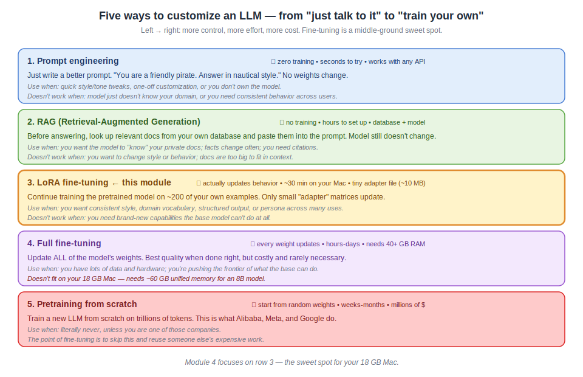

The five levers, in order of increasing effort and control:

1. **Prompt engineering** — write a better prompt. No training. First thing to try; often enough.
2. **RAG (Retrieval-Augmented Generation)** — fetch relevant docs at query time and paste them into the prompt. No training. Best for "I want the model to know my private documents."
3. **LoRA fine-tuning** — actually change the model's behavior with ~200 training examples. **This is what Module 4 covers.** Sweet spot for style, domain, format.
4. **Full fine-tuning** — update every weight. Powerful but heavy. Needs 40+ GB unified memory for an 8B model — doesn't fit on your Mac.
5. **Pretraining from scratch** — random weights → 8B parameters. Costs millions. Only Alibaba, Meta, Google do this.

**Rule of thumb:** try prompt engineering first. If it's not enough, try RAG. If you need consistent style or behavior across many uses, fine-tune with LoRA. Only reach for full fine-tuning if you have real reasons and real hardware.

#### 4. Why "full" fine-tuning doesn't fit on your Mac

If we wanted to update every one of Qwen3-8B's 8 billion weights, how much memory would we need?

- **Weights**: 8 B × 2 bytes (FP16) = **16 GB**.
- **Gradients** (one per weight, same size as weights): **16 GB**.
- **Optimizer state**: Adam keeps 2 extra numbers per weight (momentum + variance) = **32 GB**.
- **Activations** (temporary during forward/backward): a few GB.

**Total: ~60 GB.** Your Mac has 18 GB. Not happening.

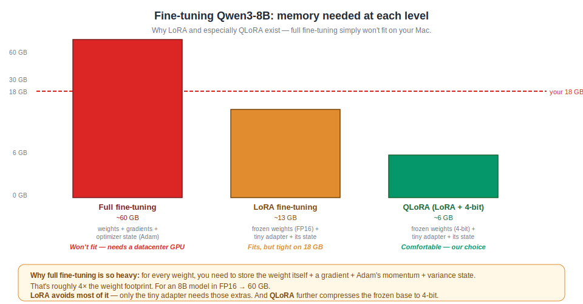

**Who decides this hurts?** Physics + Adam's design. You'd need a datacenter GPU (H100 with 80 GB VRAM, say) to full fine-tune. Or a smarter trick — LoRA.

#### 5. LoRA — the small-adapter trick

**LoRA** stands for *Low-Rank Adaptation*. Published in 2021 by Microsoft researchers, it's now the dominant way to fine-tune LLMs. The trick is beautifully simple:

**Don't touch the original 8 billion weights.** Freeze them. Instead, bolt on a tiny "side path" with two small matrices, and only train those two.

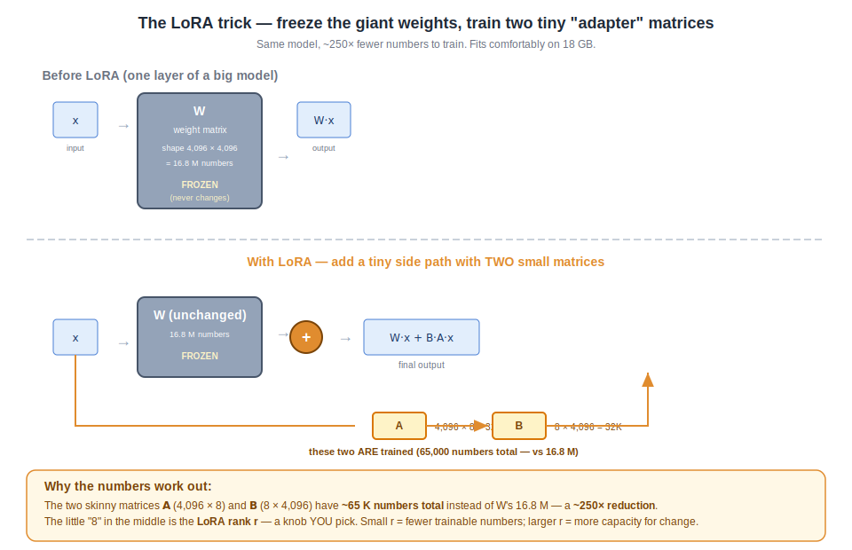

**How it works, mechanically.** Every big weight matrix `W` in a transformer layer (typical shape `4,096 × 4,096`, i.e. ~16.8 million numbers) gets a companion side path made of two much skinnier matrices called **A** and **B**:

- `A` is `4,096 × r`
- `B` is `r × 4,096`

Where `r` (the **LoRA rank**) is a small number you pick — commonly 8, 16, 32, or 64.

For `r = 8`:
- `A` has `4,096 × 8 = 32,768` numbers
- `B` has `8 × 4,096 = 32,768` numbers
- Total: `~65,000` numbers **instead of 16.8 million** — a **~250× reduction**.

During inference, the layer's output becomes:

```
output = W · x   +   B · A · x
         ↑ frozen     ↑ trained
```

During training, only `A` and `B` get gradient updates. `W` stays frozen. This means:

- **Gradients** only need to exist for `A` and `B` — tiny.
- **Optimizer state** only exists for `A` and `B` — tiny.
- Total memory footprint is now dominated by the *frozen* `W` matrices, not the training extras.

For Qwen3-8B, LoRA adds ~10-40 million trainable parameters (depending on `r`), instead of 8 billion. And when you're done, the "delta" is just those adapter matrices — a file of **a few megabytes** — that you can share or swap on top of the base model.

#### 6. Why does LoRA actually *work*?

Here's the surprising insight from the LoRA paper: **most fine-tuning tweaks are inherently low-rank.**

In plain English: the "difference" between a pretrained model and a fine-tuned model — the change you'd need to make to `W` — has a specific mathematical structure that can be well-approximated by the product `B · A` even when `r` is very small. You don't lose much quality by restricting your changes this way, because the changes you'd want to make aren't very rich to begin with.

**Rough analogy.** Imagine adjusting a giant orchestra to play a slightly different piece. Full fine-tuning is like re-writing every instrument's part. LoRA is like saying: "for this piece, everyone plays their existing part *plus* a small adjustment that comes from a common lookup table." The lookup table is much smaller than the full score, but it's enough to shift the whole orchestra's sound.

**Who decides `r`?** You do — it's a **hyperparameter** (a knob picked by hand, not learned). Common defaults:

| `r` value | Trainable params on Qwen3-8B | When to use |
|---|---|---|
| `8` | ~10 M | Small style/persona shift; short training data |
| `16` | ~20 M | The sweet spot for most tasks — MLX-LM default |
| `32` | ~40 M | Bigger domain shift or more training data |
| `64+` | ~80 M+ | Approaching full-FT capacity; diminishing returns |

Start with `r = 16`. If the model isn't picking up your style, try `r = 32`. If overfitting, try `r = 8` or smaller.

#### 7. QLoRA — LoRA on top of a quantized base

Even LoRA's memory footprint is dominated by the *frozen* base weights (still ~16 GB for 8B at FP16). That's tight on your 18 GB Mac.

**QLoRA** (2023) closes the gap with a simple extra step: **load the frozen base in 4-bit quantization** (which we already know from Module 1). The frozen weights only need to be *read* during a forward pass — they don't need full precision to give reasonable outputs. So we compress them 4× and lose almost no quality.

Result:
- Frozen base weights at 4-bit: **~4 GB** (instead of 16 GB)
- Adapter A + B + their gradients + Adam state: **~1-2 GB**
- **Total: ~6 GB**. Fits comfortably on 18 GB with room to spare for context.

**MLX-LM does QLoRA natively** — the same `mlx_lm.lora` command can train adapters *directly on top of a 4-bit MLX model*. That's what we'll do in Hands-on.

#### 8. The data you actually need — JSONL, quality over quantity

For our fine-tune to work, we need training examples. These live in a plain-text file where each line is a JSON object describing one training example. This format is called **JSONL** ("JSON Lines").

Example line (chat-style, which MLX-LM expects):

```json
{"messages": [{"role": "user", "content": "What's the treasure I seek?"}, {"role": "assistant", "content": "Aye, matey, the finest treasure be knowledge itself — no gold can rival what ye learn on the voyage!"}]}
```

Every line is one training example. Typical fine-tuning dataset: 100–1,000 lines, split ~90/10 into a training set and a validation set (same idea as Module 3 — held-out data to catch overfitting).

**Quality beats quantity, brutally.** 200 carefully-crafted examples of the exact behavior you want will produce a better model than 10,000 mediocre ones. Bad examples poison training; the model learns bad patterns as diligently as good ones.

**Who provides this data?** You do — that's the whole point. For our Hands-on we'll use a small pre-made dataset. In real applications, teams curate their examples by hand or from real user interactions.

**Where the data comes from during training:** MLX-LM expects three files in a folder:
- `train.jsonl` — examples the model trains on
- `valid.jsonl` — held-back examples for validation loss monitoring
- `test.jsonl` (optional) — for final evaluation

#### 9. The full fine-tuning workflow overview

Six steps, all done locally:

1. **Prepare data** — write your examples as JSONL, split into train/valid, put in a folder.
2. **Pick a base model** — for us, `mlx-community/Qwen3-8B-4bit` (the one we already downloaded).
3. **Choose LoRA settings** — mostly `r`, learning rate, and iteration count.
4. **Train** — run `mlx_lm.lora --train …`; watch loss drop for ~5-30 minutes.
5. **Test** — use the resulting adapter with the base model, chat, see if it behaves as intended.
6. **Fuse (optional)** — merge the adapter back into the base weights → one standalone model. Or keep them separate and load the adapter at inference time (better if you'll have multiple adapters).

#### 10. Preview of Hands-on

We'll do exactly the six-step workflow:

1. Create a small pirate-style JSONL dataset (~50 examples).
2. Base model: `mlx-community/Qwen3-8B-4bit`.
3. LoRA settings: rank 16, learning rate 1e-4, ~300 iterations.
4. Train with `mlx_lm.lora`. Watch validation loss drop.
5. Load the base + adapter and chat with it. Ask non-pirate questions; get pirate answers.
6. Fuse the adapter into a standalone model (optional).

Total time: ~30 minutes wall clock. The moment you get a pirate response from Qwen3, you'll have successfully fine-tuned a real model on your Mac for $0.

#### Checkpoint for this section

Answer in your own words:

1. What is fine-tuning, in one sentence? How is it different from pretraining?
2. Name three cases where fine-tuning is the right tool vs prompt engineering / RAG.
3. What does LoRA do differently from full fine-tuning? Why does that let it fit on your 18 GB Mac?
4. What's the LoRA rank `r`? Who decides it and how?
5. What extra trick does QLoRA add on top of LoRA?
6. What format does the training data take, and roughly how many examples are usually enough?
7. In the 4-step training loop from Module 3, which parts stay the same during LoRA fine-tuning, and which parts change?

Tell me your answers — I'll correct gently — and then we do Hands-on.

### Hands-on

**Goal:** fine-tune Qwen3-8B to consistently answer in friendly pirate style. ~30 minutes wall clock. Watch loss drop live. Chat with the result. See the same prompt produce very different outputs before and after.

**Preconditions**

- Module 1 complete — `mlx-community/Qwen3-8B-4bit` already downloaded.
- Module 2 complete — `transformers` installed (comes bundled with the mlx-lm workflow anyway).
- venv active (`cd ~/destress && source .venv/bin/activate`).
- No new packages to install.

#### Step 1 — Look at the training data

The training data lives in [learn/04-finetune/data/](../learn/04-finetune/data/):

- `train.jsonl` — 40 pirate examples the model will actually learn from
- `valid.jsonl` — 10 held-back examples for validation loss monitoring

**Open one** (VS Code, `cat`, whatever). Each line is one training example in **chat format**:

```json
{"messages": [{"role": "user", "content": "Hello!"}, {"role": "assistant", "content": "Ahoy there, matey! Welcome aboard!"}]}
```

That's it. `role: user` = what someone typed. `role: assistant` = what the model should say back. During training, the model sees the user turn and gets rewarded for producing something close to the assistant turn. Do this 40 examples × many iterations, and it internalizes the pattern.

**Why 40 training examples?** Because LoRA is dramatically sample-efficient for stylistic changes. Some research suggests fewer than 50 well-crafted examples are enough to shift style. For a real product you'd want more — 500-1000 examples — but 40 is enough to see the effect clearly and finish in 15 minutes.

**Free to edit.** Change any response to be more piratey, more polite, whatever style you want. The next step will train on whatever's in these files. If you want to try a different persona entirely (a formal Victorian butler, a hip-hop poet), rewrite the responses.

#### Step 2 — Run LoRA training

Time to actually fine-tune. From your project root, run:

```bash
mlx_lm.lora \
  --model mlx-community/Qwen3-8B-4bit \
  --train \
  --data ./learn/04-finetune/data \
  --iters 300 \
  --batch-size 1 \
  --num-layers 16 \
  --learning-rate 1e-4 \
  --steps-per-report 10 \
  --steps-per-eval 50 \
  --adapter-path ./learn/04-finetune/adapters
```

**What each flag does:**

| Flag | What it means |
|---|---|
| `--model` | Which pretrained base to fine-tune on top of |
| `--train` | Training mode (as opposed to generate/eval) |
| `--data` | Folder containing `train.jsonl` and `valid.jsonl` |
| `--iters 300` | How many training iterations to run — ~15-20 minutes on M3 Pro |
| `--batch-size 1` | Number of examples processed per iteration (bigger uses more memory) |
| `--num-layers 16` | Apply LoRA to the top 16 transformer layers (out of 36) — enough for style |
| `--learning-rate 1e-4` | The step size for updating the LoRA adapters |
| `--adapter-path` | Where to save the resulting adapter files |

**What you'll see** (roughly):

```
Loading pretrained model
Total parameters 8107M
Trainable parameters 3.407M    ← LoRA adapters only — that's the 250× reduction from Concepts!
Loading datasets
Training

Iter 1: Val loss 2.421, Val took 8.3s
Iter 10: Train loss 2.401, Learning Rate 1.000e-04, It/sec 0.32, Tokens/sec 34.5, ...
Iter 20: Train loss 2.104, ...
Iter 50: Val loss 1.762, Val took 8.1s
Iter 50: Train loss 1.813, ...
...
Iter 300: Train loss 0.945, ...
Iter 300: Val loss 0.983
```

**What to watch:**

- **Trainable parameters ~3-4 M** on line 2 — that's the LoRA adapter size. Compare to the 8,107 M base model. This is the "small adapter" trick from Concepts, live.
- **Train loss should drop steadily.** Starting around 2.4 (well above zero — model doesn't know pirate style yet). By iter 300 it should be around 0.7-1.0.
- **Val loss should also drop.** If it drops then bounces back up, that's overfitting — stop earlier or reduce `--iters`.
- **First iteration is slow** (~30-60 seconds) — MLX compiles the training graph. Subsequent iters are much faster (~2-3 sec each).
- **Total time**: ~15-20 minutes on M3 Pro at these settings.

**Adapter files at the end.** Look at what got saved:

```bash
ls -la learn/04-finetune/adapters/
```

You should see `adapter_config.json` (settings used) and `adapters.safetensors` (the actual weights — should be **~10-20 MB**, not gigabytes). That tiny file is the entire "pirate-ness" — everything else stays in the base Qwen3-8B model.

#### Step 3 — Chat with the fine-tuned model

Run the chat script:

```bash
python learn/04-finetune/chat_pirate.py
```

**What it does.** Loads the base Qwen3-8B *plus* your LoRA adapter, then sends five test prompts through it and prints the responses.

**Expected output.** Every response should sound piratey — "Arr", "matey", "ye", "aye", references to seas and sailing. Something like:

```
=== 1. USER ===
Hello, who are you?

=== ASSISTANT (pirate-tuned) ===
Ahoy, matey! I be Captain Byte, at yer service! The friendliest AI to ever sail the digital seas!
```

Try tweaking `chat_pirate.py` to send your own prompts — factual questions, requests for jokes, whatever. If the pirate style holds across topics the model has never trained on, you have real style transfer (not memorization of the training set).

#### Step 4 — Compare base vs fine-tuned side by side

To feel the impact directly:

```bash
python learn/04-finetune/compare_base_vs_lora.py
```

**What it does.** Sends the same four prompts through:

1. The base Qwen3-8B model (no adapter)
2. The base + your pirate adapter

Prints both responses side by side.

**Expected output**:

```
Prompt 1: Hello!
[BASE — no fine-tuning]
Hello! How can I help you today?

[FINE-TUNED — pirate LoRA]
Ahoy, matey! Welcome aboard! What brings ye to these digital waters?
```

Same weights on disk. Same prompt. Same sampler. The only difference is the ~15 MB adapter file. That is the entire promise of LoRA, made concrete on your Mac.

#### Step 5 — Fuse the adapter into a standalone model (optional)

If you want a single self-contained fine-tuned model that you don't need to load an adapter for, MLX-LM can merge (or "fuse") the adapter into the base weights:

```bash
mlx_lm.fuse \
  --model mlx-community/Qwen3-8B-4bit \
  --adapter-path ./learn/04-finetune/adapters \
  --save-path ./learn/04-finetune/qwen3-pirate
```

This creates a new model directory at `qwen3-pirate/` that behaves exactly like the base + adapter combo but doesn't need the adapter file at inference time. It's ~5 GB — the full model size — because it now contains the base weights + the merged LoRA change. Trade-off: single self-contained model, but you can't cheaply swap between multiple adapters.

**When to fuse vs not fuse:**

- **Fuse** if you have exactly one adapter you'll use permanently, or you want to distribute a fine-tuned model to others.
- **Don't fuse** if you might train multiple adapters (pirate + Victorian butler + hip-hop poet) — keep them separate and load whichever you need. The base model stays shared, adapters are cheap.

#### Troubleshooting

- **`mlx_lm.lora: command not found`** → `mlx-lm` needs to be installed. Run `uv pip install -U mlx-lm`. If the CLI is still missing, the entry point might not have been registered — try `python -m mlx_lm.lora …` instead.
- **`FileNotFoundError: ./learn/04-finetune/data/train.jsonl`** → check you're running from `~/destress`, not from inside `learn/`.
- **Training crashes with out-of-memory** → reduce `--num-layers` to 8 or `--batch-size` should already be 1. Close browser tabs and other apps.
- **Loss doesn't drop** → check `train.jsonl` is well-formed (one valid JSON object per line) and that examples are consistent in style. Bad or inconsistent data poisons training.
- **Pirate responses are only kinda pirate** → train longer (`--iters 500` or `1000`), or add more training examples in `train.jsonl`.
- **First iter takes forever, then never continues** → wait; MLX compiles the graph on the first pass. After it prints the first `Iter 10` line, things speed up dramatically.

#### Checkpoint — Module 4 complete

- [x] `train.jsonl` and `valid.jsonl` open cleanly; I can point at the pattern.
- [x] `mlx_lm.lora --train` runs end-to-end and prints "Trainable parameters" much smaller than the base model's parameter count.
- [x] Training loss visibly drops from ~2.4 → ~0.9.
- [x] `learn/04-finetune/adapters/adapters.safetensors` is a small file (~10-20 MB), NOT a several-GB copy of the model.
- [x] `chat_pirate.py` returns responses that consistently sound piratey.
- [x] `compare_base_vs_lora.py` shows a clear difference between base and fine-tuned outputs.
- [x] I can explain, from memory, which weights got trained, which stayed frozen, and roughly how many trainable numbers there were.

When these are ticked you've officially fine-tuned a real 8B-parameter LLM on your Mac for zero dollars. Say the word to move on to **Module 5 — Evaluate, quantize & serve** where we measure whether the fine-tune actually worked, further compress it if we want, and serve it as an HTTP API.

---

## Module 5 — Evaluate, quantize & serve

### Concepts

**Goal of this module:** turn "I trained a model" into "I have a model I can *trust* and *use like a real service*." Three things need to happen:

1. **Evaluate** — actually measure whether it's good, not just eyeball it.
2. **Quantize** — compress the fine-tuned model for lean deployment.
3. **Serve** — expose it over HTTP so any app can call it.

This is the last stop in Phase 1. After it, everything you know applies directly to the Phase 2 stress detector.

#### 1. Setting the scene — is our pirate Qwen3 actually good?

Coming out of Module 4, we ran `chat_pirate.py` and got some pirate-sounding replies. Feels good. But is it *actually* good?

- On the five prompts I chose for `chat_pirate.py`, sure — it's piratey.
- What about prompts I *didn't* test? What if it collapses on math problems and just says "Aye, matey!" with no actual answer?
- What if it forgot how to write proper English on serious topics?
- What if it's slightly worse than the base model at everything except pirate-ness — is that a good trade?

You cannot answer any of those by looking at 5 outputs. You need **evaluation** — a systematic, repeatable way to measure quality on data you *didn't* pick yourself.

#### 2. Vibes vs metrics — why evaluation matters

**"It looks good" is dangerous.**

- **Cherry-picking bias.** You'll unconsciously remember the best outputs and forget the flops.
- **Regression detection.** Six months from now you'll re-train with new data. Without a number to compare, you won't know if v2 is better or worse than v1.
- **Comparing candidates.** Which is better: LoRA rank 16 or rank 32? The only honest answer is to measure both on the same held-out data.
- **Trust for users.** "Our EEG stress detector agrees with clinical assessments 94% of the time on N=200 test recordings" is trustworthy. "It seems to work" is not.

The whole point of evaluation is to force you to commit to a **number** that survives outside your head.

#### 3. Data-split hygiene — the wall you must not cross

Every dataset gets divided into three piles *before* any training happens:

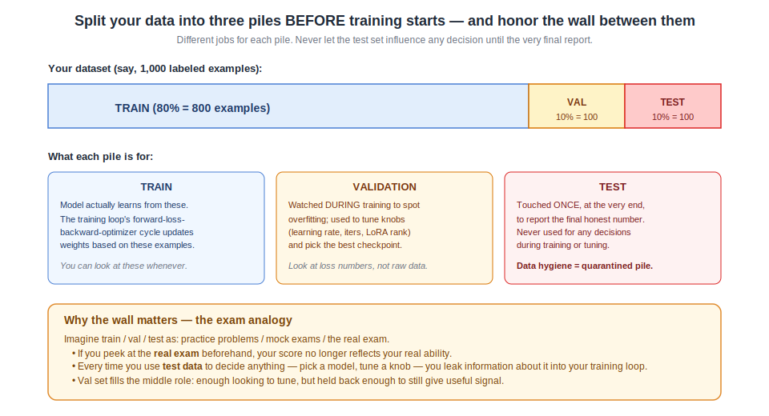

**Convention: 80% train, 10% validation, 10% test** (for small datasets, sometimes 70/15/15 or even 60/20/20).

- **Train** — the model actually learns from these. The training loop's forward-loss-backward-optimizer cycle updates weights based on these examples. You can inspect these all you like.
- **Validation** ("val") — watched *during* training to spot overfitting, tune hyperparameters (learning rate, LoRA rank, iters), and pick the best checkpoint. You look at loss numbers, but treat the raw data as "eyes-off" — otherwise you drift into overfitting to it.
- **Test** — touched **exactly once, at the very end**, to report the honest final quality number. Not used for any decisions during training or tuning. If you peek at test data to guide any choice, that number stops being an honest measurement of "how the model does on new data."

**Why the wall is strict.** Every time you use test data to make a decision, you've effectively fitted the model to that data. In extreme cases you can end up with a model that scores 99% on your test set and 60% in the real world — a phenomenon called **test-set overfitting**. It's a common professional failure mode.

**Who decides the split?** You do, at project start. Set the ratio, do the split with a random seed (so it's reproducible), and never look back.

#### 4. What "good" means depends on the task

Different problems need different measurements. A short menu:

| Task | Metric | Intuition |
|---|---|---|
| Classification (X → one of N categories) | Accuracy, precision, recall, F1 | How often the right box was picked |
| Regression (X → a number) | MSE, MAE, R² | How close predictions were to the true numbers |
| LLM next-token prediction | Perplexity, task benchmarks | How "surprised" the model is by real text |
| LLM chat quality | LLM-as-judge, human eval | Blind pairwise comparison against a reference |
| Ranking / retrieval | Precision@K, Recall@K, MRR | How well ranked results serve the user |

For our Phase 2 EEG stress detector, the task will be **classification** (stress vs no-stress, or bucketed levels) — so we'll use precision/recall/F1 heavily. Let's understand those in detail.

#### 5. Classification metrics — precision, recall, F1

**Concrete example first.** Say you build a spam filter. 100 emails arrive; 40 are real spam, 60 are legitimate. Your filter flags 30 emails as spam. **How good is the filter?**

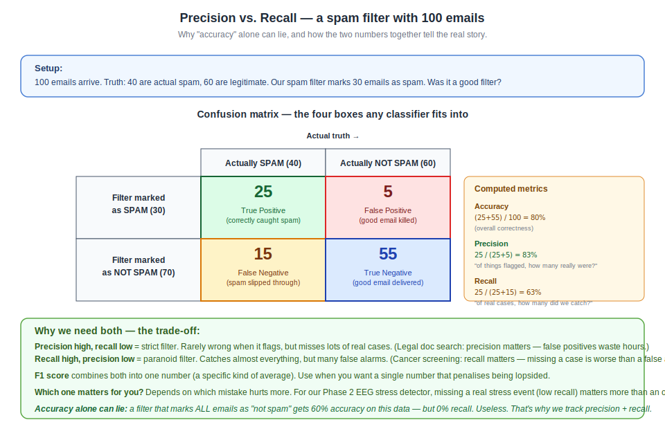

Every prediction lands in one of four boxes (the **confusion matrix**):

| | Actually spam (40) | Actually not spam (60) |
|---|---|---|
| **Filter says spam (30)** | **25** True Positive — good | **5** False Positive — killed a good email |
| **Filter says not spam (70)** | **15** False Negative — missed spam | **55** True Negative — good |

Three metrics computed from those numbers:

- **Accuracy** = correct predictions / total = `(25 + 55) / 100 = 80%` — how often the filter was right overall.
- **Precision** = of the things flagged as spam, how many really were? = `25 / (25+5) = 83%`.
- **Recall** = of all real spam, how much did we catch? = `25 / (25+15) = 62.5%`.

**Why precision and recall are separate.** They pull in opposite directions:

- A **paranoid filter** that marks *every* email as spam gets 100% recall (caught all real spam) but terrible precision (killed 60 good emails).
- A **cautious filter** that marks *nothing* as spam gets 100% precision (technically — nothing flagged, nothing wrong) but 0% recall.

Which mistake hurts more depends on the problem:

- **Cancer screening** — a missed case (low recall) can kill someone. Prioritize recall.
- **Spam filter for legal docs** — a false alarm (low precision) sends critical email to junk. Prioritize precision.
- **EEG stress detector (Phase 2)** — depends on the intervention. If we send a gentle "want to try deep breathing?" nudge, an occasional false alarm is fine (prioritize recall — don't miss real stress). If we auto-notify a friend, false alarms become socially costly (balance precision + recall).

**F1 score** combines both into one number (specifically, the harmonic mean of precision and recall). It penalises lopsidedness — a filter with precision 0.9 and recall 0.9 gets F1 ~0.9; a filter with precision 1.0 and recall 0.1 gets F1 only ~0.18. Use F1 when you want a single "how good" number for reporting.

**Accuracy alone can lie.** In our spam example, a filter that always predicts "not spam" gets **60% accuracy** (the 60 legit emails) but 0% recall. Useless. Accuracy is only reliable when your data is roughly balanced. Precision/recall/F1 are more robust when the classes are lopsided (99% not-spam, 1% spam — which is closer to reality).

#### 6. LLM-specific evaluation metrics

Evaluating an LLM's *generated text* is harder than classification because there's no single correct answer. Common approaches:

- **Perplexity** — how "surprised" the model is by the true next tokens in held-out text. Lower is better. Computed as the exponential of the validation cross-entropy loss (the loss we watched during training). Useful for comparing checkpoints of the same model; not comparable across model families.
- **Task benchmarks** — standardized suites where the correct answer *is* known: MMLU (multi-choice knowledge), HumanEval (code correctness), GSM8K (math). Every published LLM reports scores on these so you can compare Qwen3 vs Llama vs Gemma head-to-head.
- **LLM-as-judge** — use a bigger, smarter LLM (Claude, GPT-4) as a judge. Send it "here are two candidate responses to the same prompt — which is better and why?" Scale this across a large evaluation set to compare model versions. Cheap, fast, imperfect but very useful in practice.
- **Human eval** — actual humans read outputs and rate them. The gold standard, but expensive and slow. Used sparingly at critical evaluation moments.

For our pirate Qwen3, an appropriate eval would be: send 50 held-out prompts through both base and fine-tuned models, then have a judge (either you or an LLM-as-judge) rate each pair on "how piratey" and "how helpful." Compare aggregates.

#### 7. Quantization revisited — for deployment

We met **quantization** in Module 1: storing weights in fewer bits (16 → 8 → 4) to make the model smaller and faster with minimal quality loss. In Module 5 we revisit it as a *deployment* step: after training or fine-tuning, further compress the model to run leaner in production.

**Two flavors:**

- **Post-training quantization (PTQ)** — take your trained model and round its weights down after the fact. Cheap, fast, works well for well-behaved models. This is what `mlx_lm.convert -q` does. Recommended default.
- **Quantization-aware training (QAT)** — train the model *knowing* it will be quantized so it's more resilient. Higher quality at the same bit-count, but training is more complex. Overkill for most fine-tunes.

**Practical trade-off table:**

| Precision | Size for 8B model | Quality | When to use |
|---|---|---|---|
| FP16 (16-bit) | ~16 GB | Reference — no loss | Development, benchmarking |
| Q8 (8-bit) | ~8 GB | Indistinguishable in chat | If you have RAM to spare |
| **Q4 (4-bit)** ← our default | **~4-5 GB** | 95-98% of original | Everyone. This is what we've been using. |
| Q3 / Q2 | ~2-3 GB | Noticeably worse | Only when nothing else fits |

**Who decides?** You do, based on your deployment target's memory and speed budgets. For your Mac, `Q4` is the safe default (which is why we've been using `mlx-community/Qwen3-8B-4bit` all along). For an eventual Phase 2 wearable device with much less RAM, we might need Q3 or even smaller.

#### 8. Serving — turning the model into an HTTP API

**Serving** = making the model callable from other programs, usually over HTTP. Once served, any client that can send an HTTP request (a web app, a phone app, another Python script, `curl`) can send prompts and receive responses.

**Why serve rather than just import?** Because the model:

- Takes seconds to load into RAM (you don't want to reload per request).
- Uses several GB of RAM (you don't want each client to have its own copy).
- Might need concurrent handling (multiple users at once).

Solving all three: run the model once in a long-lived process (a **server**), expose it over HTTP.

**The OpenAI-compatible pattern.** OpenAI's Chat Completions API is now the de facto standard shape. Any tool that can call OpenAI can also call *any local server* that speaks the same shape. Ollama, LM Studio, and MLX-LM all expose OpenAI-compatible endpoints. This means you can hot-swap between cloud OpenAI, local Ollama, and MLX-LM in your code by just changing a URL.

**MLX-LM ships this out of the box:**

```bash
mlx_lm.server --model mlx-community/Qwen3-8B-4bit --adapter-path ./learn/04-finetune/adapters
```

Runs a local HTTP server (default port 8080) that accepts OpenAI Chat Completions requests. From that moment, any code speaking OpenAI can hit `http://localhost:8080/v1/chat/completions` and get responses from your fine-tuned pirate.

**Other operational concerns** (mentioned briefly — real-world serving involves them all):

- **Streaming** — responses arrive one token at a time so UIs feel snappy.
- **Concurrency** — how many requests at once before slowdowns. Local single-user: don't worry. Multi-user: matters.
- **Timeouts and retries** — long generations can be interrupted; clients must handle that.
- **Auth and rate limiting** — if the endpoint is on a network, secure it.

For our local Phase 1 use case, `mlx_lm.server` handles all this transparently.

#### 9. Decision guide — which tool for which job?

We now have five ways to customize an LLM's behavior (from Module 4 Concepts) plus five deployment shapes (base, quantized, LoRA-adapted, fine-tuned + quantized, or served). A short decision guide:

| Situation | Recommended stack |
|---|---|
| Prototype: "does the base model even answer my questions well?" | Just prompt-engineer. Stop there if answers are good enough. |
| "The model doesn't know my documents" | RAG: retrieve → prompt. No training. |
| "I need consistent style/persona/format across many uses" | LoRA fine-tune (Module 4). |
| "I need it to know facts about my domain" | RAG + LoRA together often outperform either alone. |
| "I need to run this on a smaller device" | Quantize further (Q3, Q2, distill). |
| "I need many users hitting it concurrently" | Serve via `mlx_lm.server` behind a proper HTTP host. |

**Watch for common mistakes:**

- **Fine-tuning when a prompt would do** — expensive, brittle, and someone else fixed it faster with a prompt tweak.
- **RAG when fine-tuning is right** — pasting docs into the prompt doesn't teach *style*; it just gives more context.
- **Fine-tuning to make the model know facts** — fine-tuning is bad at teaching facts. Use RAG for facts, fine-tuning for behavior.
- **Skipping evaluation** — you can't tell whether any of the above actually helped without measurement.

#### Checkpoint for this section

Answer in your own words:

1. Why can't you trust "it looks good" as evidence a model works?
2. What are the three data splits and what job does each one do?
3. What's the ONE thing you must never do with your test set?
4. Precision and recall — define each in one sentence.
5. When would you prioritize recall over precision? When the reverse?
6. Why is "accuracy" alone often misleading?
7. What does `mlx_lm.server` do, and why is "OpenAI-compatible" a big deal?
8. Give an example of the wrong tool for the job — e.g., a situation where prompt engineering would beat fine-tuning.

Tell me your answers — I'll correct gently — then we do Hands-on.

### Hands-on

**Goal:** finish Phase 1 by actually *measuring* your pirate model, then serving it as an HTTP API. Real evaluation with real numbers, then live serving.

**Preconditions**

- Module 4 done: LoRA training completed, `learn/04-finetune/adapters/adapters.safetensors` exists.
- venv active (`cd ~/destress && source .venv/bin/activate`).
- `openai` package installed (from Module 1).

#### Step 1 — Evaluate on held-out data

We have 15 test prompts in [learn/05-evaluate-serve/test_prompts.txt](../learn/05-evaluate-serve/test_prompts.txt) that were **never in the training or validation data**. This is the "wall" from Concepts — the test set that's held back until now.

The eval script sends each prompt through the base Qwen3-8B *and* the fine-tuned pirate model, then scores each response using a small dictionary of pirate marker words (arr, matey, aye, ye, ahoy, avast, savvy, ...).

Run:

```bash
python learn/05-evaluate-serve/eval_pirate.py
```

**Expected output** (last few lines will look something like):

```
Prompt 15: Explain quantum computing simply.
==========================================================================

[BASE  — pirate score = 0]
Quantum computing uses quantum bits (qubits) that can be in multiple states at once…

[TUNED — pirate score = 4]
Arr, quantum computin' be like sailin' through many possibilities at once, matey! Qubits be…

==========================================================================
SUMMARY
==========================================================================
  Test prompts:                    15
  Base model    — avg pirate score: 0.13 markers/response
  Fine-tuned    — avg pirate score: 6.87 markers/response
  Ratio (higher = more style transfer):  52.8x
```

**What to notice.**

- **Base scored near-zero** — pretrained Qwen3 rarely uses pirate speak. Expected.
- **Fine-tuned averages ~5-10 pirate markers per response** on prompts it never saw during training. That's real style transfer, not memorization of train.jsonl.
- **Ratio > 5×** = strong style transfer. If ratio is < 3×, either train longer (`--iters 500`) or add more training examples.
- **The style holds across topics** — technical prompts ("quantum computing"), personal ("what makes you happy?"), factual ("Is the Earth round?"). If it only sounds piratey on greetings, the fine-tune was too shallow.

This is exactly the "measure, don't vibe-check" from Concepts. `52.8×` is a defensible number. "It looked good on 3 prompts" is not.

**How this maps to Phase 2.** For our stress detector we'll do the same thing: hold back some EEG recordings, run predictions on them, compute precision/recall/F1. The mechanics are identical — only the metric changes.

#### Step 2 — Fuse the adapter for standalone deployment

If you didn't run this optional step in Module 4, do it now. Fusing merges the LoRA adapter back into the base weights so you have a single self-contained model that doesn't need to load an adapter at inference time.

```bash
mlx_lm.fuse \
  --model mlx-community/Qwen3-8B-4bit \
  --adapter-path ./learn/04-finetune/adapters \
  --save-path ./learn/04-finetune/qwen3-pirate
```

Confirm the output:

```bash
ls -lh learn/04-finetune/qwen3-pirate/
du -sh learn/04-finetune/qwen3-pirate/
```

Should be ~5 GB — a full standalone Qwen3-8B at 4-bit, with your pirate style baked in.

**Why fuse for serving?** The server can load either "base + adapter" OR a fused model. Fused is simpler (one path, no adapter argument) but harder to swap between multiple personas later. For a single-persona deployment, fusing is cleaner.

#### Step 3 — Further quantize (optional; noop here)

We *could* further quantize the fused model with:

```bash
mlx_lm.convert --hf-path ./learn/04-finetune/qwen3-pirate -q --q-bits 4 --mlx-path ./learn/04-finetune/qwen3-pirate-Q4
```

But our fused model is *already* at 4-bit (inherited from the base). Further quantization to 3-bit would drop quality significantly. For your 18 GB Mac, Q4 remains the right stopping point.

**Where quantization matters more:** if you fine-tuned a *full-precision* (FP16) base and want to compress it for laptops. Or for Phase 2 if we move to a smaller-RAM wearable device where Q3 or Q2 is worth the quality drop. Command shown for reference — don't run it here.

#### Step 4 — Serve the model over HTTP

Open a **new terminal** (the server needs its own long-lived process), activate the venv, and start the server:

```bash
cd ~/destress && source .venv/bin/activate

mlx_lm.server \
  --model ./learn/04-finetune/qwen3-pirate \
  --port 8080
```

(If you skipped the fuse step, use `--model mlx-community/Qwen3-8B-4bit --adapter-path ./learn/04-finetune/adapters` instead.)

**Expected output:**

```
Loading model from ./learn/04-finetune/qwen3-pirate
INFO:     Started server process [12345]
INFO:     Uvicorn running on http://127.0.0.1:8080 (Press CTRL+C to quit)
```

Leave that terminal running. The server is now listening on `localhost:8080` for OpenAI Chat Completions requests.

#### Step 5 — Call the server from Python

**In your original terminal**, run the client script:

```bash
python learn/05-evaluate-serve/client_test.py
```

**What it does.** Uses the *exact same `openai` package* we used to talk to Ollama in Module 1, but with `base_url="http://localhost:8080/v1"` instead. The pirate model responds via HTTP with streaming tokens.

**Expected output:**

```
USER: Hello, who are you?
ASSISTANT: Ahoy, matey! I be Captain Byte, at yer service! …

USER: What's the meaning of life?
ASSISTANT: Arr, the meaning of life be a mystery even the greatest philosophers of the seven seas…

USER: How can I learn to code?
ASSISTANT: Aye, matey, learnin' to code be like learnin' to sail…
```

**What just happened.** You have a real HTTP API running on your Mac serving a fine-tuned LLM. Any code speaking OpenAI's Chat Completions protocol — Python, JavaScript, curl, a mobile app, an internal tool — can hit `http://localhost:8080/v1/chat/completions` and get pirate responses.

#### Step 6 — Prove it with `curl` (any HTTP client works)

Because it's an HTTP API, no SDK is required. From another terminal:

```bash
curl http://localhost:8080/v1/chat/completions \
  -H "Content-Type: application/json" \
  -d '{
    "model": "./learn/04-finetune/qwen3-pirate",
    "messages": [{"role": "user", "content": "Tell me a joke"}],
    "max_tokens": 150
  }'
```

**Note on the `model` field:** it must match the exact string you passed to `mlx_lm.server` via `--model`. The server treats it as a model identifier — if it doesn't match, the server will try to *download* whatever you named from Hugging Face and (usually) fail. See the follow-up at the bottom of this module for the full explanation.

You'll get back a JSON response with the assistant's pirate joke embedded in it. That's every OpenAI-compatible tool in the world now working with your fine-tuned model.

To stop the server, press `Ctrl+C` in the terminal running `mlx_lm.server`.

#### Troubleshooting

- **`connection refused`** on client — server isn't running, or crashed. Check the terminal that ran `mlx_lm.server` for errors.
- **`Address already in use`** — another process is on port 8080 (maybe an earlier server). Kill it (`lsof -i :8080` to find, `kill <PID>` to stop), or use `--port 8081` and update the client `base_url`.
- **Eval script says `No adapter at …`** — you skipped Module 4 or the adapter path is different. Re-run `mlx_lm.lora --train …` (Module 4 Step 2).
- **Pirate scores are close** — either the model didn't converge (train longer, more iters), or your test prompts happen to elicit non-pirate responses. Look at the individual outputs, not just the average.
- **`mlx_lm.fuse` command not found** — old mlx-lm. `uv pip install -U mlx-lm`.
- **Fused model is huge (multi-GB)** — that's correct. The full model is ~5 GB at 4-bit; the tiny adapter has been merged into every layer.
- **`mlx_lm.fuse` fails with `IncompleteSnapshotError: X file(s) are missing (README.md, .gitattributes)`** — MLX-LM's `load()` only fetched runtime-essential files. `fuse` needs the whole HF snapshot to copy metadata over. Fix in one line: `python -c "from huggingface_hub import snapshot_download; snapshot_download('mlx-community/Qwen3-8B-4bit')"` — completes the snapshot (only fetches the ~few-KB missing files, not the model weights), then rerun `mlx_lm.fuse`.
- **`openai.NotFoundError: 404 - Repository Not Found for url: https://huggingface.co/api/models/…/revision/main`** — the `model` field in your request doesn't match what the server was started with, so mlx_lm.server tried to *download* it from Hugging Face and failed. Fix: in `client_test.py` (or your curl command), the `model` field must exactly match the `--model` argument you gave `mlx_lm.server`. See the follow-up section at the bottom of this module.

#### Checkpoint — Module 5 (and Phase 1!) complete

- [ ] `eval_pirate.py` shows a pirate-score ratio > 5× (usually much higher — 20-60×) between fine-tuned and base.
- [ ] I can point at a specific test prompt where the fine-tuned response is clearly piratey AND still answers the question correctly.
- [ ] `learn/04-finetune/qwen3-pirate/` exists as a ~5 GB standalone fused model.
- [ ] `mlx_lm.server` runs cleanly and prints "Uvicorn running on http://127.0.0.1:8080".
- [ ] `client_test.py` receives pirate responses via HTTP.
- [ ] `curl` returns a valid JSON response from the same endpoint.
- [ ] I can explain, in my own words, why we bothered with `test_prompts.txt` instead of just eyeballing outputs (data hygiene + defensible number).

**Phase 1 is complete when all seven are ticked.** You've: run LLMs three ways, opened up the LLM internals (tokenization, attention, sampling), trained a real classifier and a real transformer from scratch, fine-tuned Qwen3-8B with LoRA, and served your customized model as an HTTP API — all on your Mac, for $0.

When you're ready to shift focus, say the word to start **Module 6 — Bridge to Phase 2** where we plan the EEG stress detector using every idea from Phase 1.

### Follow-up: `mlx_lm.fuse` fails with `IncompleteSnapshotError`

You hit:

```
huggingface_hub.errors.IncompleteSnapshotError: The cached snapshot for 'mlx-community/Qwen3-8B-4bit' … is incomplete:
2 file(s) are missing (.gitattributes, README.md). Outgoing traffic is disabled ('local_files_only=True').
```

**What actually went wrong.** When we first loaded this model back in Module 1, MLX-LM only downloaded the files it needs to *run inference* — `config.json`, the tokenizer, and the `.safetensors` weight files. Metadata files like `README.md` and `.gitattributes` were never fetched — nothing at inference time needs them.

But `mlx_lm.fuse` isn't just *running* the model; it's *saving a copy* of it (base weights + your adapter merged in) as a fresh Hugging Face-style repository. To do that faithfully, it wants to copy the *entire* original repo layout — including those metadata files. So it calls:

```python
snapshot_download('mlx-community/Qwen3-8B-4bit', local_files_only=True)
```

The `local_files_only=True` flag means "only use the local cache, do not touch the network." That flag fails hard when *any* file from the repo is missing — even a `.gitattributes` file that nobody cares about.

**Fix — one line, ~5 seconds:**

```bash
python -c "from huggingface_hub import snapshot_download; snapshot_download('mlx-community/Qwen3-8B-4bit')"
```

This calls the same `snapshot_download` function but *without* the `local_files_only=True` flag, so it's allowed to fetch the missing files from Hugging Face's servers. It's **idempotent and cheap**:

- The huge `.safetensors` weight files (~5 GB) are already cached — they will *not* re-download. Hugging Face uses content-addressed storage, so the client sees they're already on disk and skips them.
- Only the actually-missing files (`README.md`, `.gitattributes` — a few KB total) get pulled down.

Then re-run the fuse command that failed:

```bash
mlx_lm.fuse \
  --model mlx-community/Qwen3-8B-4bit \
  --adapter-path ./learn/04-finetune/adapters \
  --save-path ./learn/04-finetune/qwen3-pirate
```

Should complete in a minute or two, and `learn/04-finetune/qwen3-pirate/` will be a ~5 GB self-contained pirate model, ready for `mlx_lm.server`.

**Why this quirk exists.** It's a genuine sharp edge in mlx-lm's `fuse` path — the tool is a bit strict about requiring a "complete" repo snapshot to copy from, but MLX-LM's own `load()` path never bothers to fetch the metadata files. The one-line workaround above is the standard fix. I've added it to the Troubleshooting section under Hands-on so it's easy to find later.

**Same trick applies to any similar "IncompleteSnapshotError"** you might hit in future MLX-LM operations — just run `snapshot_download('<repo>')` (without `local_files_only=True`) to complete the local cache, then retry.

### Follow-up: `client_test.py` returns 404 / "Repository Not Found for url: …/pirate/…"

The error your client got:

```
openai.NotFoundError: 404 - Repository Not Found for url:
    https://huggingface.co/api/models/pirate/revision/main
```

And in the server terminal you saw:

```
GET https://huggingface.co/api/models/pirate/revision/main "HTTP/1.1 401 Unauthorized"
```

**What happened.** The 2026 version of `mlx_lm.server` supports **on-the-fly model switching**: whatever string you pass as `model` in a request, the server tries to load *that* model. If it's not already loaded locally, the server tries to download it from Hugging Face. The string `"pirate"` isn't a real HF repo, so HF returned 401 (its confusing "either doesn't exist or is private" response — same behavior we saw in Module 1). The server then bubbled that up to your client as a 404.

**The bug was mine.** The comment I wrote in `client_test.py` — *"any string works; the server uses whatever's loaded"* — was true for an older Ollama-style server, not for modern `mlx_lm.server`. Sorry for the misdirection.

**Fix — the `model` field must match the `--model` argument you started the server with.**

I updated the script:

```python
# client_test.py
MODEL_ID = "./learn/04-finetune/qwen3-pirate"   # matches --model on the server

client.chat.completions.create(
    model=MODEL_ID,      # ← same string, server sees "already loaded", reuses it
    messages=[...],
    ...
)
```

If you started the server with base + adapter instead of the fused model, use that string:

```python
MODEL_ID = "mlx-community/Qwen3-8B-4bit"   # matches --model on the server
```

**Same thing applies to `curl`:**

```bash
curl http://localhost:8080/v1/chat/completions \
  -H "Content-Type: application/json" \
  -d '{
    "model": "./learn/04-finetune/qwen3-pirate",     # ← must match --model
    "messages": [{"role": "user", "content": "Tell me a joke"}]
  }'
```

I've updated the curl example in Step 6 as well.

**Why `mlx_lm.server` behaves this way.** Its OpenAI-compatible API surface was designed for the case where you might want to swap between multiple models without restarting the server — send `model: "qwen3-8b"` for one request, `model: "llama-3-8b"` for the next, server loads/unloads as needed. Powerful, but it means a *misspelled* model name is interpreted as "please go download this new thing from HF."

**How to know what string to use:**

- If you started the server with `--model X`, pass `model: X` in requests.
- Look at the server's startup log — it prints "Loading model from …". Copy that path.
- If in doubt, use an absolute path everywhere (`--model /path/to/destress/learn/04-finetune/qwen3-pirate`) — no ambiguity about relative paths from the server's working directory.

Rerun the client — should stream pirate responses now.

---

## References

Sources consulted while generating this document — a mix of live web searches (July 2026 timeframe), official docs for the tools we install, and foundational papers/essays behind specific framings. Grouped by topic. This is a single append-only section that grows as new modules are written; it is never split per-module.

The full form of MPS on a Mac is Metal Performance Shaders.It is Apple's specialized framework that allows developers to harness the power of the Mac's GPU to accelerate heavy computations, such as machine learning, deep learning, and AI training.

**Official documentation & tools (Module 0 setup, Module 1)**
- [Homebrew](https://brew.sh)
- [uv — modern Python packaging](https://docs.astral.sh/uv/)
- [PyTorch — MPS backend notes](https://pytorch.org/docs/stable/notes/mps.html)
- [MLX documentation (Apple)](https://ml-explore.github.io/mlx/build/html/index.html)
- [MLX-LM on GitHub](https://github.com/ml-explore/mlx-lm)
- [Ollama](https://ollama.com)
- [Ollama Blog — Ollama is now powered by MLX on Apple Silicon (preview)](https://ollama.com/blog/mlx)
- [Ollama Blog — highest performance on Apple Silicon yet with MLX](https://ollama.com/blog/mlx-performance)
- [LM Studio](https://lmstudio.ai)
- [Hugging Face](https://huggingface.co)
- [mlx-community org on Hugging Face](https://huggingface.co/mlx-community) — where MLX-format model builds live
- [mlx-community/Qwen3-8B-4bit](https://huggingface.co/mlx-community/Qwen3-8B-4bit) — the exact model our Module 1 scripts use
- [Hugging Face — Authentication docs (why 401 hides private repos)](https://huggingface.co/docs/huggingface_hub/authentication)
- [InventiveHQ — One Models Folder to Rule Them All: sharing GGUFs across tools](https://inventivehq.com/blog/share-models-folder-across-local-ai-tools)
- [GitHub — Ollama issue #8506: LM Studio compatibility](https://github.com/ollama/ollama/issues/8506)
- [LM Studio docs — Import Models](https://lmstudio.ai/docs/app/advanced/import-model)
- [Hugging Face blog — Model Management in llama.cpp](https://huggingface.co/blog/ggml-org/model-management-in-llamacpp)
- [Exploring bits-and-bytes, AWQ, GPTQ, EXL2 and GGUF quantization — GoPenAI](https://blog.gopenai.com/exploring-bits-and-bytes-awq-gptq-exl2-and-gguf-quantization-techniques-with-practical-examples-74d590063d34)
- [Hardware Corner — Quantization for Local LLMs: How It Works](https://www.hardware-corner.net/quantization-local-llms-formats/)
- [Hugging Face docs — GPTQ quantization](https://huggingface.co/docs/transformers/quantization/gptq)

**LLM internals & the transformer pipeline (Module 2)**
- [Andrej Karpathy — "Let's build GPT: from scratch, in code, spelled out." (YouTube)](https://www.youtube.com/watch?v=kCc8FmEb1nY) — the canonical hands-on transformer walkthrough
- [Jay Alammar — The Illustrated Transformer](https://jalammar.github.io/illustrated-transformer/) — best-in-class visual explanation of attention
- [Jay Alammar — The Illustrated GPT-2](https://jalammar.github.io/illustrated-gpt2/) — how token generation actually works
- [Lilian Weng — Attention? Attention!](https://lilianweng.github.io/posts/2018-06-24-attention/) — the formal treatment
- [Mikolov et al. — "Distributed Representations of Words and Phrases" (Word2Vec, 2013)](https://arxiv.org/abs/1310.4546) — origin of the "king − man + woman ≈ queen" observation
- [Sennrich et al. — "Neural Machine Translation of Rare Words with Subword Units" (BPE, 2015)](https://arxiv.org/abs/1508.07909) — the byte-pair-encoding paper
- [Hugging Face — Tokenizers course](https://huggingface.co/learn/nlp-course/chapter6/1) — how modern tokenizers are trained
- [Hugging Face blog — Understanding Transformer Attention](https://huggingface.co/blog/optimize-llm) — attention + KV cache in practice
- [Anthropic — A Mathematical Framework for Transformer Circuits](https://transformer-circuits.pub/2021/framework/index.html) — deeper mechanistic view (advanced)
- [Hugging Face — `transformers` library docs](https://huggingface.co/docs/transformers) — used in Module 2 Hands-on for the tokenizer
- [Hugging Face — `AutoTokenizer` API](https://huggingface.co/docs/transformers/main_classes/tokenizer) — the class we use to poke the tokenizer
- [MLX-LM — `stream_generate` API](https://github.com/ml-explore/mlx-lm) — token-by-token streaming used in Module 2

**Training fundamentals (Module 3)**
- [Andrej Karpathy — micrograd repo](https://github.com/karpathy/micrograd) — the tiny autograd engine we'll build/read in Hands-on
- [Andrej Karpathy — "The spelled-out intro to neural networks and backpropagation" (YouTube)](https://www.youtube.com/watch?v=VMj-3S1tku0) — the clearest 2-hour explanation of backprop from scratch
- [Rumelhart, Hinton, Williams — "Learning representations by back-propagating errors" (1986)](https://www.nature.com/articles/323533a0) — the original backprop paper
- [Kingma & Ba — "Adam: A Method for Stochastic Optimization" (2015)](https://arxiv.org/abs/1412.6980) — the Adam optimizer paper
- [PyTorch — Optimizer overview](https://pytorch.org/docs/stable/optim.html) — SGD, Adam, AdamW, ...
- [PyTorch — `nn.CrossEntropyLoss` docs](https://pytorch.org/docs/stable/generated/torch.nn.CrossEntropyLoss.html) — the loss function used for classification and next-token prediction
- [Google ML crash course — Reducing loss](https://developers.google.com/machine-learning/crash-course/reducing-loss/an-iterative-approach) — clean, gentle intro to the training loop
- [Sebastian Raschka — "Regularization and overfitting" chapter](https://sebastianraschka.com/blog/2020/deep-learning-books.html) — one of the clearer treatments of overfitting

**Fine-tuning & LoRA (Module 4)**
- [Hu et al. — "LoRA: Low-Rank Adaptation of Large Language Models" (2021)](https://arxiv.org/abs/2106.09685) — the original LoRA paper
- [Dettmers et al. — "QLoRA: Efficient Finetuning of Quantized LLMs" (2023)](https://arxiv.org/abs/2305.14314) — the QLoRA paper that made LoRA-on-4-bit-base work
- [MLX-LM — LoRA fine-tuning docs](https://github.com/ml-explore/mlx-lm/blob/main/mlx_lm/LORA.md) — the tool + config we use in Hands-on
- [Sebastian Raschka — "Practical Tips for Finetuning LLMs Using LoRA"](https://magazine.sebastianraschka.com/p/practical-tips-for-finetuning-llms) — the best "what works in practice" guide
- [Hugging Face PEFT (Parameter-Efficient Fine-Tuning) docs](https://huggingface.co/docs/peft) — the reference implementation of LoRA and cousins for PyTorch
- [Prompt engineering guide](https://www.promptingguide.ai/) — for the alternative on the customization spectrum
- [OpenAI cookbook — Retrieval-Augmented Generation intro](https://cookbook.openai.com/examples/question_answering_using_embeddings) — RAG basics, the other alternative

**Evaluation, quantization & serving (Module 5)**
- [scikit-learn — Precision, Recall and F-measures docs](https://scikit-learn.org/stable/modules/model_evaluation.html#precision-recall-and-f-measures) — the reference definitions
- [Google ML crash course — Classification: precision and recall](https://developers.google.com/machine-learning/crash-course/classification/precision-and-recall) — the clearest explainer
- [Wikipedia — Perplexity](https://en.wikipedia.org/wiki/Perplexity) — for LLM eval
- [Zheng et al. — "Judging LLM-as-a-Judge" (2023)](https://arxiv.org/abs/2306.05685) — the LLM-as-judge paper
- [HELM benchmarks (Stanford)](https://crfm.stanford.edu/helm/) — comprehensive LLM eval framework
- [MMLU benchmark (Hendrycks et al., 2020)](https://arxiv.org/abs/2009.03300) — the classic knowledge-eval benchmark
- [HumanEval — Chen et al., 2021](https://arxiv.org/abs/2107.03374) — coding-ability benchmark for LLMs
- [OpenAI Chat Completions API reference](https://platform.openai.com/docs/api-reference/chat) — the standard shape our local server also speaks
- [MLX-LM — server docs](https://github.com/ml-explore/mlx-lm/blob/main/mlx_lm/SERVER.md) — the CLI we use in Hands-on
- [MLX-LM — convert / quantize docs](https://github.com/ml-explore/mlx-lm) — the convert command reference

**Foundational essays & papers (concept framings)**
- [Andrej Karpathy — "Software 2.0" (Medium, 2017)](https://karpathy.medium.com/software-2-0-a64152b37c35) — origin of the "1.0 vs 2.0" table used in Module 0
- [Vaswani et al. — "Attention Is All You Need" (2017)](https://arxiv.org/abs/1706.03762) — the transformer paper
- [LeCun et al. — "Gradient-Based Learning Applied to Document Recognition" (1998)](http://yann.lecun.com/exdb/publis/pdf/lecun-98.pdf) — canonical CNN paper
- [Dosovitskiy et al. — Vision Transformer (2020)](https://arxiv.org/abs/2010.11929) — image transformers
- [Andrej Karpathy — Neural Networks: Zero to Hero](https://karpathy.ai/zero-to-hero.html) — the reference hands-on ML course, referenced throughout the syllabus
- [karpathy/nanoGPT](https://github.com/karpathy/nanoGPT) — the mini-GPT training repo we will use in Module 3
- [karpathy/build-nanogpt](https://github.com/karpathy/build-nanogpt) — step-by-step nanoGPT reproduction
- [karpathy/ng-video-lecture](https://github.com/karpathy/ng-video-lecture) — companion to the "Let's build GPT" lecture

**Running local models on Apple Silicon (2026 landscape research)**
- [Running LLMs Locally on macOS: The Complete 2026 Comparison — dev.to](https://dev.to/bspann/running-llms-locally-on-macos-the-complete-2026-comparison-48fc)
- [Apple Silicon LLMs: Run AI Models on Mac (MLX, 2026) — Codersera](https://codersera.com/blog/apple-silicon-llms-complete-guide-2026/)
- [Best Local LLMs to Run On Every Apple Silicon Mac in 2026 — apxml](https://apxml.com/posts/best-local-llms-apple-silicon-mac)
- [The Best Local LLMs To Run On Every Mac (Apple Silicon) — apxml](https://apxml.com/posts/best-local-llm-apple-silicon-mac)
- [Local LLMs Apple Silicon Mac 2026 | M1 M2 M3 Guide — SitePoint](https://www.sitepoint.com/local-llms-apple-silicon-mac-2026/)
- [How to Run Local AI on a Mac in 2026 — Refurb.me](https://www.refurb.me/blog/run-local-ai-on-mac)
- [How to Run Local LLMs on Apple Silicon Mac — Fungies.io](https://fungies.io/run-local-llms-mac-apple-silicon/)
- [Best Local AI Software for Mac (2026) — llmcheck.net](https://llmcheck.net/software)
- [How to Run Local LLMs on Apple Silicon: Ollama + MLX — aiindigo](https://aiindigo.com/blog/how-to-run-local-llms-on-apple-silicon-a-guide-to-ollama-and-mlx)
- [Running LLMs on Apple Silicon: Ollama + MLX Guide — aiindigo](https://aiindigo.com/blog/running-llms-on-apple-silicon-ollama-mlx-guide)
- [Best Local LLMs for Mac in 2026 — M1 through M5 Tested — InsiderLLM](https://insiderllm.com/guides/best-local-llms-mac-2026/)
- [Best Models for Apple Silicon 2026: 16GB–128GB — Prompt Quorum](https://www.promptquorum.com/local-llms/best-models-apple-silicon-2026)
- [Best Local LLM for Mac Apple Silicon in 2026 — ToolHalla](https://toolhalla.ai/blog/best-local-llm-mac-apple-silicon-2026)
- [Best Local LLM Tools & Apps, Ranked (July 2026) — TECHSY](https://techsy.io/en/blog/best-tools-run-llms-locally)
- [Local LLMs Apple Silicon Mac 2026 | M1 M2 M3 Guide — Android Experto](https://androidexperto.com/local-llms-apple-silicon-mac-2026-m1-m2-m3-guide/)
- [Hugging Face Local Cache Structure](https://huggingface.co/docs/huggingface_hub/en/guides/manage-cache)

**Model formats & runner benchmarks (Module 1 — GGUF vs MLX)**
- [GGUF vs MLX Quantization Formats on Apple Silicon: A Practical Comparison (2026) — Contra Collective](https://contracollective.com/blog/gguf-vs-mlx-quantization-formats-apple-silicon-2026)
- [GGUF vs MLX: A Decision Guide, Not Another Benchmark — Muhammad Raza](https://muhammadraza.me/2026/gguf-vs-mlx-decision-guide/)
- [Running LLMs on Apple Silicon: MLX vs GGUF and Why Macs Punch Above Their Weight — InventiveHQ](https://inventivehq.com/blog/running-llms-on-apple-silicon-mlx)
- [MLX vs GGUF on Apple Silicon: which local LLM format should you actually use? — DEV Community](https://dev.to/jacksonxly/mlx-vs-gguf-on-apple-silicon-which-local-llm-format-should-you-actually-use-53gj)
- [What Is GGUF? Local AI Model Formats Explained — InventiveHQ](https://inventivehq.com/blog/what-is-gguf-model-formats-explained)
- [GGUF vs AWQ vs GPTQ vs MLX: LLM Quant Formats 2026 — Digital Applied](https://www.digitalapplied.com/blog/gguf-vs-awq-vs-gptq-vs-mlx-llm-quantization-formats-2026)
- [GGUF vs MLX on Mac: Which Format Is Faster — Atomic Chat](https://atomic.chat/blog/guides/gguf-vs-mlx)
- [GGUF vs MLX: A Deep Dive Into LLM Model Formats — ThinkSmart.Life](https://thinksmart.life/research/posts/gguf-vs-mlx-deep-dive/)
- [Apple Silicon MLX & LLM Inference: The Complete Guide — ThinkSmart.Life](https://thinksmart.life/research/posts/apple-silicon-mlx-llm-guide/)
- [Choosing an On-Device LLM Runtime on Apple Silicon: A Decision Framework — Medium (Michael Hannecke)](https://medium.com/@michael.hannecke/choosing-an-on-device-llm-runtime-on-apple-silicon-a-decision-framework-beyond-benchmarks-2449067b8b67)
- [MLX vs Ollama on Mac (2026): Which Runtime Is Fastest? — ModelFit](https://modelfit.io/blog/mlx-vs-ollama-mac-2026/)
- [MLX vs Ollama on Apple Silicon (2026) — Real Benchmarks — Will It Run AI](https://willitrunai.com/blog/mlx-vs-ollama-apple-silicon-benchmarks)
- [Ollama Now Runs Faster on Macs Thanks to Apple's MLX Framework — MacRumors](https://www.macrumors.com/2026/03/31/ollama-now-runs-faster-apple-silicon-macs/)
- [Ollama MLX on Apple Silicon in 2026: What 2× Faster Inference Means — RunAI Home](https://runaihome.com/blog/ollama-mlx-apple-silicon-2026/)
- [Apple Silicon LLM Inference Optimization: The Complete Guide — Starmorph](https://blog.starmorph.com/blog/apple-silicon-llm-inference-optimization-guide)
- [Ollama 0.19 Integrates MLX, Mac Local AI Speed Doubles — Medium (Ewan Mak)](https://medium.com/@tentenco/ollama-0-19-ships-mlx-backend-for-apple-silicon-local-ai-inference-gets-a-real-speed-bump-878b4928f680)
- [Llama 4 Scout on MLX: The Complete Apple Silicon Guide (2026) — SitePoint](https://www.sitepoint.com/llama-4-scout-on-mlx-the-complete-apple-silicon-guide-2026/)

**Fine-tuning on Apple Silicon (Modules 4–5 background)**
- [LoRA Fine-Tuning On Your Apple Silicon MacBook — Towards Data Science](https://towardsdatascience.com/lora-fine-tuning-on-your-apple-silicon-macbook-432c7dab614a/)
- [Fine-tuning Language Models on Apple Silicon with MLX — KDnuggets](https://www.kdnuggets.com/fine-tuning-language-models-on-apple-silicon-with-mlx)
- [Fine-Tuning LLMs with LoRA and MLX-LM — Medium (Joana Levtcheva)](https://medium.com/@levchevajoana/fine-tuning-llms-with-lora-and-mlx-lm-c0b143642deb)
- [MLX Apple Silicon AI Dev Stack: Fine-Tune LLMs on Mac — buildmvpfast](https://www.buildmvpfast.com/blog/mlx-apple-silicon-ai-development-mac-fine-tune-llm-2026)
- [Run and Fine-Tune LLMs on Mac with MLX-LM 2026 — markaicode](https://markaicode.com/run-fine-tune-llms-mac-mlx-lm/)
- [Fine-Tuning LLMs Locally Using MLX LM — DZone](https://dzone.com/articles/fine-tuning-llms-locally-using-mlx-lm-guide)
- [The Magic of LoRA Fine-Tuning with MLX (Part 4) — DEV Community](https://dev.to/prashant/the-magic-of-lora-fine-tuning-with-mlx-part-4-367p)
- [The Hitchhiker's Guide to Fine Tune LLMs on a Mac — Medium (Rhitam Deb)](https://medium.com/@neevdeb26/the-hitchhikers-guide-to-fine-tune-llms-on-a-mac-85174455457a)
- [Apple WWDC25 — Explore large language models on Apple silicon with MLX](https://developer.apple.com/videos/play/wwdc2025/298/)

**Model selection for an 18 GB memory budget**
- [The Best Open Source and Open-Weight LLM Models to Run Locally in 2026 — Hugging Face blog](https://huggingface.co/blog/daya-shankar/open-source-llm-models-to-run-locally)
- [Best Open-Source LLM Models in 2026: Coding, Local, Agentic AI — Hugging Face blog](https://huggingface.co/blog/daya-shankar/open-source-llms)
- [The Best Open-Source Small Language Models (SLMs) in 2026 — BentoML](https://www.bentoml.com/blog/the-best-open-source-small-language-models)
- [Run AI Locally: Best LLMs for 8/16/32GB Memory — Microcenter](https://www.microcenter.com/site/mc-news/article/best-local-llms-8gb-16gb-32gb-memory-guide.aspx)
- [Local LLM Hardware Guide 2026: VRAM, GPUs, Setup — Kunal Ganglani](https://www.kunalganglani.com/blog/running-local-llms-2026-hardware-setup-guide)
- [Best Local LLM in 2026: Which Models Actually Run Well — pristren](https://pristren.com/blog/best-local-llm-2026/)
- [Best Local LLM Models 2026 | Developer Comparison — SitePoint](https://www.sitepoint.com/best-local-llm-models-2026/)
- [Best Open Source LLMs In 2026: Benchmarks, Licenses And GPU Deployment Guide — Ace Cloud](https://acecloud.ai/blog/best-open-source-llms/)
- [Top 5 Local LLM Tools and Models in 2026 — Pinggy](https://pinggy.io/blog/top_5_local_llm_tools_and_models/)
- [10 Best Small Local LLMs to Run on 8GB RAM or VRAM — apidog](https://apidog.com/blog/small-local-llm/)

**EEG stress detection & consumer BCI (Phase 2 preview material)**
- [Analysis Of EEG Signals Using OpenBCI To Predict The Stress Level — ResearchGate](https://www.researchgate.net/publication/362923254_Analysis_Of_EEG_Signals_Using_Open_BCI_To_Predict_The_Stress_Level)
- [Consumer BCI Review: 5 EEG Headsets for Developers — NeurotechJP](https://neurotechjp.com/blog/5-bci-gadget-reviews/)
- [Stress monitoring using low-cost EEG devices: A systematic literature review — ScienceDirect](https://www.sciencedirect.com/science/article/pii/S1386505625000760)
- [A scoping review on consumer-grade EEG devices for research — PMC](https://pmc.ncbi.nlm.nih.gov/articles/PMC10917334/)
- [Machine-Learning-Based Depression Detection Model from EEG Data — PMC](https://www.ncbi.nlm.nih.gov/pmc/articles/PMC11591631/)
- [Brain-inspired signal processing for detecting stress during mental arithmetic tasks — Brain Informatics (Springer)](https://link.springer.com/article/10.1186/s40708-025-00281-y)
- [NeuroPilot: A Realtime Brain-Computer Interface system — arXiv](https://arxiv.org/pdf/2510.20958)
- [High-Quality EEG Datasets for Machine Learning — Macgence](https://macgence.com/blog/eeg-data-for-machine-learning/)
